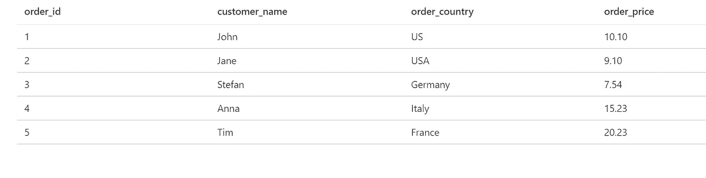
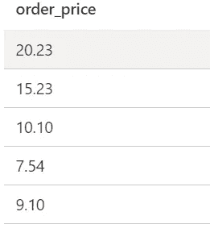

# SQL—CASE 语句的用法和酷用例

> 原文：<https://medium.com/codex/sql-advanced-usage-of-case-statement-4e5a9528a317?source=collection_archive---------2----------------------->

卡斯帕·卡米尔·鲁宾在 [Unsplash](https://unsplash.com?utm_source=medium&utm_medium=referral) 上的照片

数据清理、宁滨和灵活排序都可以通过使用 CASE 语句来完成。我将向您展示如何使用它，以及如何实现这些用例。但是在我们开始之前，让我们从基础开始。

# 如何使用 CASE

Case 是 SQL 实现 if else 逻辑的方式。基本上，你可以根据布尔表达式定义逻辑。所以，当某事为真时，这个值就是结果。在代码中，它看起来像这样:

这里我们看到了 CASE 子句的基本实现。CASE 和 END 包含一系列 WHEN THEN 语句和一个可选的 ELSE 语句。请记住，您返回的值必须是同一类型的。在本例中，我们只返回类似“Good Customer”的字符串。CASE 语句可以相互嵌套，也可以使用逻辑连接和+ OR。

## 展示准备

我将使用一个非常小的数据集来展示以下示例中的所有内容。这将由我在 SQL Server (Azure SQL)上完成，但如果您使用另一个数据库引擎，这没有问题，因为语法在任何地方都是相同的。

DDL(创建表格)可以在[这里](https://github.com/Graflinger/CaseMediumDemo.git)找到，所以你可以很容易地自己摆弄数据。但是为了简化，我们有一个名为 orders 的表，包含以下几列:

*   order_id (INT 主键)
*   客户名称(Varchar)
*   订单 _ 国家(Varchar)
*   order_price(浮点/小数)

订单表

## 数据清理

如您所见，我们的 order_country 列中存在数据质量问题。一个订单来自“我们”，另一个来自“美国”。这将使分组和聚合变得困难。以下是如何用案例陈述来处理它:

这个查询将生成一个名为“order_country_cleaned”的新列，解决了我们的问题。现在我们两个行具有相同的值，这提高了我们的数据质量。也可以只使用 1 WHEN，并将该逻辑与 OR 相结合。请记住，使用一个超级复杂的 CASE 语句来清理数据是没有意义的，如果您的数据超过 10 行，那么使用一个查找表可能会更好，因为它具有可重用性的好处。

CASE 是提高查询中数据质量的一个很好的方法，但是如果可能的话，请联系数据工程师/开发人员来提高源表中的数据质量。

## 扔掉

当你处理连续值时，宁滨在你的分析中真的很有价值。它使您能够创建存储桶，使分组和聚合对您可用。宁滨可以这样做:

这里，我们从连续列“order_price”创建了 3 个类别。现在使用这个分箱的列，例如，您可以分别对所有客户的类别进行计数。

## 灵活订购

CASE 语句还使您能够利用更复杂的 ORDER BY 实现。这可以从这里看出:

这会产生以下输出:

灵活订单的输出依据

# 结论

如果你只学了一门，那么希望你不总是需要 SQL 中最新奇的特性来实现一些很酷的想法。甚至像 CASE 语句这样古老而众所周知的东西也能为你提供超酷的能力，让你的生活变得更轻松。