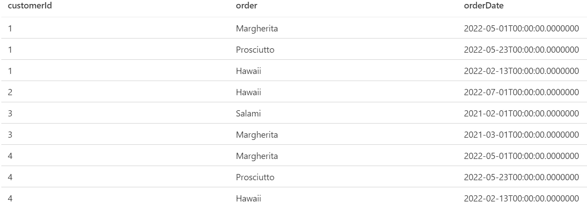

# SQL —案例与透视

> 原文：<https://medium.com/codex/sql-case-vs-pivot-586402c6979f?source=collection_archive---------0----------------------->

数据透视表通常为您的分析提供巨大的价值。在这篇博客中，我将向您展示如何使用 CASE 和 Pivot(T-SQL)在 SQL 中创建它们。

照片由 [Raymond Hsu](https://unsplash.com/@raymondhsu?utm_source=medium&utm_medium=referral) 在 [Unsplash](https://unsplash.com?utm_source=medium&utm_medium=referral) 上拍摄

CASE 是标准 SQL 工具包中真正通用的工具。它甚至可以用来旋转你的桌子。但是微软认为，对于其基于 SQL Server 的产品来说，增加一个额外的 PIVOT 功能将是一个很好的升级。在这篇博客中，我将向你展示为什么这真的有益，以及什么时候 CASE 语句也是足够的。

在对透视数据做了一些介绍之后，我将首先展示如何用 case 来做这件事，在我们讨论了它的缺点之后，我将向您展示使用 PIVOT 的替代方法。如果你不熟悉案例陈述或者想要快速回顾一些细节，你可以在这里查看。

## 旋转到底是什么意思？

在我们进入技术细节之前，让我们快速讨论一下旋转表格到底意味着什么。为了向您展示一切，我使用了下面这个名为 pizzaOrders 的演示表:

披萨订单表

这张桌子很直。我们有顾客，他们在某一天点了披萨。如果我们现在希望每个客户只有一列，我们需要透视数据。这意味着，对于来自其他列的每个不同的值，需要有一个列来代替。

为了更简单，我们只关注 customerId 和 order。例如，Id 为 1 的客户当前有 3 行，订购了 3 种不同的披萨(Margherita、Prosciutto 和 Hawaii)。为了将所有这些信息放在一行中，我们需要为每一个比萨饼指定一列，在我们的例子中，如果比萨饼真的被购买了，还需要一个 1(真)/0(假)标志。

*注意:这个例子被极大地简化了，在一个完整的例子中，你可能有一个数字来表示类似订单金额的东西，作为你的比萨饼列中的值。此外，如果你想自己尝试任何事情，你可以在这里找到你需要的一切***。**

## *带外壳的枢轴*

*为了更好地理解上例中的透视表，我们将在查询中使用 CASE 来构建一个透视表。*

*此查询按 customerId 进行分组，并使用事例条件创建 sum。如果客户订购了某个比萨饼，结果为 1，如果没有订购，结果为 0。您得到的输出如下所示:*

**

*查询的输出*

*这将使我们能够轻松地在一行中对客户执行一些筛选。此外，快速检查哪个顾客购买了特定的比萨饼变得容易多了。*

*带着箱子旋转真的很方便。它很容易使用并构建到 SQL 标准中。但是它有一个很大的缺点:您必须为每个唯一值定义一个 CASE 语句，以便为其创建列。这对于像 pizzaOrder 这样的表来说是可以的，我们只有 4 种不同的披萨，但是如果我们有超过 10 个不同的值，在我看来就不再可行了。此外，如果数据库表中出现新值，您总是需要更新查询。这就是 SQL Server 中的 PIVOT 语句等内置函数发挥作用的地方:*

## ***带枢轴的枢轴***

*现在让我们对 PIVOT 做同样的事情。*

*看起来完全不同，对吧？我来给你解释一下！我们有一个外部 Select (SELECT *)，它使用 pivot 语句的结果。内部选择为我们的旋转准备列。我们需要 pivot 列(orders)和 group 列(这是我们示例中的列 id，因为我们是按客户分组的),在我们的示例中，这并不重要，order 的另一种表示形式在我们的示例中就足够了，但有一个特定的列是很重要的。*

*Pivot 语句正在使用这 3 列。group 列隐式使用，聚合列和 pivot 列需要显式定义，就像您在我们的查询中看到的那样。您还需要提供一个值列表，该列表应被转换为列(我们的比萨饼)。*

*但是等等？！我没告诉过你吗，这个透视表的最大优点是我们不需要手动列出我们的透视表。没错。为了实现这一点，我们需要利用定义变量的能力。我们可以用表中所有不同的比萨饼填充一个变量，并在透视逻辑中使用它。*

*如您所见，我们使用变量@colNameList 动态地用 orders 表中的所有比萨饼填充数据透视表列表。*

*这两个示例也产生了这个透视表:*

**

*旋转表格—又一次*

## *结论*

*旋转为你的分析任务提供了很好的洞察力，我希望我能给你一个很好的概述，告诉你如何使用 2 种方法来实现它。如果您不使用 SQL Server，几乎所有其他引擎都支持非常相似的旋转方式。*