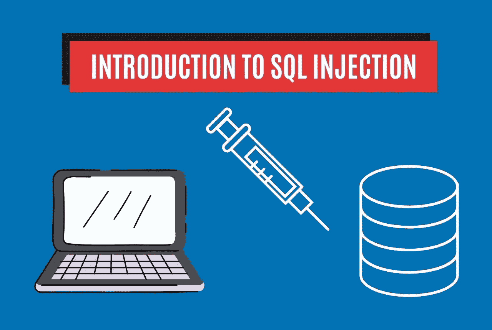

# SQL 注入:您需要知道的— StackZero

> 原文：<https://medium.com/codex/sql-injection-what-you-need-to-know-stackzero-abc80bc1ea5e?source=collection_archive---------21----------------------->

# 什么是 SQL 注入？

SQL 注入(SQLi)是对利用目标软件中的安全漏洞的 web 应用程序(最著名的还有 [XSS](https://www.stackzero.net/xss/) )的攻击，特别是，它允许攻击者在易受攻击的数据库上执行一些操作。