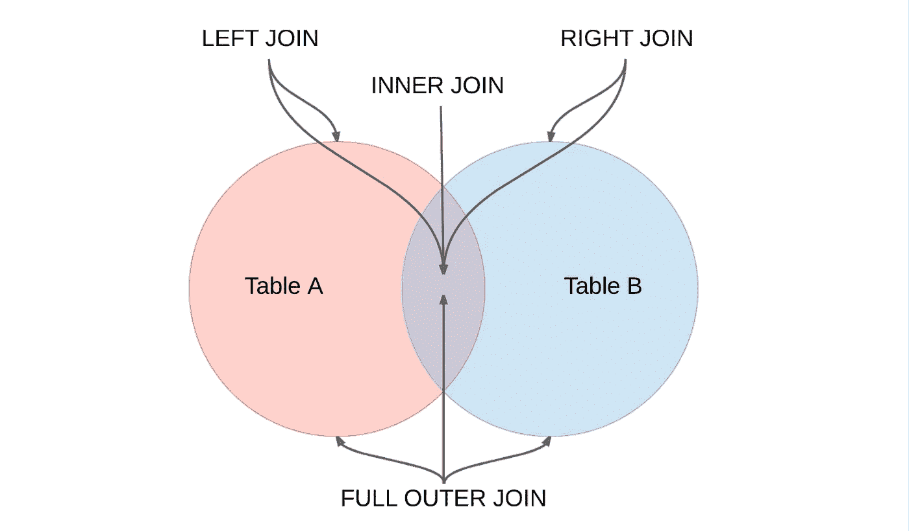

# SQL 连接—所有人的主要指南

> 原文：<https://medium.com/codex/sql-joins-the-master-guide-for-all-d8fed712b4c?source=collection_archive---------9----------------------->

SQL 是数据人员说的语言，尽管当任何人开始使用这种语言时，他们通常从普通的选择操作和使用“ **WHERE** 子句开始。但是我觉得真正的力量在于 SQL 的**连接**功能。在这篇文章中，我将浏览所有的连接并简要解释它们。

**什么是联结？**