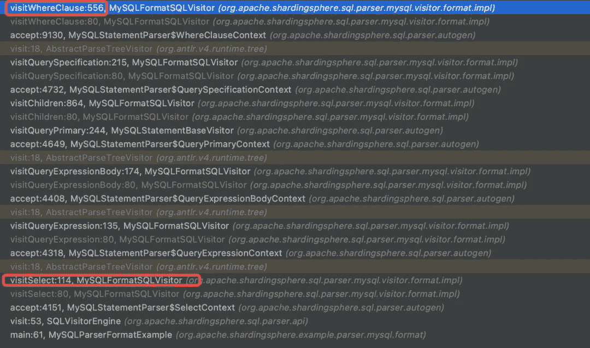
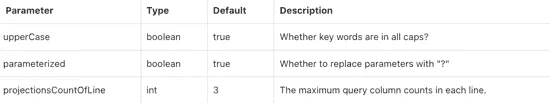

# SQL 解析格式函数 Apache ShardingSphere 的技术深度探索

> 原文：<https://medium.com/codex/sql-parse-format-function-a-technical-deep-dive-by-apache-shardingsphere-f5183e1de215?source=collection_archive---------5----------------------->

复杂的 SQL 语句是数据科学家和工程师遇到的一些最常见的问题。例如，您能一眼理解下面复杂的 SQL 语句吗？

```
select a.order_id,a.status,sum(b.money) as money from t_order a inner join (select c.order_id as order_id, c.number * d.price as money from t_order_detail c inner join t_order_price d on c.s_id = d.s_id) b on a.order_id = b.order_id where b.money > 100 group by a.order_id
```

格式化怎么样？下面格式化的格式化版本是不是更容易理解？

```
SELECT a . order_id , a . status , SUM(b . money) AS moneyFROM t_order a INNER JOIN(SELECT c . order_id AS order_id, c . number * d . price AS moneyFROM t_order_detail c INNER JOIN t_order_price d ON c . s_id = d . s_id) b ON a . order_id = b . order_idWHEREb . money > 100GROUP BY a . order_id;
```

解析如此复杂的 SQL 的第一步总是格式化，然后可以根据格式化的内容解析它的 SQL 语义。因此，SQL 格式化程序是任何数据库软件的基本功能之一。

因此， [Apache ShardingSphere](https://shardingsphere.apache.org) 现在提供了一个名为 SQL Parse Format 的 SQL 格式化工具，它依赖于 ShardingSphere 的 SQL 方言解析器。

**SQL 解析格式是 ShardingSphere 解析引擎的重要功能，也是 ShardingSphere 的 SQL Audit (TODO)的基础。**本文深入探讨了 SQL 解析格式函数:

*   它的核心理念是什么？
*   你如何使用它？
*   如何开发 SQL 解析格式？

# **解析引擎**

首先，我们需要介绍更多关于 Apache ShardingSphere 的解析器引擎，因为 SQL 解析格式是解析器引擎的一个独特且相对独立的功能。

Apache ShardingSphere 开发了解析器引擎来提取 SQL 中的关键信息，例如数据分片的字段和用于数据加密的重写列。到目前为止，Apache ShardingSphere 的解析器引擎已经经历了三次迭代。

最初的解析器引擎利用 [Druid](https://druid.apache.org) 作为它的 SQL 解析器，并且在 sharding sphere 1.4 . x 版之前表现得相当好。

后来，ShardingSphere 社区决定自己开发第二代解析器引擎。由于使用目的发生了变化，ShardingSphere 采用了另一种方法来理解 SQL:只提取数据分片所需的上下文信息，而不生成解析树或二次遍历，以提高性能和兼容性。

目前，第三代 ShardingSphere 解析引擎使用 [ANTLR](https://www.antlr.org) 作为解析树生成器，然后通过进行二次树遍历来提取上下文信息。它基本上兼容更多的 SQL 方言，这进一步加速了在 Apache ShardingSphere 中开发其他功能。

在 5.0.x 版本中，ShardingSphere 开发人员进一步增强了最新解析器引擎的性能，将树遍历方法从监听器更改为访问者，并为预编译的 SQL 语句添加解析结果缓存。

SQL 解析格式的实现归功于新的解析引擎。接下来，我们来看看 SQL 解析格式函数。

# **SQL 解析器格式**

SQL 解析格式用于格式化 SQL 语句。此外，SQL 解析格式功能将在未来的 SQL 审计中使用，为用户提供查看 SQL 历史、用报表显示格式化的 SQL，或者进一步分析或处理 SQL。

例如，使用 SQL Parse 格式格式化的以下 SQL 的每一部分都变得更加清晰，因为换行和关键字都是大写的:

```
select age as b, name as n from table1 join table2 where id = 1 and name = 'lu';
-- After Formatting
SELECT age AS b, name AS n
FROM table1 JOIN table2
WHERE 
        id = 1
        and name = 'lu';
```

到目前为止，我们已经介绍了 SQL 解析格式的基础知识。

> 接下来我们来回答这个问题:SQL 解析格式是什么概念？

一条 SQL 语句在 Apache ShardingSphere 中是如何格式化的？以下面的 SQL 为例:

```
select order_id from t_order where status = 'OK'
```

1.  Apache ShardingSphere 使用`ANTLR4`作为它的解析器引擎生成器。首先，我们需要遵循 ANTLR4 方法来定义`.g4`文件中`select`的语法(以 MySQL 为例)。

```
simpleSelect
    : SELECT ALL? targetList? intoClause? fromClause? whereClause? groupClause? havingClause? windowClause?
    | SELECT distinctClause targetList intoClause? fromClause? whereClause? groupClause? havingClause? windowClause?
    | valuesClause
    | TABLE relationExpr
    ;
```

2.我们可以使用 IDEA 的 ANTLR4 插件轻松查看 SQL 语句的语法树。

更多关于 ANTLR4 的信息，请参考:[https://plugins.jetbrains.com/plugin/7358-antlr-v4.](https://plugins.jetbrains.com/plugin/7358-antlr-v4.)


ANTLR4 可以编译我们定义的语法文件:它首先对 SQL 语句进行词法分析，将其拆分为不可分割的部分，即记号，并根据不同数据库的字典值将这些记号划分为关键字，表达式。

例如，在上图中，我们得到了关键字`SELECT`、`FROM`、`WHERE`、`=` 和变量`order_id`、`t_order`、`status`、`OK`。

3.然后 ANTLR4 将解析器引擎的输出转换成语法树，如上图所示。

基于 Apache ShardingSphere 的源代码，上述过程复制如下。

```
String sql = "select order_id from t_order where status = 'OK'";
CacheOption cacheOption = new CacheOption(128, 1024L, 4);
SQLParserEngine parserEngine = new SQLParserEngine("MySQL", cacheOption, false);
ParseContext parseContext = parserEngine.parse(sql, false);
```

4.Apache ShardingSphere 的 SQL 解析器引擎封装并抽象了 ANTLR4 解析器:它通过 SPI 加载 SQL 方言解析器。用户还可以通过 SPI 的扩展点来扩展数据方言。此外，ShardingSphere 在内部增加了一个缓存机制来提高性能。看一下如下解析的相关代码:

```
public ParseContext parse(final String sql) {
    ParseASTNode result = twoPhaseParse(sql);
    if (result.getRootNode() instanceof ErrorNode) {
        throw new SQLParsingException("Unsupported SQL of `%s`", sql);
    }
    return new ParseContext(result.getRootNode(), result.getHiddenTokens());
}

private ParseASTNode twoPhaseParse(final String sql) {
    DatabaseTypedSQLParserFacade sqlParserFacade = DatabaseTypedSQLParserFacadeRegistry.getFacade(databaseType);
    SQLParser sqlParser = SQLParserFactory.newInstance(sql, sqlParserFacade.getLexerClass(), sqlParserFacade.getParserClass(), sqlCommentParseEnabled);
    try {
        ((Parser) sqlParser).getInterpreter().setPredictionMode(PredictionMode.SLL);
        return (ParseASTNode) sqlParser.parse();
    } catch (final ParseCancellationException ex) {
        ((Parser) sqlParser).reset();
        ((Parser) sqlParser).getInterpreter().setPredictionMode(PredictionMode.LL);
        try {
            return (ParseASTNode) sqlParser.parse();
        } catch (final ParseCancellationException e) {
            throw new SQLParsingException("You have an error in your SQL syntax");
        }
    }
}
```

`twoPhaseParse`是解析器的核心。首先会根据数据库类型将其加载到正确的解析器类中，然后由于反射机制会生成一个 ANTLR4 的解析器实例。然后，ANTLR4 提供了两种解析方式:先进行快速解析，如果失败，再进行常规解析。用户可以通过快速解析获得大多数 SQL 语句的解析结果，从而提高解析性能。解析之后，我们得到解析树。

那么 Apache ShardingSphere 如何从解析树中获取格式化的 SQL 语句呢？

事实上，ShardingSphere 使用了`Visitor`方法。ANTLR4 提供了两种访问语法树的方法:`Listener`和`Visitor`。ShardingSphere 选择后者来访问语法树。下面的代码显示了如何从语法树中获取格式化的 SQL:

```
SQLVisitorEngine visitorEngine = new SQLVisitorEngine("MySQL", "FORMAT", new Properties());
String result = visitorEngine.visit(parseContext);
```

Apache ShardingSphere 的`SQLVisitorEngine`也抽象和封装了各种方言访问者。核心方法如下所示:

```
public <T> T visit(final ParseContext parseContext) {
    ParseTreeVisitor<T> visitor = SQLVisitorFactory.newInstance(databaseType, visitorType, SQLVisitorRule.valueOf(parseContext.getParseTree().getClass()), props);
    T result = parseContext.getParseTree().accept(visitor);
    appendSQLComments(parseContext, result);
    return result;
}
```

首先，就上述`Visitor`方法而言，根据数据库类型和访问者的类型来决定要使用的访问者，并且还通过反射机制在内部实例化访问者。目前，`visitorType`支持两种方式:`FORMAT`和`STATEMENT`。后者是 Apache ShardingSphere 常用的，可以将 SQL 转换成`Statement`信息，提取相关的上下文信息，提供数据分片等功能。其实这也是 SQL 解析格式和其他普通解析引擎函数的唯一区别。

接下来，我们还是以 SQL 语句为例，提供具体的代码来展示`Visitor`是如何格式化它的。

`MySQLFormatSQLVisitor`用于访问 SQL。基于`DEBUG`代码，我们可以清晰的看到这次访问的执行路径如下图所示。Visitor 遍历语法树的所有部分，ANTLR4 根据定义的语法规则生成访问每个节点的默认方法。Apache ShardingSphere 利用关键方法，成功开发了完整的 SQL 格式化功能。



下面的代码可以帮助我们更好地理解`Visitor`如何格式化 SQL。

当`Visitor`遍历到`select`时，`Visitor`会先格式化，然后再访问`projection`。`projection`的内部格式化将通过`visitProjections`方法进一步实现。

在访问`from`之前处理空行。由`Visitor`实例化的对象维护一个`StringBuilder`来存储格式化的结果。因为每个 SQL 的解析器和访问者都是新创建的实例化对象，所以不存在线程问题。最终遍历之后，Apache ShardingSphere 在`StringBuilder`中输出结果，然后我们得到格式化的 SQL。

```
public String visitQuerySpecification(final QuerySpecificationContext ctx) {
    formatPrint("SELECT ");
    int selectSpecCount = ctx.selectSpecification().size();
    for (int i = 0; i < selectSpecCount; i++) {
        visit(ctx.selectSpecification(i));
        formatPrint(" ");
    }
    visit(ctx.projections());
    if (null != ctx.fromClause()) {
        formatPrintln();
        visit(ctx.fromClause());
    }
    if (null != ctx.whereClause()) {
        formatPrintln();
        visit(ctx.whereClause());
    }
    if (null != ctx.groupByClause()) {
        formatPrintln();
        visit(ctx.groupByClause());
    }
    if (null != ctx.havingClause()) {
        formatPrintln();
        visit(ctx.havingClause());
    }
    if (null != ctx.windowClause()) {
        formatPrintln();
        visit(ctx.windowClause());
    }
    return result.toString();
}
```

现在，基于上面的过程分析和代码片段，您可以理解 SQL 解析格式的原理。

# **SQL 解析格式用户指南**

您可能会发现在 Apache ShardingSphere 中使用 SQL Parse Format 函数很容易，只要您知道它的原理。

至于 Java 应用，用户只需要添加依赖项，调用 API 即可。

*   **添加依赖关系**

```
<dependency>
    <groupId>org.apache.shardingsphere</groupId>
    <artifactId>shardingsphere-sql-parser-engine</artifactId>
    <version>${project.version}</version>
</dependency>

<dependency>
    <groupId>org.apache.shardingsphere</groupId>
    <artifactId>shardingsphere-sql-parser-mysql</artifactId>
    <version>${project.version}</version>
</dependency>
```

*   **调用 API**

```
public static void main(String[] args) {
    String sql = "select order_id from t_order where status = 'OK'";
    CacheOption cacheOption = new CacheOption(128, 1024L, 4);
    SQLParserEngine parserEngine = new SQLParserEngine("MySQL", cacheOption, false);
    ParseContext parseContext = parserEngine.parse(sql, false);
    SQLVisitorEngine visitorEngine = new SQLVisitorEngine("MySQL", "FORMAT", new Properties());
    String result = visitorEngine.visit(parseContext);
    System.out.println(result);
}
```

*   **属性支持的参数**



还可以在 ShardingSphere-Proxy 中使用 DistSQL 对 SQL 解析格式函数执行操作:

```
mysql> FORMAT select order_id from t_user where status = 'OK';
+-----------------------------------------------------+
| formatted_result                                    |
+-----------------------------------------------------+
| SELECT order_id
FROM t_user
WHERE
        status = 'OK'; |
+-----------------------------------------------------+
```

就上述`Statement`模式而言，也可以让用户方便地查看从 SQL 转换而来的`SQLStatement` 的结果。

```
mysql> parse SELECT id, name FROM t_user WHERE status = 'ACTIVE' AND age > 18;
+----------------------+---------------------------------------------------------------------------------------------------------------------------------------------------------------------------------------------------------------------------------------------------------------------------------------------------------------------------------------------------------------------------------------------------------------------------------------------------------------------------------------------------------------------------------------------------------------------------------------------------------------------------------------------------------------------------------------------------------------------------------------------------------------------------------------------------------------------------------------------------------------------------------------------------------------------------------------------------------------------------------------------------------------------------------------------------------------------------------------------------------------------------------------+
| parsed_statement     | parsed_statement_detail                                                                                                                                                                                                                                                                                                                                                                                                                                                                                                                                                                                                                                                                                                                                                                                                                                                                                                                                                                                                                                          |
+----------------------+---------------------------------------------------------------------------------------------------------------------------------------------------------------------------------------------------------------------------------------------------------------------------------------------------------------------------------------------------------------------------------------------------------------------------------------------------------------------------------------------------------------------------------------------------------------------------------------------------------------------------------------------------------------------------------------------------------------------------------------------------------------------------------------------------------------------------------------------------------------------------------------------------------------------------------------------------------------------------------------------------------------------------------------------------------------------------------------------------------------------------------------+
| MySQLSelectStatement | {"projections":{"startIndex":7,"stopIndex":14,"distinctRow":false,"projections":[{"column":{"startIndex":7,"stopIndex":8,"identifier":{"value":"id","quoteCharacter":"NONE"}}},{"column":{"startIndex":11,"stopIndex":14,"identifier":{"value":"name","quoteCharacter":"NONE"}}}]},"from":{"tableName":{"startIndex":21,"stopIndex":26,"identifier":{"value":"t_user","quoteCharacter":"NONE"}}},"where":{"startIndex":28,"stopIndex":63,"expr":{"startIndex":34,"stopIndex":63,"left":{"startIndex":34,"stopIndex":50,"left":{"startIndex":34,"stopIndex":39,"identifier":{"value":"status","quoteCharacter":"NONE"}},"right":{"startIndex":43,"stopIndex":50,"literals":"ACTIVE"},"operator":"\u003d","text":"status \u003d \u0027ACTIVE\u0027"},"right":{"startIndex":56,"stopIndex":63,"left":{"startIndex":56,"stopIndex":58,"identifier":{"value":"age","quoteCharacter":"NONE"}},"right":{"startIndex":62,"stopIndex":63,"literals":18},"operator":"\u003e","text":"age \u003e 18"},"operator":"AND","text":"status \u003d \u0027ACTIVE\u0027 AND age \u003e 18"}},"unionSegments":[],"parameterCount":0,"commentSegments":[]} |
+----------------------+---------------------------------------------------------------------------------------------------------------------------------------------------------------------------------------------------------------------------------------------------------------------------------------------------------------------------------------------------------------------------------------------------------------------------------------------------------------------------------------------------------------------------------------------------------------------------------------------------------------------------------------------------------------------------------------------------------------------------------------------------------------------------------------------------------------------------------------------------------------------------------------------------------------------------------------------------------------------------------------------------------------------------------------------------------------------------------------------------------------------------------------+
```

更多 [DistSQL](https://opensource.com/article/21/9/distsql) 函数请参考文档:[https://sharding sphere . Apache . org/document/current/cn/concepts/dist SQL/](https://shardingsphere.apache.org/document/current/cn/concepts/distsql/)

# **结论**

目前 Apache ShardingSphere 的 Format 函数只支持 [MySQL](https://www.mysql.com) 。在理解了它的概念以及如何使用它之后，如果您感兴趣，欢迎您为开发 SQL Parse Format 函数做出贡献。

# Apache ShardingSphere 开源项目链接:

[ShardingSphere Github](https://github.com/apache/shardingsphere)

[ShardingSphere Twitter](https://twitter.com/ShardingSphere)

[ShardingSphere 松弛通道](https://join.slack.com/t/apacheshardingsphere/shared_invite/zt-sbdde7ie-SjDqo9%7EI4rYcR18bq0SYTg)

[投稿指南](https://shardingsphere.apache.org/community/cn/contribute/)

# **作者**

**陈楚欣**

> SphereEx 中间件工程师& Apache ShardingSphere 提交者
> 
> 目前，他致力于开发 Apache ShardingSphere 的内核模块。

