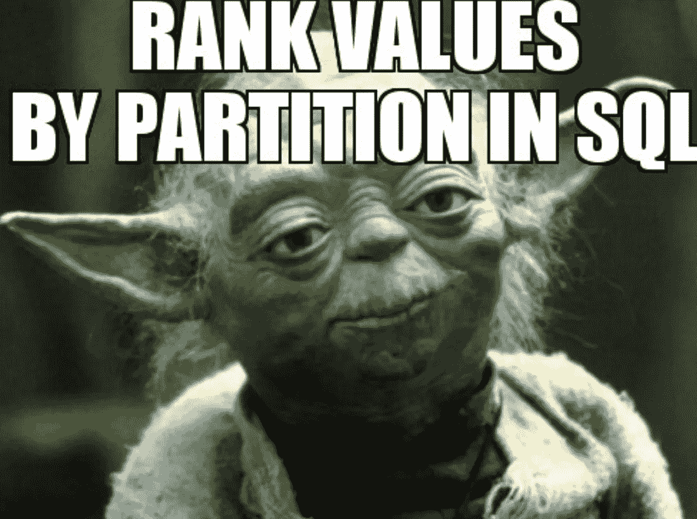
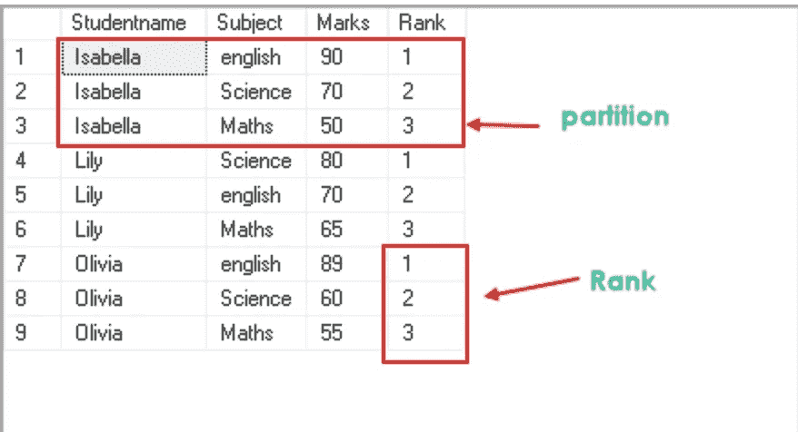
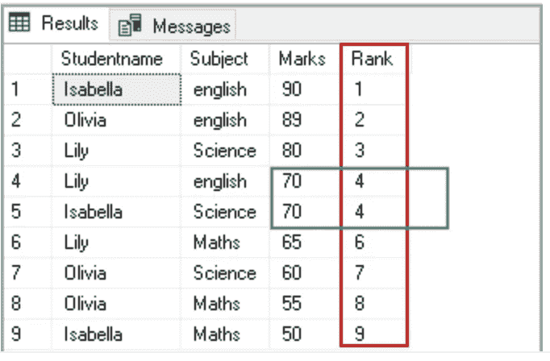
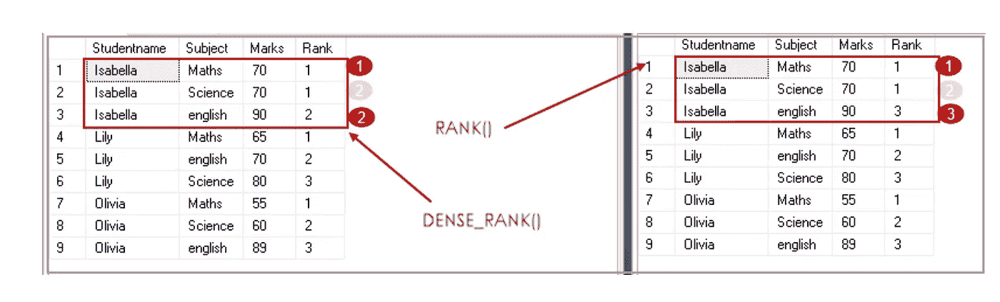
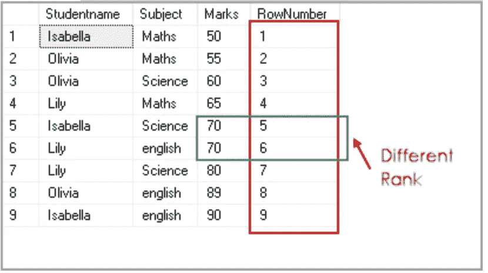

# SQL 等级函数过于简单

> 原文：<https://medium.com/codex/sql-rank-functions-oversimplified-d363cabb2648?source=collection_archive---------5----------------------->

# 商务人士需要 SQL 吗？

SQL 是最容易学习的计算机语言之一。如今，越来越多的公司鼓励非 IT 领域(如销售、广告和财务)的员工学习和使用 SQL。当企业能够自己回答与数据相关的问题时，决策者就可以将这些见解转化为可操作的项目，从而提高工作效率。如果您有兴趣了解更多关于 SQL 的知识，并且您熟悉 SQL 的基础知识，那么本文将帮助您快速了解一些非常有用的 SQL 函数。

## **窗口功能介绍**

**它为什么叫窗户？**此处的窗口描述了函数操作的行集合。

**它是做什么的？**它对一组与当前行相关的表格行执行一系列计算。


**幕后发生了什么？**它的工作方式类似于聚合函数，但是这里需要注意的是，与聚合函数不同的是，这些行不仅仅被分组到一个输出行中，相反，这些行仍然保持它们各自的身份。

虽然窗口函数广泛涵盖了所有这些函数，但我们今天只关注**排名。**

*   **聚合函数:** MAX()、MIN()、AVG()、SUM()、COUNT()等。
*   **排名函数:** ROW_NUMBER()，RANK()，DENSE_RANK()，NTILE()，PERCENT_RANK()，CUME_DIST()等。
*   **解析函数:** LEAD()，LAG()，FIRST_VALUE()，LAST_VALUE()等。

# 主题

1.  带分区的等级
2.  无划分的秩
3.  秩和稠密秩的区别
4.  行号

## 1.带分区的等级用例(当您需要一起查看数据子集时)



想象你有一对双胞胎——伊莎贝尔和奥利维亚。他们在同一个班学习。为了给他们提供关于他们职业道路的家长谈话，你必须看到他们的分数。

商业逻辑→绕回数据问题，你将需要看到伊莎贝拉的科目和分数在一起，然后是奥利维亚的科目和分数。

SQL 逻辑→这个业务逻辑应该引导您考虑如何根据学生的名字来划分数据。

商业逻辑→作为一名家长，你可能希望看到孩子在哪些领域表现突出，这应该会让你想到“排名”。

SQL 逻辑→等级 1 分配给孩子得分最高的科目。*提示:按降序排列。*



```
SELECT Studentname,Subject,Marks,RANK() OVER(PARTITION BY Studentname ORDER BY Marks DESC) RankFROM ExamResultORDER BY Studentname,Rank;
```

*   为了区分孩子，我们使用 PARTITION**BY student name**子句，这样我们就可以对每个学生组的分数进行计算。每个学生小组，我指的是伊莎贝拉和奥利维亚。
*   作为家长，你想先看到他们的最佳表现，所以让我们按降序排列
*   我们还将使用 Order By 子句对学生姓名的结果进行排序，因此您会首先看到 Isabella。

这就对了。你现在可以给他们讲一讲文学。

## 2.无划分的等级(不需要子集，需要等级)

从小到大，我有一个好朋友，她的妈妈非常好胜。她经常会问别人过得怎么样。

> “嗯……长时间的停顿……那么……有多少其他的孩子，得到了和你一样的分数？与你相比，其他人的表现如何？”

为了回答这些问题，我们可能需要对所有科目的学生分数进行排名。见下文。

1.  结果告诉你伊莎贝拉的英语成绩是班上最高的，奥利维亚的英语成绩也一样好。正在成长的作家！

2.如果你是那些争强好胜的父母中的一员，你可能希望把第三名(莉莉获得的*科学)给你的孩子*伊莎贝拉或奥利维亚，这样你的孩子就可以统治世界了！



我们没有使用按科目或学生划分，因为我们只是想对所有科目有一个整体的看法。相反，我们使用 SQL Rank 函数和 Marks 子句上的 **OVER 子句(按降序)来获得相应行的等级。**

## 秩和密集秩差(Dense_Rank()给出唯一的秩)



**排位→** 与`DENSE_RANK`不同的是，`RANK`在排位相等后跳过位置。跳过的位置数取决于有多少行具有相同的排名。例如，伊莎贝拉在数学和科学两科中得分相同，所以这两科都名列第一。有了`RANK`，下一个位置就是# 3；用`DENSE_RANK`，下一个位置是#2。

**Dense_Rank() →** 根据指定的列值，这将为您提供分区内唯一的等级号。

## 行号()

此函数为每一行提供一个唯一的顺序号(1、2、3 等)，它为第一行提供一个等级，然后为每一行增加一个值。

这里需要注意的是，行的不同等级也有相似的值。

```
SELECT Studentname,Subject,Marks,ROW_NUMBER() OVER(ORDER BY Marks) RowNumberFROM ExamResult;
```



# 结论

排名函数是数据分析师最常用的工具之一。要对 SQL 中的排名感到自信，请感到有能力并开始练习。您可以查看 [SQL Fiddle](http://sqlfiddle.com/) 或 [SQL Zoo](https://sqlzoo.net/wiki/SQL_Tutorial) 。这些是免费平台，以一种对初学者非常友好的方式呈现 SQL。它非常直观&将帮助您在舒适的环境中亲自操作 SQL。