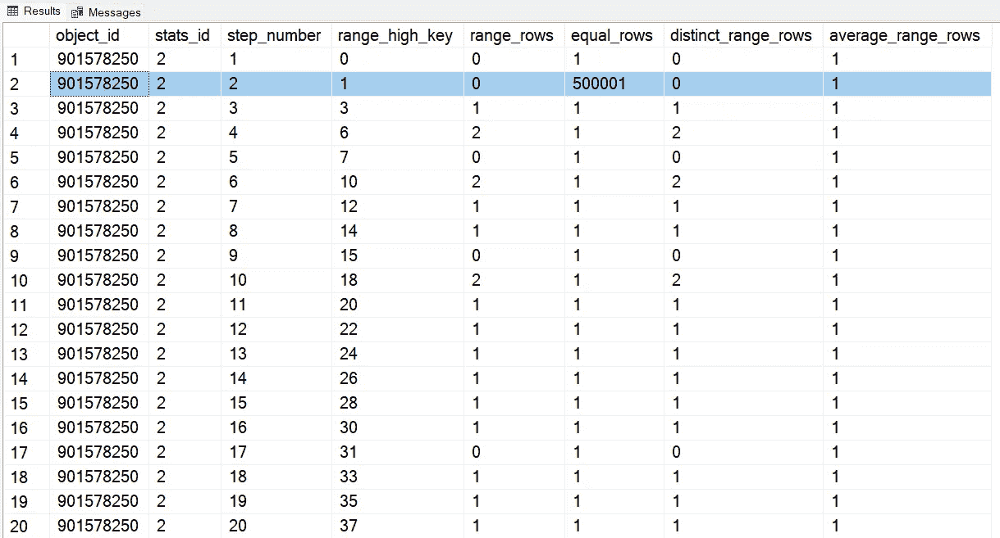
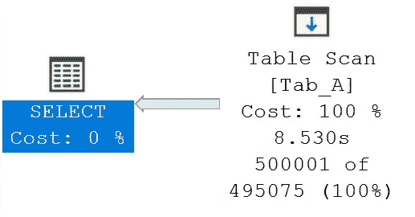
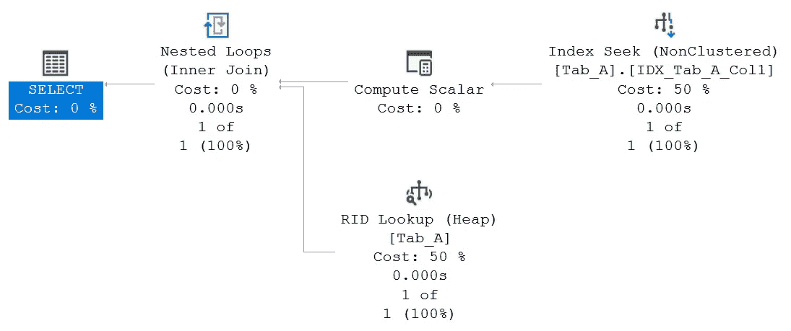
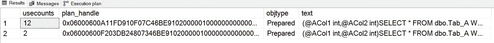

# SQL Server 2022 参数敏感计划(PSP)优化

> 原文：<https://medium.com/codex/sql-server-2022-parameter-sensitive-plan-psp-optimization-a5e8a319fa0b?source=collection_archive---------3----------------------->

## 下一代智能查询处理的杀手锏！


卡斯帕·卡米尔·鲁宾在 [Unsplash](https://unsplash.com?utm_source=medium&utm_medium=referral) 上的照片

## **简介**

对参数敏感的计划优化是 SQL Server 2022 的新特性之一，它是名为[智能查询处理](https://docs.microsoft.com/en-us/sql/relational-databases/performance/intelligent-query-processing?WT.mc_id=DP-MVP-4029181)的系列特性的一部分，可在不更改应用程序代码的情况下提高现有工作负载的性能。

## **参数敏感方案优化**

SQL Server 2022 中的参数敏感计划优化进一步增强了智能查询处理，解决了参数化查询的单个缓存执行计划对于这些参数可能采用的所有值都不是最佳的情况。此问题与 SQL Server 实现的[执行计划保存和重用](https://docs.microsoft.com/en-gb/sql/relational-databases/query-processing-architecture-guide?WT.mc_id=DP-MVP-4029181#parameters-and-execution-plan-reuse)机制有关。执行计划保存和重用机制旨在增加查询的响应时间，因为 SQL Server 将缓存以前保存和参数化的计划，因此不必在每次运行相同的查询时编译新的计划。这种技术优化了查询的编译时间，但是在存在非均匀数据分布的情况下，它可能会降低性能，这种现象称为[参数嗅探](https://docs.microsoft.com/en-gb/sql/relational-databases/query-processing-architecture-guide?WT.mc_id=DP-MVP-4029181#parameter-sensitivity)。更多信息可在文章[有参数敏感计划(PSP)问题的查询](https://docs.microsoft.com/en-gb/azure/azure-sql/identify-query-performance-issues?WT.mc_id=DP-MVP-4029181#ParamSniffing)中找到。

参数敏感计划将允许您在计划缓存中保存多个活动的执行计划。对于单个参数化查询，每个执行计划都将进行优化，并将根据参数假定的值托管不同的数据大小。每当 SQL Server 检测到需要使用未保存在参数化查询的计划缓存中的执行计划时，它将为当前参数值计算最佳执行计划。

## 测试环境设置

为了演示参数敏感计划如何工作，我们将使用 PSP 数据库，该数据库可以在 SQL Server 2022 实例中使用以下脚本创建。

```
USE [master];
GO-- Drop database PSP if exists
IF (DB_ID('PSP') IS NOT NULL)
BEGIN
  ALTER DATABASE [PSP]
    SET SINGLE_USER WITH ROLLBACK IMMEDIATE; DROP DATABASE [PSP];
END;
GO-- Create database PSP
CREATE DATABASE [PSP]
  ON PRIMARY 
  (
    NAME = N'PSPData'
    ,FILENAME = N'C:\SQL\DBs\PSPData.mdf'
  )
  LOG ON 
  (
    NAME = N'PSPLog'
    ,FILENAME = N'C:\SQL\DBs\PSPLog.ldf'
  );
GO-- Set recovery model to SIMPLE
ALTER DATABASE [PSP] SET RECOVERY SIMPLE;
GO
```

让我们添加 dbo。新创建的 PSP 数据库的表。以下脚本创建该表并插入一些示例数据。

```
USE [PSP];
GODROP TABLE IF EXISTS dbo.Tab_A;
GOCREATE TABLE dbo.Tab_A
(
  Col1 INTEGER
  ,Col2 INTEGER
  ,Col3 BINARY(2000)
);
GO-- Insert some data into the sample table
SET NOCOUNT ON;BEGIN
  BEGIN TRANSACTION;DECLARE @i INTEGER = 0;WHILE (@i < 10000)
  BEGIN
    INSERT INTO dbo.Tab_A (Col1, Col2) VALUES (@i, @i);
    SET @i+=1;
  END;COMMIT TRANSACTION;
END;
GO-- There are much more rows with value 1 than rows with other values
INSERT INTO dbo.Tab_A (Col1, Col2) VALUES (1, 1)
GO 500000SET NOCOUNT OFF;
GO-- Create indexes
CREATE INDEX IDX_Tab_A_Col1 ON dbo.Tab_A
(
  [Col1]
);
GOCREATE INDEX IDX_Tab_A_Col2 ON dbo.Tab_A
(
  [Col2]
);
GO
```

dbo 中的数据分布。Tab_A 表是不一致的，在列 Col1 和 Col2 中具有值 1 的行(510，000 行中的 500，001 行)多于具有其他值的行。

让我们考虑下面的存储过程，它在 dbo 上执行简单的搜索。Tab _ 列 Col1 和 Col2 的表。

```
CREATE OR ALTER PROCEDURE dbo.Tab_A_Search
(
  @ACol1 INTEGER
  ,@ACol2 INTEGER
)
AS BEGIN
  SELECT * FROM dbo.Tab_A WHERE (Col1 = @ACol1) AND (Col2 = @ACol2);
END
```

在存储过程的初始编译期间，WHERE 子句中列的可用统计信息用于识别非均匀分布，并评估最“有风险”的参数化谓词，最多三个可用谓词。存储过程中使用的谓词影响列 Col1 和 Col2，在这些列上创建的非聚集索引导致了相关统计信息的创建。

以下查询显示了描绘 Col1 列上的数据分布的直方图步骤，其中 range_high_key 显示了现有的 Col1 输入值。

```
SELECT
  sh.* 
FROM
  sys.stats AS s
CROSS APPLY
  sys.dm_db_stats_histogram(s.object_id, s.stats_id) AS sh
WHERE
  (name = 'IDX_Tab_A_Col1') AND (s.object_id = OBJECT_ID('dbo.Tab_A'));
GO
```

输出如下图所示，您可以看到值为 1 的 range_high_key 有 500，001 条记录，而大多数其他值只有几条记录。



IDX_Tab_A_Col2 指数也是类似情况。

存储过程 dbo 的首次执行。Tab_A_Search 将参数@ACol1 和@ACol2 设置为 1，这对应于 500K 记录数据集。

```
EXEC dbo.Tab_A_Search @ACol1 = 1, @ACol2 = 1;
```

下图显示了 SQL Server 为此输入参数选择的执行计划。



执行计划显示已经选择了表扫描作为数据访问方法，这对于返回大量行的场景非常有效。在 SQL Server 和 Azure SQL 数据库的任何早期版本中，计划缓存和重用此执行计划是参数化查询的默认行为。如果使用这个执行计划来检索几行，效率会很低。

使用 SQL Server 2022 中兼容级别设置为 160 的数据库，Parameter Sensitive Plan 可以检测这些等式谓词的情况，就像本例中使用的一样(其中 Col1 = @ ACol1 ),它将允许您为同一个查询在计划缓存中保留多个活动计划。每个计划将仅用于返回的行数与第一次执行存储过程返回的行数相似的执行。因此，在返回很少几行的执行过程中，我们将有一个更有效的执行计划，使用不同的数据访问方法和不同的计划操作符。将使用索引上的直接指向操作(查找)而不是全扫描(扫描)。

```
EXEC dbo.Tab_A_Search @ACol1 = 33, @ACol2 = 33;
GOEXEC dbo.Tab_A_Search @ACol1 = 33, @ACol2 = 25;
GO
```

下面的执行计划显示了一种更有效的索引查找方法，在这种执行中只返回几行。



对于适合使用参数敏感计划进行优化的执行计划，初始编译会生成包含优化逻辑(调度程序表达式)的调度程序计划。调度程序计划基于谓词基数范围边界值映射到查询变量。每个变量都链接到一个执行计划，在该计划中，您将找到最合适的操作符来处理预计由该特定查询变量返回的数据集。

如果数据分布发生重大变化，调度程序计划会自动更新。链接到查询变量的执行计划会根据需要独立地重新编译。

未记录的跟踪标志 12619 允许您获取有关参数敏感计划在查询存储中执行的优化的详细信息。

sys.query_store_query_variant 系统视图允许您监视查询及其变体之间的关系，并允许创建与带有参数的查询相关联的所有查询变体的报告，它代表了通过 query_hash 进行数据聚合的替代方法。

以下查询从计划缓存中检索数据，并显示同一查询存在两个活动的执行计划，第一个最适合提取大量行，第二个最适合提取少量行。

```
SELECT
  usecounts
  ,plan_handle
  ,objtype
  ,text
FROM
  sys.dm_exec_cached_plans 
CROSS APPLY
  sys.dm_exec_sql_text (plan_handle)
WHERE
  (text LIKE '%Tab_A%')
AND
  (objtype = 'Prepared');
GO
```



## 摘要

SQL Server 2022 中默认启用的查询存储与新一代智能查询处理相结合，允许在一些常见情况下提高性能，而无需更改 T-SQL 代码。参数敏感计划(PSP)优化代表了这些改进之一，因为它允许在计划缓存中为单个参数化查询保留多个活动执行计划，以解决著名的参数嗅探问题。

享受 SQL Server 2022！