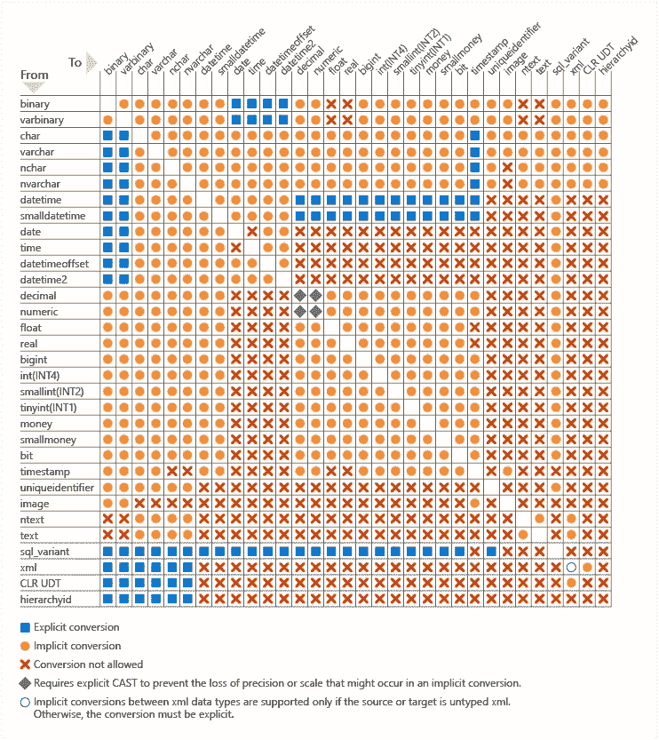

# SQL Server 使用 sqlcmdcli 更改列

> 原文：<https://medium.com/codex/sql-server-alter-column-with-sqlcmdcli-6ee50db509c5?source=collection_archive---------4----------------------->

## 它改变了 SQL Server 数据库中具有依赖关系的列！

有多少次您不得不更改其他 SQL Server 数据库对象所依赖的列的数据类型？

如果您有这种需求，您将会面临[错误消息 5074](https://docs.microsoft.com/en-us/sql/relational-databases/errors-events/database-engine-events-and-errors?view=sql-server-2017#errors-5000-to-5999) ，这表明由于存在链接对象，如索引、约束、统计等，无法更改列的数据类型和属性。

您会在网上找到许多描述错误消息 5074 的帖子，但是除了在运行 ALTER COLUMN 命令之前手动删除链接的对象之外，很少有人提供解决方案。

错误消息 5074 如下所示:

```
Msg 5074, Level 16, State 1, Line 1135The object 'Object Name' is dependent on column 'Column Name'.
```

错误消息 5074 之后是[错误消息 4922](https://docs.microsoft.com/en-us/sql/relational-databases/errors-events/database-engine-events-and-errors?view=sql-server-2017#errors-4000-to-4999) ，如本例所示:

```
Msg 4922, Level 16, State 9, Line 1135ALTER TABLE ALTER COLUMN 'Column Name' failed because one or more objects access this column
```

仅仅更改名称并不是一个简单的操作，尤其是当该列被其他数据库对象(如视图、索引、统计数据等)引用时。要重命名表中的列，可以使用 [sp_rename](https://docs.microsoft.com/it-it/sql/relational-databases/system-stored-procedures/sp-rename-transact-sql?view=sql-server-2017) 系统存储过程，但是要更改列的数据类型，如果您不想使用任何第三方工具，除了手动编写 T-SQL 代码之外别无选择。

我多次遇到这个问题，所以我决定创建一个过程，它能够为连接到我想要修改的列的每个对象自动编写适当的 DROP 和 create 命令。由此诞生了完全集成在命令行应用程序 [sqlcmdcli](https://github.com/segovoni/sqlcmdcli) 中的 [sp_alter_column](https://github.com/segovoni/sp_alter_column) 存储过程。

[sqlcmdcli](https://github.com/segovoni/sqlcmdcli) 是一个命令行界面，用于在 SQL Server 上即席、交互式地执行命令，允许您执行特定的操作，包括更改 SQL Server 数据库中具有依赖关系的列的数据类型。特定命令 [altercolumn](https://github.com/segovoni/sqlcmdcli/wiki#altercolumn-altercol) 能够为已识别的对象识别并生成用于以下数据库对象(可能与列有依赖关系)的删除/创建命令:

*   主键
*   外键
*   默认约束
*   唯一约束
*   检查约束
*   指数
*   统计数字
*   视图

## 例子

如果您想更改*产品的*版本*列的数据类型。使用以下 TSQL 命令将 *AdventureWorks2017* 数据库中的*表从 *nchar(5)* 记录到 *nvarchar(10)* :

```
ALTER TABLE Production.Document ALTER COLUMN Revision NVARCHAR(10) NOT NULL
```

您将收到以下错误消息:

```
Msg 5074, Level 16, State 1, Line 1136The index 'IX_Document_FileName_Revision' is dependent on column 'Revision'.Msg 4922, Level 16, State 9, Line 1136ALTER TABLE ALTER COLUMN Revision failed because one or more objects access this column.
```

sqlcmdcli [altercolumn](https://github.com/segovoni/sqlcmdcli/wiki#altercolumn-altercol) 命令将无错误地执行操作，以下是命令行示例:

```
**sqlcmdcli.exe** altercolumn -servername:SSS -databasename:DDD -username:UU -password:PP -schemaname:Production -tablename:Document -columnname:Revision -datatype:nvarchar(10)
```

sqlcmdcli 的最新版本可从以下网站下载:

[](https://github.com/segovoni/sqlcmdcli/releases) [## 发布 segovoni/sqlcmdcli

### 更新 build.yml for Azure Pipelines 更新 build.yml for Azure Pipelines 更新 build.yml 将复制文件任务添加到…

github.com](https://github.com/segovoni/sqlcmdcli/releases) 

sqlcmdcli 的可用命令记录在项目的 wiki 页面上，如下所示:

[](https://github.com/segovoni/sqlcmdcli/wiki) [## 主页 segovoni/sqlcmdcli Wiki

### 此时您不能执行该操作。您已使用另一个标签页或窗口登录。您已在另一个选项卡中注销，或者…

github.com](https://github.com/segovoni/sqlcmdcli/wiki) 

## 摘要

根据本文[中描述的](https://docs.microsoft.com/en-us/sql/t-sql/functions/cast-and-convert-transact-sql?view=sql-server-2017)和下图所示的数据类型之间的转换规则， [sqlcmdcli](https://github.com/segovoni/sqlcmdcli) 可以让您轻松修改列的数据类型或其名称，试试吧！



SQL Server 中允许的显式和隐式转换—[https://bit.ly/3qIDZIk](https://bit.ly/3qIDZIk)

尽情享受 sqlcmdcli 吧！