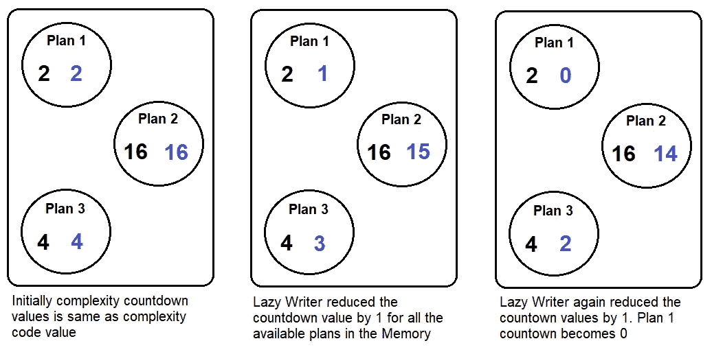
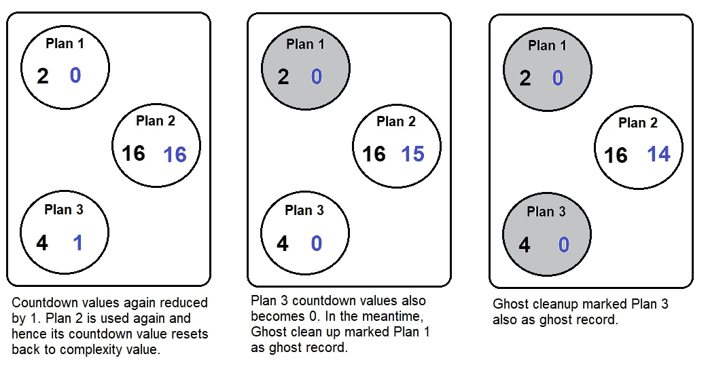

# SQL Server —惰性编写器

> 原文：<https://medium.com/codex/sql-server-lazy-writer-df06425bd452?source=collection_archive---------8----------------------->

惰性编写器是 SQL Server 中的一个进程，每个 DBA 都应该了解它。惰性编写器负责从缓存中丢弃未使用的页面。在我们了解一个懒惰的编写器是如何工作的之前，让我们后退一步，理解为什么它需要从缓存中移除未使用的页面。

SQL Server 只处理内存中的数据。SQL Server 在内存中有一个缓冲池来保存它需要的数据页。同样，SQL Server 也在称为计划缓存的内存中维护查询计划。当数据仅在磁盘中可用时，SQL Server 会在处理数据之前将这些数据加载到内存中。为了平滑这个过程，应该删除内存中最近没有使用的数据，以便为新数据提供空间。SQL Server 使用一种称为 LRU-K 的算法来识别要从内存中清除的页面。惰性编写器和 Ghost 清理是从缓存中识别和移除未使用的数据或计划的两个进程。

SQL Server 应该知道哪些数据或计划没有被使用，惰性编写器有助于识别未使用的数据或计划。让我们看看懒惰的作者如何帮助清理查询计划。

创建并保存在内存中的每个查询计划都有两个值，一个是复杂度代码值，另一个是复杂度倒计时值。复杂性代码值指示查询计划的复杂程度以及重新生成它的难度。复杂度倒计时值表示最近使用该查询的时间。惰性编写器使用这两个值来帮助 SQL Server 确定未使用的计划。

最初，当创建查询计划时，复杂性倒计数的值与复杂性代码的值相同。惰性编写器定期启动，并每次将倒计时值减 1，直到它变为 0。每当使用查询计划时，倒计时值重置回其复杂性代码值。

具有最小倒数计数值的查询被认为是最近没有被使用的查询，并且可以被丢弃。但是，与复杂查询相比，不太复杂的查询将具有较小的值，即使它最近被使用过。是的，甚至有时 SQL server 决定不存储一些简单的即席查询的查询计划，因为每次都很容易重新生成。

当复杂性倒计时值变为零时，查询计划是否会立即从计划缓存中删除？不，Ghost cleanup 会定期启动，并将这些计划标记为 Ghost 记录，准备丢弃。当 SQL server 感受到内存压力时，将从计划缓存中删除幻像计划，否则，计划将保留在计划缓存中。SQL Server 也使用类似的方法从内存中清除数据页。

让我们总结一下，Lazy writer 使用 LRU-K 算法来确定未使用的数据页或查询计划。Ghost cleanup 会将未使用的页面标记为 Ghost 记录，当内存出现压力时，会将它们从内存中删除。感谢你阅读这篇文章。我希望你喜欢它。喜欢请分享。