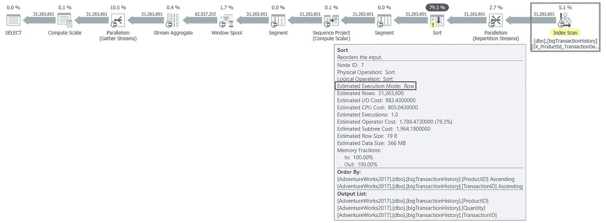
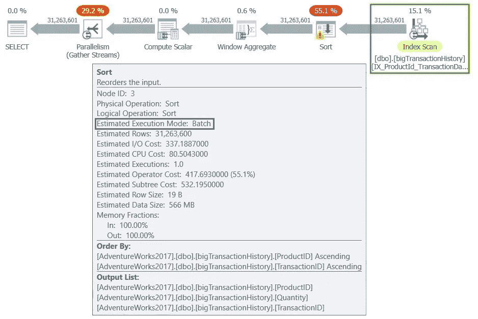
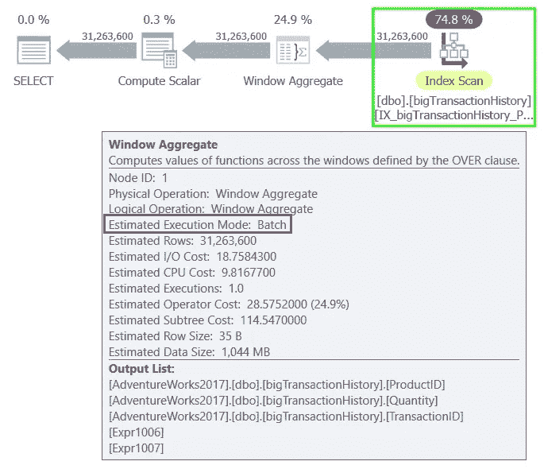

# SQL Server 查询模式执行和列存储索引

> 原文：<https://medium.com/codex/sql-server-query-mode-execution-and-columnstore-indexes-fa05152c0753?source=collection_archive---------6----------------------->

## 在 SQL Server 2017 上“无”列存储索引激活批处理模式执行的魔术！

本文介绍了两种 SQL Server 查询处理方法，即行模式执行和批处理模式执行。我们还将描述在 SQL Server 2017 上启用批处理模式执行的独特机制，即使您无法创建列存储索引。

## 行模式执行

行模式执行是一种用于传统的基于磁盘的表的查询处理方法，其中数据以行格式存储。使用这种传统存储格式的表也称为“行存储表”。当执行查询并访问行存储表中的数据时，执行树操作符和子操作符读取表模式中指定的所有列中的每个所需行。然后，SQL Server 从读取的每一行中检索结果集所需的列，如 SELECT 语句、联接谓词或筛选谓词所引用的列。

对于 OLTP 场景，行模式执行非常有效，但是在扫描大量数据时，例如在数据仓库场景中，效率可能较低。

## 批处理模式执行

批处理模式执行是一种用于同时处理多行的查询处理方法。这种方法基于向量的使用，批处理中的每一列都作为向量存储在单独的内存区域中。批处理模式执行使用针对多核 CPU 优化的算法，确保更高的内存吞吐量。批处理方法的第一个实现是与 columnstore 存储格式紧密集成和优化的，但是这是两个独立的特性。

当查询以批处理模式执行并访问列存储索引中的数据时，执行树操作符和子操作符一起读取列段中的多行。SQL Server 只读取结果所需的列，如 SELECT 语句、联接谓词或筛选谓词所引用的列。批处理模式执行是非常高效的数据仓库场景，在这种场景中，要读取和聚合大量数据。

批处理模式执行已经随着时间的推移而扩展，因此从 SQL Server 2019 和 Azure SQL 数据库开始，它不需要使用列存储索引。这是 rowstore 上新的批处理执行模式，允许您在没有列存储索引的情况下在分析工作负载中同时处理多行。在 SQL Server 2019 和 Azure SQL 数据库中对 rowstore 执行批处理模式，可以为所有支持此功能的执行计划操作符启用批处理模式。

你们中的一些人想知道，在不添加列存储索引的情况下，是否有可能在 SQL Server 2017 中启用行存储的批处理执行模式…你所想的可能有一个技巧，让我们看看如何实现！

我们将在其上运行示例查询的数据库是兼容级别设置为 SQL Server 2017 (140)的 [AdventureWorks2017](https://docs.microsoft.com/en-us/sql/samples/adventureworks-install-configure?WT.mc_id=DP-MVP-4029181) 。AdventureWorks2017 数据库的这一副本包含 dbo.bigTransactionHistory 表，该表是由于由[亚当·基尼克](https://www.linkedin.com/in/adammachanic)开发并发表在他的文章 [Thinking Big (Adventure)](http://dataeducation.com/thinking-big-adventure/) 中的脚本而添加的。该表包含很多被管理产品的交易，它包含 31.263.601 行！

考虑以下查询，该查询提取仓库中产品的动态库存水平，并返回根据仓库数量计算的累计。返回的数据集按产品标识符和交易标识符排序。

```
SELECT
  ProductID
  ,TransactionID
  ,Quantity
  ,SUM(Quantity) OVER(PARTITION BY ProductID ORDER BY TransactionID ROWS BETWEEN UNBOUNDED PRECEDING AND CURRENT ROW)FROM
  dbo.bigTransactionHistory
ORDER BY
  ProductID
  ,TransactionID;
```

为查询生成的执行计划使用并行性，IX_ProductId_TransactionDate 索引被完全读取(索引扫描),因为没有过滤谓词。排序运算符按 TransactionID、ProductID 和数量对数据进行排序。

排序操作(排序任务)是执行计划中开销最大的操作，它也用警告符号(排序警告)突出显示，因为它使用 tempdb 系统数据库(在 tempdb 上溢出)。随后，在执行流中，数据按 ProductID(段)进行分区，并进行聚合(流聚合)以计算 Quantity 列上的运行总数。

如下图所示，查询计划中的所有任务都是以“行模式”执行的。



图 1 —行模式执行

在测试环境中，这个查询的执行需要 40 秒(不返回数据)。如果以批处理模式运行，此查询将具有巨大的优势，但我们没有 SQL Server 2019，并且我们不想向 dbo.bigTransactionHistory 表添加列存储索引，因为它会受到 OLTP 工作负载的影响。

我们可以使用一个技巧:**创建一个过滤后的 columnstore 索引，其过滤谓词包含一个矛盾**，比如请求让 TransactionID 列同时等于-1 和-2！过滤后的 columnstore 索引将为空，因此它不会给 DML 查询增加任何开销，同时，它将激活批处理模式处理！

下面的 T-SQL 代码实现了对 dbo.bigTransactionHistory 表创建筛选的列存储索引。

```
CREATE NONCLUSTERED COLUMNSTORE INDEX
  NCCX_bigTransactionHistory_TransactionID
    ON dbo.bigTransactionHistory (TransactionID)
    WHERE (TransactionID = -1 AND TransactionID = -2);
```

因为我们现在有了一个列存储索引(即使为空),所以启用了批处理模式执行，执行计划继续以并行性为特征，但是除了索引查找之外，操作符都以批处理模式工作。排序运算符仍然具有最高的开销，但向窗口聚合运算符提供数据，该运算符已取代了段、序列项目、窗口假脱机和流聚合运算符，如下图所示。



图 2 —批处理模式执行

在测试环境中，查询的执行大约需要 20 秒(不返回数据)。与前一次运行相比时间减半(行模式执行)。

通过在 ProductID 和 TransactionID 列上创建以下索引并包含 Quantity 列(在 INCLUDE 子句中)，可以提高查询的性能。

```
CREATE NONCLUSTERED INDEX
  IX_bigTransactionHistory_ProductID_TransactionID
    ON dbo.bigTransactionHistory (ProductID, TransactionID)
    INCLUDE(Quantity);
```

因为现在查询有了一个覆盖的索引，所以我们有了有史以来最好的计划，批处理模式执行，无需对任务进行排序，如下图所示。



图 3 —无分类任务的批处理模式执行

## 摘要

SQL Server 2019 和 Azure SQL 数据库中的批处理模式执行不需要使用列存储索引。在 SQL Server 2017 中，可以通过创建筛选的列存储索引来激活批处理模式执行，在该索引中指定了矛盾的条件，例如(TransactionID = -1 和 TransactionID = -2)。以这种方式创建的筛选列存储索引没有维护成本，但是它将为支持这种处理方法的操作者激活批处理模式执行！

享受 SQL Server 和 T-SQL 语言！