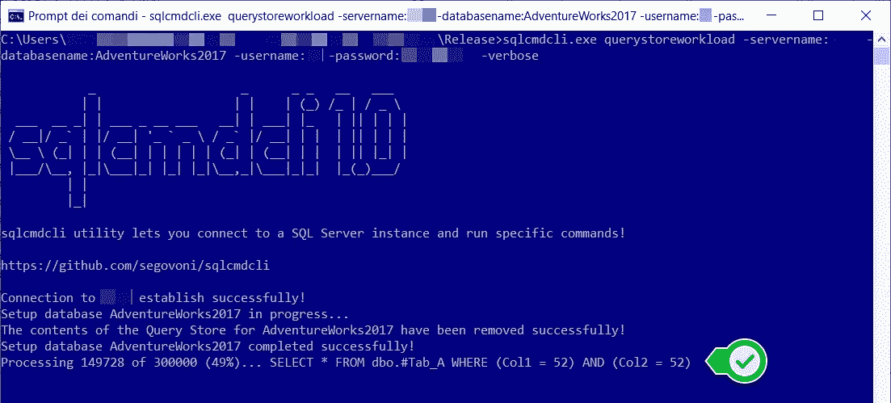
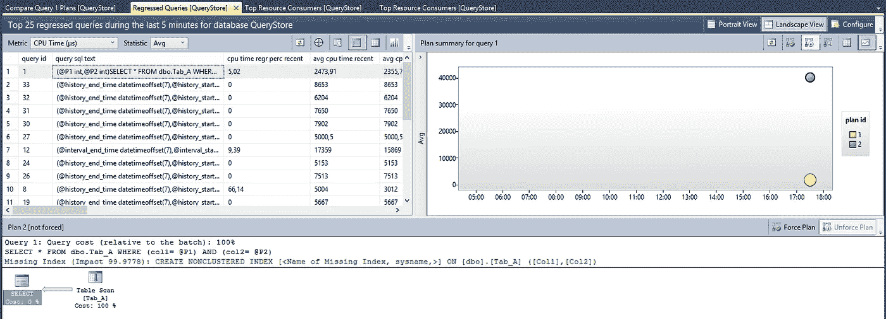
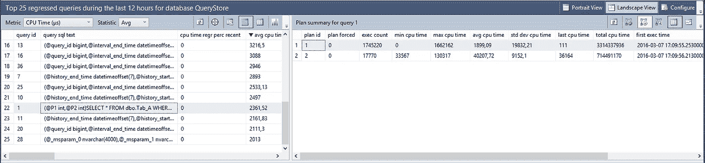
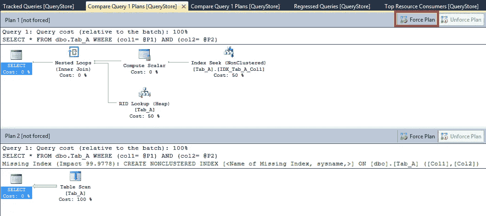
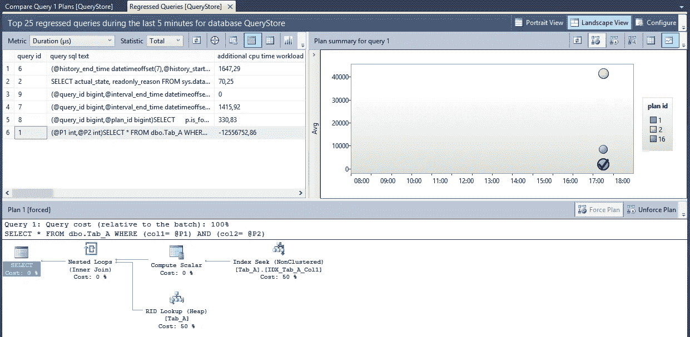

# SQL Server 查询存储:性能回归查询的故事！

> 原文：<https://medium.com/codex/sql-server-query-store-the-story-of-a-performance-regressed-query-385273d06d29?source=collection_archive---------3----------------------->

## 与查询计划选择更改相关的性能问题

在上一篇文章[SQL Server 查询存储简介](https://segovoni.medium.com/introduction-to-sql-server-query-store-9e45a563a502)中，我谈到了查询存储如何捕获数据以及它能为您做什么！现在，我将讨论与查询计划选择更改相关的性能问题，以及查询存储如何帮助我们识别变慢的查询！

为了向您展示查询存储是如何工作的，以及 DBA 如何轻松地强制执行计划(针对特定的查询)，我开发了 [sqlcmdcli](https://github.com/segovoni/sqlcmdcli) 这是一个开源的命令行实用程序，用于在 SQL Server 上以特定的交互式方式执行命令，以模拟特定的工作负载、匿名化数据等等。 [querystoreworkload](https://github.com/segovoni/sqlcmdcli/wiki#querystoreworkload-qsw) 命令运行特定的工作负载来重现查询的回归。它可以用来分析带有 [SQL Server 查询存储](https://docs.microsoft.com/en-us/sql/relational-databases/performance/monitoring-performance-by-using-the-query-store?WT.mc_id=DP-MVP-4029181)的查询的回归。一旦确定了回归，就有可能继续手动强制最佳执行计划！querystoreworkload 命令在一个长循环(300，000 次迭代)中执行以下查询。请注意参数，因为它们的值将由随机函数生成，该函数返回 0 到 100 之间的随机值。当参数值小于 2 时，该命令还会清除计划缓存。

```
SELECT
  *
FROM
  dbo.Tab_A
WHERE
  (Col1 = @Parameter1) AND (Col2 = @Parameter2);
```

让我们使用 [sqlcmdcli](http://github.com/segovoni/sqlcmdcli) 在 AdventureWorks2017 数据库上运行示例工作负载。我使用了以下命令行:

```
**sqlcmdcli.exe** querystoreworkload -servername:MyServerName -databasename:AdventureWorks2017 -username:MyUserName -password:MyPassword -verbose
```

下图显示了工作中的控制台应用程序。



sqlcmdcli—[https://github.com/segovoni/sqlcmdcli](https://github.com/segovoni/sqlcmdcli)

您可以通过 SQL Server Management Studio 以及我在上一篇文章[SQL Server 查询存储简介](https://segovoni.medium.com/introduction-to-sql-server-query-store-9e45a563a502)中提到的 dmv 来查看查询存储捕获了哪些数据。使用 SQL Server Management Studio，您可以找到一个名为“查询存储”的新分支，它位于数据库分支下。首先，双击“回归查询”菜单项，可以看到“回归查询”报告。下图显示了所选数据库在过去 5 分钟内的前 25 个回归查询。



查询存储捕获的前 25 个回归查询

如图所示，SQL Server 对同一个查询使用了两个执行计划，query_id 等于 1 的查询。这两个执行计划完全不同，plan_id 等于 2 的计划使用“表扫描”操作符来访问表 dbo。Tab_A，相反，plan_id 等于 1 的第二个使用最有效的“索引查找”从同一个表中检索数据。对于同一个查询，我们有两个执行计划，这意味着 SQL Server 根据分配给参数的不同值选择了两种不同的方法来访问数据。当分配给参数 1 和参数 2 的值等于 1 时，查询检索大约 100000 行，相反，对于其他值，查询检索不到 10 行，执行计划完全不同。存储了与每个计划相关的指标，您可以通过单击按钮“以网格格式查看计划摘要”获得这些指标，如下图所示。



query_id 1 的计划摘要

您可以注意到，与 plan_id 等于 2 的计划相比，plan_id 等于 1 的计划使用的次数更多。这两个计划在“平均 CPU 使用率”指标上也有很大的不同。与 plan_id 等于 1 的执行计划的相同指标相比，plan_id 等于 2 的计划的 CPU 平均使用率高出 20 倍。

您还可以比较两个计划的图形表示，您可以使用右侧工具栏上的“比较”按钮进行比较。比较这两个执行计划，您可能会决定对这个特定的查询强制使用其中的一个(两个或多个),查询存储使这项任务变得很容易。在这种情况下，我的选择是将 plan_id 等于 1 的计划强制用于 query_id 等于 1 的查询。我可以通过右上角的工具栏上的“强制计划”按钮来实现。



执行计划比较

SQL Server Management Studio 询问我是否确定要强制执行该计划，如果我回答是，则强制完成！从现在开始，SQL Server 查询优化器将使用我强制的计划，而不是另一个计划。



计划标识 1 已被强制用于查询标识 1

就是这样！

对于意大利人来说，在 Vimeo 的[UGISS](https://www.ugiss.org/)(SQL Server 的意大利用户组)频道上有一段关于 SQL Server 查询存储 e 自动调优的视频:

## 接下来会发生什么？

在名为 [SQL Server 2022](https://www.microsoft.com/en-us/sql-server/sql-server-2022) 的 SQL Server 下一版本中，查询存储将默认启用，并与**的**新一代**智能查询处理**相结合，将允许在一些常见场景中提高性能，而无需更改 T-SQL 代码。**参数敏感性计划** (PSP)允许为同一个参数查询缓存多个执行计划！**基数估计(CE)反馈**将为查询优化器和查询处理提供更多关于查询执行指标的详细信息，以改进未来的决策！

仅此而已！享受查询商店！