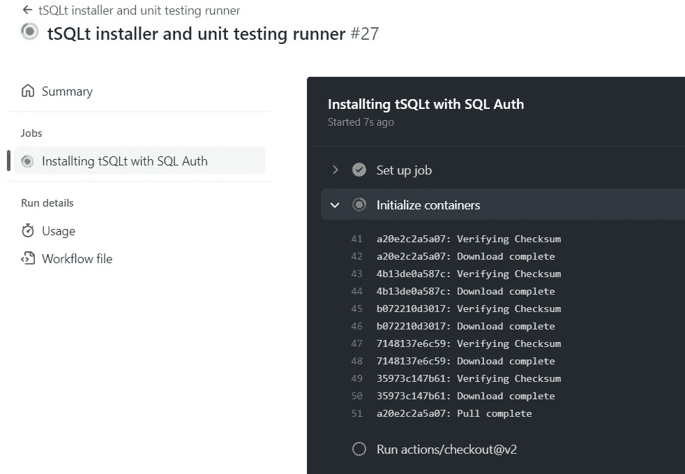

# 使用 tSQLt、Docker 和 GitHub 操作进行 SQL Server 单元测试！

> 原文：<https://medium.com/codex/sql-server-unit-testing-with-tsqlt-docker-and-github-actions-9fa48a4072a6?source=collection_archive---------3----------------------->

## 真正改变游戏规则的是自动化！


卡斯帕·卡米尔·鲁宾在 [Unsplash](https://unsplash.com?utm_source=medium&utm_medium=referral) 上的照片

在本系列的第三篇[上一篇文章](https://segovoni.medium.com/unit-testing-how-to-write-your-first-unit-test-for-t-sql-code-3bc1533acbbc)中，我们描述了如何为触发器编写和运行单元测试！本文描述了如何使用 tSQLt、Docker 和 GitHub 操作对一个或多个 SQL Server 对象进行自动化测试！

## 这里使用的技术和框架

tSQLt 是一个针对 SQL Server 的单元测试框架。它提供了创建和执行测试用例的 API，并将它们与持续集成服务器集成在一起。在我以前的文章[tSQLt 框架和测试的执行](https://segovoni.medium.com/unit-testing-the-tsqlt-framework-and-the-execution-of-a-test-e4d135c3e343)中已经描述了 tSQLt 框架的强大功能。

Docker 是最流行的系统之一，用于在称为容器的可隔离、最小且易于部署的环境中运行应用程序。由于 SQL Server 2017，SQL Server 引擎可以在 Docker 容器中运行，在 Docker 容器中运行 SQL Server 的典型用法涉及软件测试的自动化。

[GitHub Actions](https://github.com/features/actions) 是一个持续集成和持续交付(CI/CD)平台，允许您自动化您的构建、测试和部署管道。您可以创建工作流来构建和测试对存储库的每个拉请求，或者将合并的拉请求部署到生产环境中。GitHub 提供 Linux、Windows 和 macOS 虚拟机来运行您的工作流，或者您可以在自己的数据中心或云基础架构(如 Microsoft Azure)中托管自己的自托管运行程序。

## 病历

[AdventureWorks2017 数据库](https://github.com/Microsoft/sql-server-samples/releases/tag/adventureworks)包含生产。存储由假冒公司 Adventure Works LTD .管理和销售的产品的产品表。

我们编写的触发器是为了防止将价值小于 10 的新产品作为“安全库存”插入。该公司希望每种产品的库存不低于 10 件。安全库存水平对于自动程序来说是一个非常重要的值:它允许重新订购物料。新采购订单和生产订单的创建基于安全库存水平。为了使我们的触发器简单，对于插入命令，它将只响应 OnInsert 事件。

用于创建触发器和相关单元测试的 TSQL 脚本可以在 GitHub[SQL-server-demos-ci-CD](https://github.com/segovoni/sql-server-demos-ci-cd)存储库中找到，存储过程 production . USP _ Raiserror _ SafetyStockLevel 集中处理错误。

## 使用 tSQLt、Docker 和 GitHub 操作执行无人值守单元测试

触发器和相关单元测试的实现已经完成，下一个挑战是**在库的主分支的每次提交时自动执行测试**。为了实现这个目标，有必要确定一个能够支持 Docker 容器使用的持续集成/持续交付平台。

GitHub Actions 将成为我们的 CI/CD 平台，它支持 Docker 容器的使用，并紧密集成到 GitHub 中，GitHub 是管理我们源代码的源代码控件。使用 GitHub Actions 不是唯一的可能性，但对于这个项目来说，它肯定是最合适的。

让我们继续创建一个工作流:一个自动化的、可配置的流程，它将执行一个或多个作业。工作流是用存储在保存源代码的同一个存储库中的 YAML 文件定义的。当存储库中发生事件(例如提交)时，将触发工作流。

工作流也可以手动激活或根据定义的计划激活。实现测试自动化工作流的 YAML 文件在[这里](https://github.com/segovoni/sql-server-demos-ci-cd/blob/master/.github/workflows/automated-tests.yml)可用，基本步骤是:

*   激活事件的定义
*   从 Linux 上的 SQL Server 映像创建 Docker 容器
*   AdventureWorks2017 数据库恢复
*   tSQLt 框架的安装
*   创建要测试的数据库对象(SUT)
*   创建和执行单元测试

## 激活事件的定义

激活事件的定义通常在 YAML 脚本的开头完成，代码片段类似于下面所示。当“主”分支上发生推或拉请求事件时，工作流被激活。“workflow_dispatch”规范允许您从“操作”选项卡中手动运行工作流。

```
# Controls when the workflow will run
on:
  # Triggers the workflow on push or pull request events but only for the "master" branch
  push:
    branches: [ "master" ]
  pull_request:
    branches: [ "master" ]

  # Allows you to run this workflow manually from the Actions tab
  workflow_dispatch:
```

## 从 Linux 上的 SQL Server 映像创建 Docker 容器

从 Linux 上的 sqlserver 映像创建 Docker 容器可以通过请求 SQL Server 服务以及您想要使用的 Docker 映像的路径来完成。微软为 Linux 上的 SQL Server 提供的官方图像可在[这里](https://hub.docker.com/_/microsoft-mssql-server)获得。我们不会使用从微软注册表下载的官方图片。我们将使用安装了 AdventureWorks 数据库的 SQL Server 的 Docker 映像，此映像由 [chriseaton](https://hub.docker.com/u/chriseaton) 发布，您可以在[此链接](https://hub.docker.com/r/chriseaton/adventureworks)找到它。下面的 YAML 代码片段设置 SQL Server 服务。

```
jobs:
  windows-auth-tsqlt:
    name: Installting tSQLt with SQL Auth
    # The type of runner that the job will run on
    runs-on: ubuntu-latest

    services:
      sqlserver:
        image: chriseaton/adventureworks:latest
        ports:
          - 1433:1433
        env:
          ACCEPT_EULA: Y
          SA_PASSWORD: 3uuiCaKxfbForrK
```

为了引用新创建的 Docker 容器，将它的标识符保存在环境变量中是很重要的。以下 YAML 代码片段使用创建的容器的 ID 设置 ENV_CONTAINER_ID 变量。

```
- name: Set environment variable ENV_CONTAINER_ID
  run: echo "ENV_CONTAINER_ID=$(docker ps --all --filter status=running --no-trunc --format "{{.ID}}")" >> $GITHUB_ENV
```

## AdventureWorks2017 数据库恢复

可以使用下面的 [docker exec](https://docs.docker.com/engine/reference/commandline/exec/) 命令执行 AdventureWorks2017 数据库恢复。

```
- name: Restore AdventureWorks2017
  run: docker exec -i $ENV_CONTAINER_ID /opt/mssql-tools/bin/sqlcmd -S localhost -U SA -P "3uuiCaKxfbForrK" -Q "RESTORE DATABASE [AdventureWorks2017] FROM DISK = '/adventureworks.bak' WITH MOVE 'AdventureWorks2017' TO '/var/opt/mssql/data/AdventureWorks.mdf', MOVE 'AdventureWorks2017_log' TO '/var/opt/mssql/data/AdventureWorks_log.ldf'"
```

## tSQLt 框架的安装

AdventureWorks2017 数据库中最新版本的 tSQLt 框架的安装是使用由 [lowlydba](https://github.com/lowlydba) 发布的 GitHub Actions tSQLt 安装程序完成的，您可以在这里和[GitHub Actions market place](https://github.com/marketplace/actions/tsqlt-installer)上找到更多详细信息[。](https://github.com/lowlydba/tsqlt-installer)

用于在 AdventureWorks2017 数据库中安装 tSQLt 框架的 YAML 代码片段如下。

```
steps:
  - uses: actions/checkout@v2 - name: Install tSQLt with SQL auth on AdventureWorks2017
    uses: lowlydba/tsqlt-installer@v1
    with:
      sql-instance: localhost
      database: AdventureWorks2017
      version: latest
      user: sa
      password: 3uuiCaKxfbForrK
```

## 创建要测试的数据库对象(SUT)

测试环境已经准备好了，我们在 Docker 容器中有一个 Linux 上的 SQL Server 实例；AdventureWorks2017 数据库已还原，可以使用了。让我们继续创建触发器和存储过程(管理错误)，它们代表我们测试中的[系统(SUT)](https://en.wikipedia.org/wiki/System_under_test) 。

TR_Product_SafetyStockLevel 触发器创建脚本和 usp_Raiserror_SafetyStockLevel 存储过程创建脚本保存在 [sql-server-demos-ci-cd](https://github.com/segovoni/sql-server-demos-ci-cd) 存储库的[源目录](https://github.com/segovoni/sql-server-demos-ci-cd/tree/master/source)中。

触发器和存储过程是在附加到 SQL Server 实例的 AdventureWorks2017 数据库中创建的，执行此操作的 YAML 代码片段如下。

```
- name: Create sp usp_Raiserror_SafetyStockLevel
  run: docker exec -i $ENV_CONTAINER_ID /opt/mssql-tools/bin/sqlcmd -S localhost -U SA -P "3uuiCaKxfbForrK" -d AdventureWorks2017 -b < ./source/usp-raiserror-safetystocklevel.sql- name: Create TR_Product_SafetyStockLevel
  run: docker exec -i $ENV_CONTAINER_ID /opt/mssql-tools/bin/sqlcmd -S localhost -U SA -P "3uuiCaKxfbForrK" -d AdventureWorks2017 -b < ./source/tr_product_safetystocklevel.sql
```

## 测试单元的创建和执行

这个工作流的最后一个阶段由单元测试的创建和执行来表示。测试类和单元测试创建脚本包含在 [sql-server-demos-ci-cd](https://github.com/segovoni/sql-server-demos-ci-cd) 存储库的[单元测试目录](https://github.com/segovoni/sql-server-demos-ci-cd/tree/master/unit-test)中。

让我们继续创建专用于 TR_Product_SafetyStockLevel 触发器的测试类，我们称之为 UnitTestTRProductSafetyStockLevel。以下 docker exec 命令使用 sqlcmd，执行包含在[test-class-trproductsafetystocklevel . SQL](https://github.com/segovoni/sql-server-demos-ci-cd/blob/master/unit-test/test-class-trproductsafetystocklevel.sql)脚本中的 TSQL 命令。

```
- name: Create test class UnitTestTRProductSafetyStockLevel
  run: docker exec -i $ENV_CONTAINER_ID /opt/mssql-tools/bin/sqlcmd -S localhost -U SA -P "3uuiCaKxfbForrK" -d AdventureWorks2017 -b < ./unit-test/test-class-trproductsafetystocklevel.sql
```

让我们继续创建和执行单元测试。每个。“测试用例”系列的 sql 文件包含用于创建和运行相关单元测试的 TSQL 命令。每个存储过程只测试一个测试用例。对于 TR_Product_SafetyStockLevel 触发器，我们提供了四个测试用例。下面的 YAML 代码片段创建并运行测试单元。

```
- name: Create and run test case try to insert one wrong row
  run: docker exec -i $ENV_CONTAINER_ID /opt/mssql-tools/bin/sqlcmd -S localhost -U SA -P "3uuiCaKxfbForrK" -d AdventureWorks2017 -b < ./unit-test/test-case-try-to-insert-one-wrong-row.sql- name: Create and run test case try to insert one right row
  run: docker exec -i $ENV_CONTAINER_ID /opt/mssql-tools/bin/sqlcmd -S localhost -U SA -P "3uuiCaKxfbForrK" -d AdventureWorks2017 -b < ./unit-test/test-case-try-to-insert-one-right-row.sql- name: Create and run test case try to insert multiple rows
  run: docker exec -i $ENV_CONTAINER_ID /opt/mssql-tools/bin/sqlcmd -S localhost -U SA -P "3uuiCaKxfbForrK" -d AdventureWorks2017 -b < ./unit-test/test-case-try-to-insert-multiple-rows.sql- name: Create and run test case try to insert multiple rows ordered
  run: docker exec -i $ENV_CONTAINER_ID /opt/mssql-tools/bin/sqlcmd -S localhost -U SA -P "3uuiCaKxfbForrK" -d AdventureWorks2017 -b < ./unit-test/test-case-try-to-insert-multiple-rows-ordered.sql
```

我们工作流的 YAML 脚本已经完成，您可以在这里找到它[，我们只需通过从](https://github.com/segovoni/sql-server-demos-ci-cd/blob/master/.github/workflows/automated-tests.yml)[操作选项卡](https://github.com/segovoni/sql-server-demos-ci-cd/actions/workflows/automated-tests.yml)手动运行它来检查它。

如果执行的所有操作都成功，则工作流将成功完成。



## 摘要

为 SQL Server 解决方案开发的单元测试不仅仅是为了在发布之前验证需求是否已经得到满足；真正的游戏规则改变者表现为在新代码开发和错误修复过程中重复检查的可能性。测试的可重复性提供了自动化测试的能力，这是在持续集成平台中集成自动化测试的必要条件。在本文中，我们描述了如何使用 tSQLt、Docker 和 GitHub 操作来自动测试 SQL Server 对象！

感谢阅读！