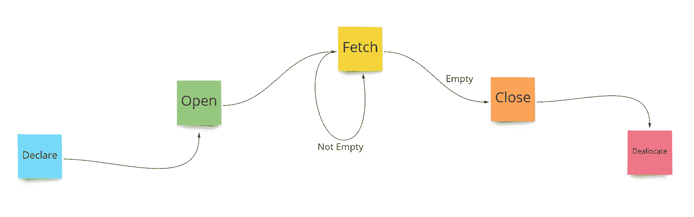

# SQL 存储过程:游标

> 原文：<https://medium.com/codex/sql-stored-procedures-cursors-2e4984d39599?source=collection_archive---------5----------------------->

在这个故事中，我们将介绍什么是游标以及有关游标的基本语法。



# 什么是 SQL 游标？

游标为我们提供了对单个记录执行操作的能力，而默认的 SQL 行为使我们能够对一组数据进行操作。游标指向数据集中的单个记录，并沿表移动以对后续记录进行操作。

游标为我们提供了一种非常精细的操作单个记录的方式，因此游标操作比通常的操作要慢，因为在单个记录中移动需要更多的时间。

现在让我们把手弄脏。

1.  **声明光标**

```
DECLARE Cursor_Name CURSOR
    FOR SELECT Col1, Col2 FROM [dbo].[table1]
```

要定义一个游标，我们只需使用`DECLARE`语句，后跟游标名称，然后将数据类型定义为`CURSOR`。游标总是为一组记录声明，然后我们使用`FOR`语句指向那组记录。`SELECT`语句后面是`FOR`语句，用于定义我们想要操作的记录集。

2.**打开&关闭光标**

```
OPEN Cursor_Name
    -- Do Something
CLOSE Cursor_Name
DEALLOCATE Cursor_Name
```

要开始使用光标，我们首先需要打开它。使用`OPEN`关键字后跟光标名称来打开它。然后我们编写使用打开的光标的代码。当使用光标的代码被执行时，我们可以使用`CLOSE`关键字后跟光标名称来关闭它。

此时，光标仍然停留在 SQL 的工作内存中，并且位于它的最后一个位置。要删除对光标的任何引用，我们只需使用`DEALLOCATE`关键字来释放与光标相关的所有内存。

3.**读取单个记录**

```
OPEN Cursor_Name
    FETCH NEXT FROM Cursor_Name
CLOSE Cursor_Name
DEALLOCATE Cursor_Name
```

为了将光标移动到第一条记录，我们使用了`FETCH NEXT FROM`子句，后跟光标名称。这将光标移动到所选记录集中的第一条记录。

4.**读取多条记录(从第一条到最后一条)**

```
DECLARE Cursor_Name CURSOR
    FOR SELECT Col1, Col2 FROM [dbo].[table1]OPEN Cursor_Name
    FETCH NEXT FROM Cursor_Name WHILE @@FETCH_STATUS=0
        FETCH NEXT FROM Cursor_NameCLOSE Cursor_Name
DEALLOCATE Cursor_Name
```

为了读取多个记录，我们使用了全局变量`@@FETCH_STATUS`。在游标能够提取记录之前，此变量等于 0。如果游标无法获取记录，则该值不为 0。所以我们使用`WHILE @@FETCH_STATUS=0`继续循环。要读取下一条记录，我们只需使用`FETCH NEXT FROM`语句。

当光标到达最后一条记录时，`FETCH NEXT FROM`没有成功获取下一条记录，并且`@@FETCH_STATUS`不再为 0，因此循环中断。至此，我们已经逐个读取了所选集合中的所有记录。

5.**读取多条记录(从最后一条到第一条)**

```
DECLARE Cursor_Name CURSOR SCROLL
    FOR SELECT Col1, Col2 FROM [dbo].[table1]OPEN Cursor_Name
    FETCH LAST FROM Cursor_NameWHILE @@FETCH_STATUS=0
        FETCH PRIOR FROM Cursor_NameCLOSE Cursor_Name
DEALLOCATE Cursor_Name
```

SQL 中有不同类型的游标。一个这样的游标是上面定义的滚动游标，在声明游标时使用`CURSOR SCROLL`关键字。滚动光标让我们使用`FETCH LAST FROM`子句从要读取的已定义记录集的最后一条记录开始读取记录。

为了从最后到第一个读取记录，我们首先将最后一个记录读入游标，然后使用`FETCH PRIOR FROM`子句在`WHILE`循环中向上移动。

*注意:滚动光标还允许我们使用类似于* `*FETCH FIRST FROM*` *的子句来访问第一条记录。如果光标刚刚打开，这相当于* `*FETCH NEXT FROM*` *。主要区别是滚动光标让我们直接滚动到给定集合中的不同记录，而普通光标从开始移动到结束。*

6.**读取第 n 条记录**

```
DECLARE Cursor_Name CURSOR SCROLL
    FOR SELECT Col1, Col2 FROM [dbo].[table1]OPEN Cursor_Name
    FETCH ABSOLUTE 5 FROM Cursor_NameCLOSE Cursor_Name
DEALLOCATE Cursor_Name
```

为了直接读取第*条记录，我们将再次使用滚动光标。在上面的例子中，我们读取了给定集合中的第 6 条*记录(假设它至少有 5 条记录)。我们简单地使用`FETCH ABSOLUTE N-1 FROM`子句。这里的 *N* 是我们要读取的第*N*条记录。

为了向后读取记录，我们简单地使用`FETCH ABSOLUTE -N FROM`。这将让我们从末尾读取第 n 条记录。在下面的例子中，我们从集合的末尾读取第 5 条记录。

```
DECLARE Cursor_Name CURSOR SCROLL
    FOR SELECT Col1, Col2 FROM [dbo].[table1]OPEN Cursor_Name
    FETCH ABSOLUTE -5 FROM Cursor_NameCLOSE Cursor_Name
DEALLOCATE Cursor_Name
```

7.**读取记录时步进**

```
DECLARE Cursor_Name CURSOR SCROLL
    FOR SELECT Col1, Col2 FROM [dbo].[table1]OPEN Cursor_Name
    FETCH ABSOLUTE 5 FROM Cursor_NameWHILE @@FETCH_STATUS=0
        FETCH RELATIVE 10 FROM Cursor_NameCLOSE Cursor_Name
DEALLOCATE Cursor_Name
```

上面的代码让我们从集合的第五条记录开始。然后我们使用`FETCH RELATIVE N FROM`从当前点跳转 N 条记录。循环中读取的下一个记录将是第 16 个*记录。*

为了逆向阅读，我们简单地否定了关键字`RELATIVE`后面的数字。

```
DECLARE Cursor_Name CURSOR SCROLL
    FOR SELECT Col1, Col2 FROM [dbo].[table1]OPEN Cursor_Name
    FETCH ABSOLUTE -5 FROM Cursor_NameWHILE @@FETCH_STATUS=0
        FETCH RELATIVE -10 FROM Cursor_NameCLOSE Cursor_Name
DEALLOCATE Cursor_Name
```

8.**变量和光标**

```
DECLARE @ValCol1 INT
DECLARE @ValCol2 VARCHAR(100)DECLARE Cursor_Name CURSOR
    FOR SELECT Col1, Col2 FROM [dbo].[table1]OPEN Cursor_Name
    FETCH NEXT FROM Cursor_Name
        INTO @ValCol1, @ValCol2WHILE @@FETCH_STATUS=0
        FETCH NEXT FROM Cursor_Name
            INTO @ValCol1, @ValCol2
        SELECT @ValCol1, @ValCol2CLOSE Cursor_Name
DEALLOCATE Cursor_Name
```

为了将光标的值读入变量，我们首先创建`@ValCol1`和`@ValCol2`来分别存储`Col1`和`Col2`的值。接下来，在`FETCH NEXT FROM`语句之后，我们使用`INTO`关键字，后跟声明用来存储列值的变量的名称。

我们在`WHILE`循环的代码块中使用了类似的语法。然后我们做一个`SELECT`来输出读入变量的值。

9.**光标范围**

```
DECLARE Cursor_Name CURSOR GLOBAL
    FOR SELECT Col1, Col2 FROM [dbo].[table1]OPEN Cursor_Name
    -- Do SomethingCLOSE Cursor_Name
DEALLOCATE Cursor_Name
```

我们有两种类型的光标`GLOBAL`和`LOCAL`。如上所示，我们可以通过在关键字`CURSOR`之后的游标声明语句中使用相应的关键字来定义这个范围。

局部游标仅在给定的一批语句中可用，而全局游标在当前连接引用中的任何位置都可用。为了更好地理解，下面的代码将导致一个错误，因为本地光标在当前批处理的范围之外。

```
DECLARE Cursor_Name CURSOR LOCAL
    FOR SELECT Col1, Col2 FROM [dbo].[table1]
GOOPEN Cursor_Name
    -- Do SomethingCLOSE Cursor_Name
DEALLOCATE Cursor_Name
```

10.**光标类型**

到目前为止，我们已经讨论了两种类型的游标:

1.  仅向前
2.  卷轴。

“仅向前”是默认光标，仅在一个方向读取，即相对于其当前位置向前。滚动光标让我们读取第*条*条记录，也让我们向前(`NEXT`)、向后(`PRIOR`)读取，并以步长跳过中间记录(`RELATIVE N`)。

其他类型的光标:

1.  快进
2.  静态
3.  动态的
4.  键盘

*请参考本* [*微软文档*](https://docs.microsoft.com/en-us/sql/t-sql/language-elements/declare-cursor-transact-sql?view=sql-server-ver15) *了解这些光标类型的更多详情。*

到目前为止，我们已经讨论了光标的基础知识。下次让我们看看如何用游标修改数据。如果您还没有检查 SQL 和存储过程 *中的* [*循环，请确保检查最后一个帖子。*](/@yuvrendergill21/sql-stored-procedures-loops-a3cb6d6114a9)