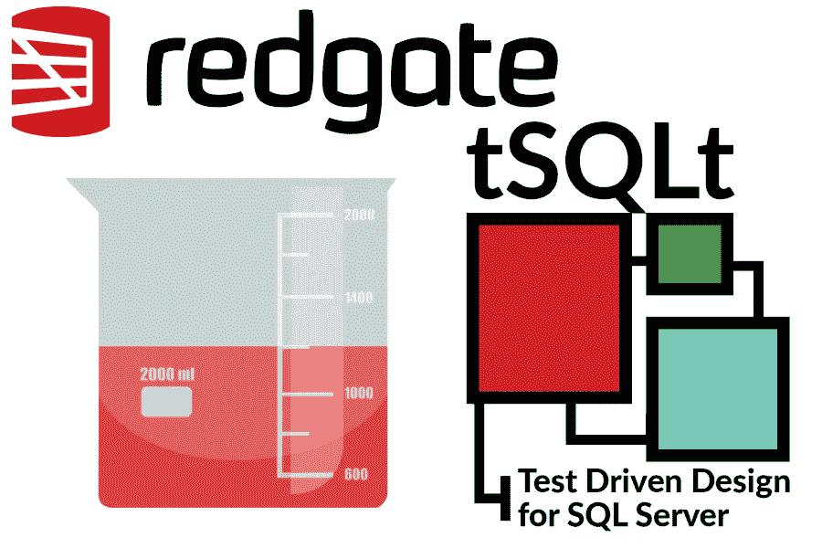
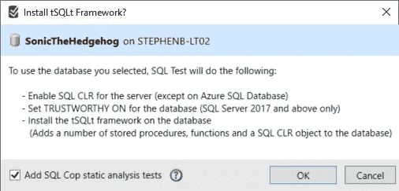
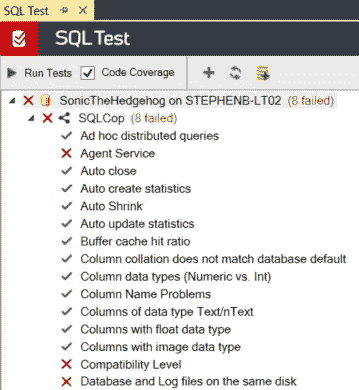
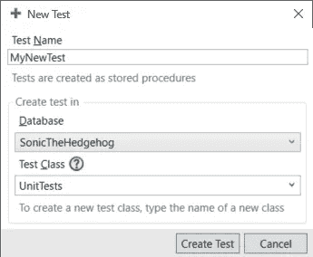
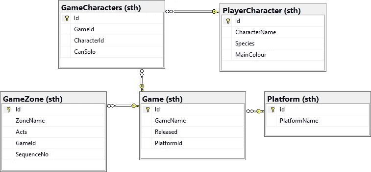
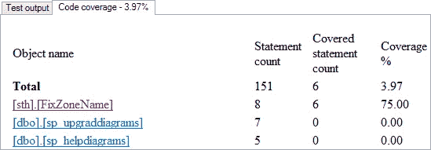
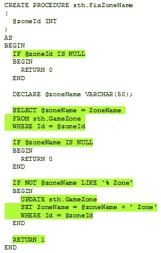

# 使用 Redgate 和 tSQLt 进行 SQL 单元测试

> 原文：<https://medium.com/codex/sql-unit-testing-with-redgate-and-tsqlt-329917829f42?source=collection_archive---------10----------------------->



来自[的阿历克斯·戈加](https://openclipart.org/detail/227338/beaker-vaso-de-precipitado-bequer-becher)的剪贴画

当我和我的团队处理一个令人毛骨悚然的逻辑时，我们经常发现为相关代码编写单元测试很有用。这有助于我们定义和记录我们的期望，减轻手动测试的负担，并让我们安心，新的代码更改不会破坏我们目前所拥有的。直到最近，我还用 C#、JavaScript、Java 和 Delphi 做过单元测试，但从未用 SQL 做过。

Redgate 是一家提供各种产品的公司，这些产品使数据库的各方面工作变得更加容易。他们的产品之一， [SQL Test](https://www.red-gate.com/products/sql-development/sql-test/) ，允许开发者用 T-SQL 做单元测试。它基于开源的 tSQLt 框架，也是我们在 SQL Server 中对存储过程进行单元测试时所使用的。

# 设置

## 正在安装 SQL 测试

我们将 SQL Test 作为 [SQL Toolbelt](https://www.red-gate.com/products/sql-development/sql-toolbelt/) 的一部分安装，尽管看起来它也可以作为一个独立的产品使用。你可以开始 28 天的免费试用，但要知道 Redgate 并不便宜。

## 安装 tSQLt 框架

要将 tSQLt 安装到数据库上，请启动 SQL Server Management Studio (SSMS ),然后单击 SQL Toolbelt 中的 SQL Test 按钮。如果您还没有任何正在测试的数据库，这将显示一个空列表。单击“添加数据库…”按钮，提示您选择一个数据库。选择一个数据库，然后单击“添加数据库”。这将显示以下对话:



安装 tSQLt 框架

首先注意 SQL Test 警告它将对数据库进行的更改。不幸的是，这些变化是安装框架所必需的。我建议使用数据库的开发副本，这样就不会影响到其他环境。

其次，注意您可以选择添加 [SQL Cop](https://github.com/red-gate/SQLCop/) 静态分析测试。这是一组预制的测试，根据一组标准检查您的数据库，例如，所有的表都有主键，所有出现的`VARCHAR`类型都有指定的大小。这些测试被添加到它们自己的模式中，即`SQLCop`。



SQL Cop 测试运行的示例

例如，如果我在数据库上运行 SQL Cop 测试，那么“没有任何数据的表”测试就会失败。单击失败的测试会在右边的窗格中显示测试输出，在我的例子中会写出空表的名称:

```
Test Procedure: [SonicTheHedgehog].[SQLCop].[test Tables without any data] on STEPHENB-LT02
[SQLCop].[test Tables without any data] failed: (Failure)
Empty tables in your database:[sth].[Character]
[sth].[GameCharacters]
[sth].[Zone]
```

不管您是否安装了 SQL Cop，您都会看到在模式`tSQLt`下创建的对象。这些对象将由测试框架隐式使用，或者由您在编写单元测试时显式使用。

# 创建单元测试

单击“New test…”按钮(带有大加号图标的按钮)会弹出下面的窗口，提示您输入测试名称和测试类。



创建新测试

测试名称将用作测试所基于的存储过程的名称(前缀为单词“test”和一个空格)。test 类将确定底层模式的名称，并用于在 UI 中对测试进行分组。

一旦您创建了一个新的测试，您就会看到一个 SQL 脚本，它改变了您新创建的测试过程。该模板遵循流行的[Arrange–Act–Assert](https://automationpanda.com/2020/07/07/arrange-act-assert-a-pattern-for-writing-good-tests/)模式(尽管术语“组装”被用来代替“排列”)。

1.  **安排/组装:**为你正在测试的代码设置先决条件。这可能包括伪造一个表格(更多内容见下文)和插入一些数据。
2.  **Act:** 运行被测代码。这可能是执行存储过程或调用函数。
3.  **断言:**检查运行代码的实际结果，并将它们与预期结果进行比较。为此，tSQLt 提供了许多断言函数。

这种结构促使你仔细考虑测试的前提条件、主题和后置条件。从现在开始，对测试进行更改意味着对这个存储过程进行修改。

## 可重新运行的测试

SQL Test 在执行后自动回滚的事务中运行每个单元测试。这意味着测试可以重复运行并且行为一致，但也意味着您的测试代码不会对您的数据进行持久的更改。

## 伪造数据库对象

编写单元测试的一个常见挑战是隔离依赖关系。我们希望我们的测试代码关注被测试的功能。我们还希望我们的测试是健壮的，也就是说，我们不希望它们因为系统的无关部分的改变而失败。

在像 Java 和 C#这样的编程语言中，这个问题通常通过模仿或存根接口来解决。tSQLt 框架提供了帮助“伪造”表或函数的实用程序。

在 [FakeTable](https://tsqlt.org/user-guide/isolating-dependencies/faketable/) 的情况下，给定的表被替换为一个空表，该空表是原始表的逐列副本。然而，这个副本没有复制任何约束，这意味着在设置前提条件时，您不必担心关系数据。例如，下表存储了出现在每个刺猬索尼克游戏中的[区域](https://sonic.fandom.com/wiki/Zone):

```
CREATE TABLE sth.GameZone
(
  Id INT NOT NULL,
  ZoneName VARCHAR(50) NOT NULL,
  Acts INT NOT NULL DEFAULT 2,
  GameId INT NOT NULL,
  PRIMARY KEY (Id),
  FOREIGN KEY (GameId) REFERENCES sth.Game (Id)
)
```

由于`sth.Game`的外键，在我们可以将行插入到`sth.GameZone`之前，我们首先需要将相关数据插入到`sth.GameZone`表中。在正常情况下，这是一件好事，但在这里，它只会增加我们的测试代码。因此，我们称它为 FakeTable:

```
EXEC tSQLt.FakeTable @TableName = 'sth.GameZone'
```

在内部，这将重命名原始表，并在测试期间在其位置创建一个假表。现在我们可以插入到`sth.GameZone`中，而不用担心外键或任何其他约束——我们所关心的是它如何影响被测代码。

有关更多信息，请参见 tSQLt 文档中的[隔离依赖关系](https://tsqlt.org/user-guide/isolating-dependencies/)部分。

## 坚持期望

tSQLt 框架为断言代码的预期结果提供了几个助手过程。这些包括比较两个标量值的简单断言，例如`AssertEquals`和`AssertLike`。不出所料，只要不满足条件，这些过程就会使您的测试失败。

还有一些表格级别的断言也非常有用——在这些断言中，我们发现`AssertEqualsTable`特别强大。该过程比较每个表中的所有行，允许您非常精确地指定数据的“之前”和“之后”状态。当表内容不同时，测试生成如下输出:

```
|_m_|Id|Name                |Released               |PlatformId|
+---+--+--------------------+-----------------------+----------+
|<  |3 |Sonic & Knuckles    |1994-10-18 00:00:00.000|1         |
|=  |1 |Sonic the Hedgehog  |1991-06-23 00:00:00.000|1         |
|=  |2 |Sonic the Hedgehog 2|1992-11-21 00:00:00.000|1         |
|>  |3 |Sonic the Hedgehog 3|1994-05-27 00:00:00.000|1         |
```

请注意，这个文本表使用了比较表中的列和值，并添加了`_m_`列。这里，`=`(等于)用于标记完全匹配的行。`<`(小于)符号表示出现在预期表中但不在实际表中的行，而`>`(大于)表示相反的情况。

在我的例子中，缺少“Sonic & Knuckles”行，因为它包含在预期的结果集中，但在实际的表中却没有。另一方面,“刺猬索尼克 3”的行是意外的，因为它出现在实际的表中，尽管不存在于预期的表中。

关于使用`AssertEqualsTable`的更多信息，参见[本页](https://tsqlt.org/user-guide/assertions/assertequalstable/)。

## 奖励:断言错误

我想测试在某些情况下我的过程会抛出一个异常(即它调用了`RAISERROR`)。我并不清楚如何使用 [ExpectException](https://tsqlt.org/user-guide/expectations/expectexception/) ，因为任何异常都会自动使我的测试失败，不管它是否是预期的。

我发现解决方案是在一个`try…catch`块中调用我的过程和断言，例如

```
CREATE PROCEDURE MyTests.[test ExpectException]
AS
BEGIN
  BEGIN TRY
    -- Call the proc that raises the error
    EXEC endTheWorld

    -- Tell tSQLt to expect the exception
    EXEC tSQLt.ExpectException @ExpectedMessage = 'The apocalypse is here', @ExpectedSeverity = NULL, @ExpectedState = NULL;
  END TRY
  BEGIN CATCH
    -- No need to do anything here
  END CATCH
END;
```

# 简单的例子

继续我之前的刺猬索尼克的例子，让我们假设我的数据库具有如下所示的模式:



刺猬索尼克示例数据库的模式

假设我有一个存储过程`FixZoneName`，它会在区域名称的末尾添加单词“Zone ”(如果它还不存在的话)。下面是单元测试的一个示例:

该测试执行以下操作:

1.  伪造`GameZone`表，这样我们就不必处理对`Game`和`Platform`表的依赖。
2.  将测试数据插入假`GameZone`表。
3.  执行被测程序，即`FixZoneName`。
4.  查询`GameZone`的内容，并使用`AssertEqualsString`确认记录按预期更新。

这有点简单，但是它演示了一个测试的基本结构。

# 代码覆盖率

当您在 SQL Test 中运行测试时，您会发现除了测试输出之外，它还提供了一个关于代码覆盖率的报告，例如



SQL 测试中的代码覆盖率

这个报告的一个漂亮的特性是过程名是可点击的。这样做可以向下滚动到该过程的代码，其中 SQL Test 突出显示了测试所覆盖的语句。



FixZoneName 中包含的语句

# 解决纷争

我发现在某些数据库上，我的测试无法运行。相反，它们在`System.Data.SqlClient.SqlException`上失败，并显示如下错误消息:

```
Cannot access CLR. Assembly might be in an invalid state. Try running EXEC tSQLt.EnableExternalAccess @enable = 0; or reinstalling tSQLt.
```

在我的例子中，这条消息建议的 SQL 命令不起作用。然而，我在这篇[有用的文章](https://www.red-gate.com/simple-talk/databases/sql-server/tools-sql-server/ten-things-i-wish-id-known-when-i-started-using-tsqlt-and-sql-test/)中找到了一个补救方法。除了给出一些方便的技巧之外，作者还建议通过将数据库所有者改为`sa`来解决这个问题。

```
ALTER AUTHORIZATION ON DATABASE::tSQLt_Example TO sa
```

# 版本化您的测试

由于单元测试构成了数据库模式的一部分，如果您使用 SQL 源代码控制(SOC)或 SQL 变更自动化(SCA)，您的测试将被自动覆盖。测试模式和过程的处理方式与数据库中的任何其他对象相同。

在没有模式版本控制系统的情况下，另一个选择是为每个测试保存创建脚本。这可能对一个小项目有用，但是如果您的数据库很大/很复杂，您可能会发现这种方法很快就变得很麻烦。但是，如果您想尝试这种方法，请注意创建 tSQLt 测试模式与创建普通模式是不同的，例如

```
EXEC tSQLt.NewTestClass 'UnitTests';
```

这是因为 tSQLt 需要将模式标记为测试类。感谢我的同事[特什维尔](https://www.linkedin.com/in/teshvier-mathura-810aa1170/)帮助揭开了这个秘密。

本文介绍了使用 Redgate 和 tSQLt 框架进行 SQL 单元测试的基础知识。单元测试是一种非常有用的技术，看到我们能够在数据库层面上直接应用这种技术是令人兴奋的。

## 用于本文

*   SQL Server Management Studio 18 . 9 . 1
*   SQL Server 15.0.2000.5 (2019)
*   SQL 测试