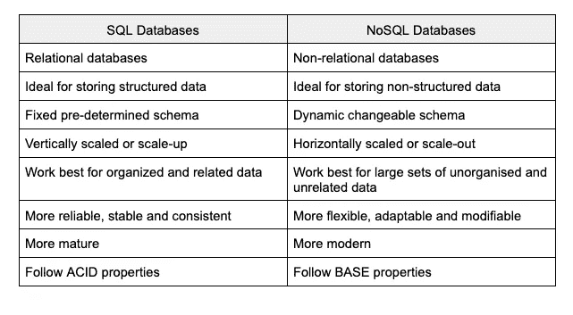

# SQL 与 NoSQL:何时使用哪个

> 原文：<https://medium.com/codex/sql-vs-nosql-when-to-use-which-86e4a008f4ed?source=collection_archive---------9----------------------->

SQL 与 NoSQL

# 介绍

用克莱夫·亨比的话说，“数据是新的石油。”

这些话在当今世界可以说是相当贴切的。但是，在这里必须提到，只有当数据被管理并提取为比原始数据更有用的形式时，数据才能得到有效利用。

因此，随着每天数据量的疯狂增长，出现了高效且有目的地管理和存储这些数据的需求。

这就是 [**数据库管理系统**](https://www.ibm.com/docs/en/zos-basic-skills?topic=zos-what-is-database-management-system) (DBMS)的用武之地。多年来，DBMS 一直被用来管理大量的数据。这里要注意的是，DBMS 的框架是为特定目的存储数据的实际数据库。

数据库基本上是可以数字化存储和访问的数据集合。例如，用于存储一批学生的考试记录的数据库实质上是该批学生中每个学生的姓名、卷号、科目、分数等数据的集合。

随着数据量的快速增长，可用数据库的数量也在增加。这给我们带来了一个基本问题，即如何选择最合适的数据库来满足特定项目的需求。

这种选择通常可以作为企业资源管理的主要决定因素。如果我们选择了错误的数据库来存储我们的数据，随着时间的推移，管理它以满足我们的需求的过程会变得很困难。

在本文的最后几节中，我们将研究这种情况。首先，让我们试着理解在选择要使用的数据库时，我们可以做哪些选择。

因此，您可能知道，主要有两种数据库可用，即

1.  SQL(或结构化查询语言)数据库，如 MySQL、PostgreSQL 等；和
2.  NoSQL(或者不仅仅是结构化查询语言)数据库，比如 MongoDB、Redis 等等。

大多数情况下，人们必须在这两大类数据库之间进行选择，以合并到一个项目中。在本文中，我们将看看每一种(SQL 和 NoSQL ),然后进行比较，讨论何时使用哪一种。

最后，我们将总结从讨论中得出的推论。

现在让我们仔细看看每一种 SQL 和 NoSQL 类型的数据库。

# 什么是 SQL？

[**SQL**](https://www.scaler.com/topics/sql/) 代表结构化查询语言。SQL 数据库类似于数据集合的表格格式。

这类似于在具有不同行和列的 Excel 表中存储数据。多年来，结构化查询语言数据库一直用于存储关系数据库管理系统(RDBMS)的数据。

这主要是因为 SQL 数据库通常被归类为关系数据库，因为它们可以有效地在数据块之间建立关系，以减少重复存储数据的冗余。我们将在接下来的章节中对此进行更深入的研究。

SQL 非常适合于存储具有明确结构的数据(这样就可以用表格格式表示)以及管理数据实体之间的关系。

SQL 数据库的一个例子可能是用于存储食堂食品订单的数据库。对于这样的数据库，要存储的信息可以很容易地组织成行和列。

此外，使用 SQL 来管理信息(如订单 ID、特定食品 ID 和特定客户 ID)也非常简单和容易。

一些广泛使用的流行 SQL 数据库有

1.  关系型数据库
2.  一种数据库系统
3.  Db2
4.  Oracle 数据库
5.  Microsoft SQL Server
6.  YugabyteDB

# 什么是 NoSQL？

**不仅代表结构化查询语言。NoSQL 数据库并没有明确的结构。**

**它可以将数据存储在各种数据结构中(比如作为键:值对的 JSON 对象，等等)，而不是在行和列中存储简单的数据条目。由于实体是复杂的数据结构，数据库可以有任何需要的结构。**

**这就是为什么这种数据库被认为比 SQL 数据库更灵活的原因。**

**然而，NoSQL 数据库是非关系数据库，因为它们不太善于非常容易地在数据实体之间建立关系。**

**然而，它们更灵活，因为它们允许我们根据应用选择最合适的结构。**

**NoSQL 数据库并不是完全没有 SQL，它们在需要时也可以支持一些 SQL 命令。**

**NoSQL 数据库的一个例子可以是用于管理脸书简档的数据库。在这样的数据库中，需要更大的灵活性。**

**这可以从如何通过将脸书的朋友彼此联系起来而产生更灵活的结构中看出。没有一个人有一定数量的朋友可以像另一个人一样排成行列。**

**因此，每个人的记录会导致数据库结构的不一致性。在这种情况下，NoSQL 数据库将是完美的选择。**

**广泛使用的一些流行的 NoSQL 数据库是**

1.  **MongoDB**
2.  **雷迪斯**
3.  **卡桑德拉**
4.  **FaunaDB**
5.  **弹性搜索**
6.  **CouchDB**

**在接下来的几节中，让我们更详细地了解一下 SQL 和 NoSQL 数据库的一些特性，以便我们可以在以后决定何时使用哪一个。**

# **SQL 的典型特征**

1.  ****模式:**模式是数据库中组织数据的结构或格式。正如我们在前面几节中讨论的，SQL 数据库有明确的结构。
    这暗示他们有一个固定的预定义模式。因此，SQL 数据库需要在使用前进行结构化和组织。换句话说，我们需要在使用 SQL 数据库之前定义它的模式。
    这几乎类似于在我们向表格中输入数据之前设计表格的格式。一旦模式确定，添加的新记录必须与模式中指定的格式相同。**
2.  ****可伸缩性:** SQL 数据库垂直伸缩或“纵向扩展”这意味着，为了增加负载，我们需要将数据移动到具有更多 RAM、CPU 或 SSD 的更大的服务器上。为了形象化这一点，人们可能会考虑如何通过在现有结构的顶部添加更多楼层来增加建筑物的商业空间。
    有时，垂直扩展可能会很困难，而且通常我们可以扩展的范围是有限的，因为在某个点之后，整合更大的磁盘空间或更复杂的处理单元可能会变得不经济。这通常会使扩展 SQL 数据库变得更加麻烦。因此，SQL 数据库是存储压缩数据首选，压缩数据不会增加太多久而久之。**
3.  ****属性:** SQL 是针对 RDBMS 应用的。因此，它具有用于事务管理的 ACID 属性。酸代表原子性、一致性、隔离性和持久性。**

**现在，让我们更详细地了解一下每个属性:**

****a .原子性:**这表示每个事务本身必须被视为一个原子单元。因此，要么全部处理，要么根本不处理。**

****b .一致性:**数据库在每次事务前后都要保持一致的状态。在任何事务中，都不能对数据库进行剧烈的更改。**

****c .隔离:**交易之间要相互隔离。它们的执行方式不应影响任何其他事务的存在。**

****d .持久性:**数据库应该能够在系统故障或重启的情况下保持更新。**

****4。可靠性:**由于它们的 ACID 属性，SQL 数据库是高度可靠的。它们的工作方式比 NoSQL 数据库更加有组织、一致和成熟。它们更加稳定，可预测，并且不太适应新的变化。**

# **NoSQL 的特色**

1.  ****模式:** NoSQL 数据库具有动态模式或可定制的结构。这就是说，并不是输入数据库的每一条记录都需要遵循严格的格式。
    使用这样的数据库不需要为构建模式做很多规划。因此，这些数据库在用例方面更加通用。我们可以根据需要修改存储在 NoSQL 数据库中的数据格式。**
2.  ****可伸缩性:** NoSQL 数据库水平伸缩或“横向扩展”这意味着，为了增加负载，可以根据需要添加额外的服务器。
    为了形象地说明这是如何发生的，我们可以说这类似于通过在现有建筑周围增加更多建筑来扩大商业空间。这使得 NoSQL 数据库比 SQL 数据库更容易扩展，也是 NoSQL 数据库的最大优势之一。通过这种方式，这些数据库的内存效率更高、更健壮，因此大量数据可以在 NoSQL 数据库的帮助下轻松存储。**
3.  **属性: NoSQL 数据库本质上不是关系型的。因此，酸性对它们来说并不重要。这种数据库被称为拥有基本属性。
    基础代表基本可用，柔软状态，最终一致。让我们更详细地看看每个属性:**

****答:基本可用:**通过跨数据库集群节点复制数据，数据将变得可用。这是即时一致性的替代方案。**

****b .软状态:**将确保数据库一致性的责任赋予开发人员，以弥补即时一致性的不足。**

****c .最终一致:**尽管缺乏即时一致性，但在数据仍然可以读取的情况下，最终还是可以达到一致性。**

**这里，有趣的是，NoSQL 数据库不仅仅是 SQL。因此，很多时候，一些 NoSQL 数据库(比如 MongoDB、Db2 等等)也可能拥有 SQL 数据库的一些属性。**

**4.**灵活性:** NoSQL 数据库无疑比 SQL 数据库更加灵活。这是由于它们的动态模式特性。**

**将这一点与增强的可伸缩性特性结合起来，它使 NoSQL 数据库更能适应新的变化。对这样的数据库进行修改非常容易，这带来了很大的弹性空间。**

# **什么时候使用 SQL？**

**SQL 数据库最适合在需要结构化关系数据的情况下使用。由于 SQL 数据库有固定的模式，它们可以非常有效地用于存储结构化数据。在这里，结构化数据可能是更静态的记录，比如管理酒店预订。**

**说静态数据最适合 SQL 数据库是说这种数据最不可能改变它的格式。因此，它很容易在 SQL 数据库中构建。**

**SQL 数据库的另一个重要用例是关系数据。SQL 非常擅长管理数据实体之间的关系，并根据需要链接记录。这有效地减少了不必要的数据重复，并允许随时随地进行实时更新。**

**如果需要在数据实体之间建立一个庞大的关系网络，SQL 数据库是完美的选择。如果我们考虑同一个管理预订的例子，我们可以看到，包含访问者信息的集合可以链接到包含可用房间信息的集合。**

**在这种情况下，如果游客想从套房换到豪华房，反之亦然，只需要改变链接，而不是必须单独改变每个集合。**

**尽管这是一个非常基本的例子，但我希望它能阐明在更复杂的情况下(比如必须同时修改多个记录)这种情况是如何发生的。**

**扩展 SQL 数据库有时会有问题。但是，对于涉及结构化和相关数据的情况，通常是可能的。不幸的是，它们不是存储大量不相关数据的最佳选择。**

**如前所述，SQL 数据库由于其 ACID 属性而极其可靠。因此，它们非常适合需要一致、稳定和可靠的数据库的应用程序。**

**这些数据库更加成熟和可预测，基本上经过了尝试和测试，因此不会出现意外情况。正是由于这个原因，金融机构使用 SQL 数据库来存储不应该被更改或丢失的重要信息。**

**SQL 数据库也非常受欢迎，因为它们易于使用和学习。他们通常只需要少量的培训，因为他们有非常标准的命令可以使用。**

**此外，由于这种标准化，有一个大型社区可以帮助解决与 SQL 查询相关的问题。**

**这使得 SQL 数据库成为存储部门存储记录等数据的流行选择，非专业人员也可以轻松管理这些数据。**

# **何时使用 NoSQL？**

**NoSQL 数据库非常适合存储非结构化数据。当涉及到数据存储的格式时，它们更加灵活。格式可以是基于文档的、仅列的、基于图形的，甚至是键值对。**

**这使得 NoSQL 数据库更有吸引力。这种灵活性也为项目进展的任何部分带来了修改的余地。**

**这种数据可能具有更不可预测的性质，例如监视数据或卫星数据，它们不一定总是以表格格式组织。**

**NoSQL 数据库是非关系数据库。这意味着它们可以用来存储不需要太多关系链接的数据。**

**这表明要存储的数据应该是不相关的，并且更具有独立的性质。尽管 NoSQL 数据库可以在一定程度上处理关系数据，但是处理大量的这类数据还是有些困难。**

**这是因为数据的非结构化性质导致了不一致性，使得管理复杂的关系变得困难。总而言之，NoSQL 数据库是存储大量不相关数据的理想选择。这样的例子可以是从电子邮件或文本文件中得到的数据。**

**使用 NoSQL 数据库的最大优点可能是它们增强的可伸缩性。如前所述，这种数据库是水平扩展的。**

**这使得它们更容易升级。它们可用于跨多个服务器存储大量不断变化的数据。这一特性确保了内存资源的最大可用性和最佳使用。**

**因此，NoSQL 数据库最适合存储大量非结构化和不相关的数据，如大数据。**

**NoSQL 数据库的另一个优点是增强了灵活性。他们有一个动态模式以及良好的可伸缩性选项。这些使它们高度灵活。他们可以轻松存储不断变化的数据，如来自社交媒体平台或在线游戏应用程序的数据。**

**与稳定一致的 SQL 数据库不同，它们的灵活性也使它们更具适应性和现代化。**

**然而，NoSQL 的数据库有点难学。这使得它们主要面向专业人士。他们需要一些正式的训练来变得熟练。**

**这就是为什么 NoSQL 数据库在基于技术的产品开发或即将到来的技术创业中最受欢迎。它们仍然很新，这意味着它们在不断变化，需要人们不断更新他们的知识。**

# ****对比表:SQL vs NoSQL****

****

# **结论**

**在本文中，我们了解了什么是 SQL 和 NoSQL 数据库。我们还讨论了这两种数据库的一些特征。基于这个讨论，我们推断出何时使用哪种数据库。**

**最后，基于本文前面讨论的观点，我们对 SQL 和 NoSQL 数据库进行了比较。**

**总之，不用说，何时使用哪个数据库的决策很大程度上取决于需要存储哪种数据以及需要存储的数据量。**

**有助于做出正确决策的另一个要点可能是，存储的数据需要如何随时间进行管理，以及需要多久在数据库中更新一次。**

**在一些应用中，确定哪个数据库最合适变得很重要，这些应用包括大数据应用、支付管理应用、金融机构数据库、人工智能/数据科学应用，甚至只是在不同的时间间隔存储信息记录。**

**在某些情况下，选择正确的数据库类型可能会影响成败。因此，了解项目的需求并选择合适的数据库变得非常重要。**