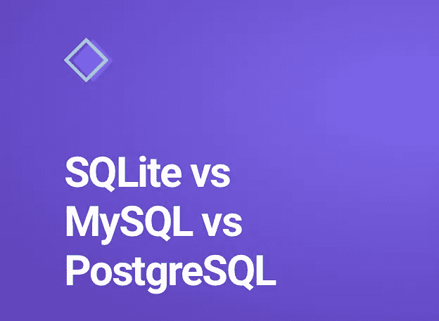

# SQLite vs MySQL vs PostgreSQL —详细指南

> 原文：<https://medium.com/codex/sqlite-vs-mysql-vs-postgresql-a-detailed-guide-67fe8ed00782?source=collection_archive---------6----------------------->

每个数据分析师、数据科学爱好者都至少使用过这些查询语言中的任何一种，即 SQLLite、MySQL 或 PostgreSQL

最近，我在之前的故事中谈到了数据库管理系统[，在这个故事中，我将经历一个新手对于各种 SQL 的主要困惑。](/codex/normalization-in-database-management-systems-dbms-1nf-2nf-3nf-bcnf-cbf6dbc214cc)

SQLite vs MySQL vs PstgreSQL —新手指南