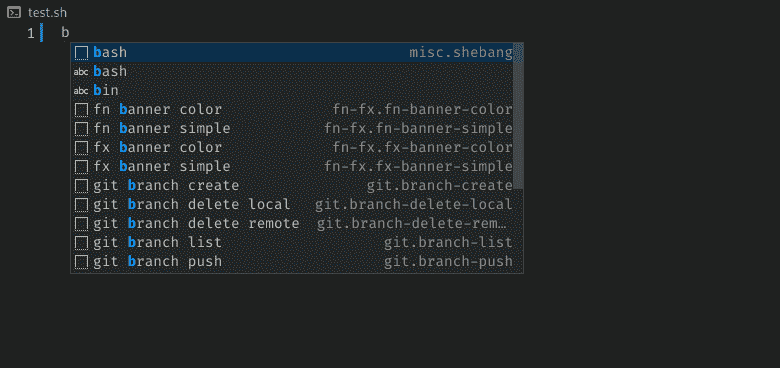

# 本周 SRE—2022 年 11 月 5 日

> 原文：<https://medium.com/codex/sre-this-week-5-nov-2022-cb1045348966?source=collection_archive---------4----------------------->

我收集了我遇到的最好的东西，并在我的 LinkedIn 帖子中分享。

本周我们讨论了:

1.  成为一个 docker-compose 向导！
2.  加速您的 python 代码
3.  简化 bash 脚本编写的 Vscode 插件
4.  加速您的 python 测试

我定期在我的 Linkedin 个人资料上写关于软件开发和 SRE 的工具和技巧。你可以在这里查看我的简介:[https://www.linkedin.com/in/vikasyadav94/](https://www.linkedin.com/in/vikasyadav94/)

# 成为一个 docker-compose 向导！

这个项目将使你成为一个 docker-compose 向导！

这是一个涵盖各种场景的 docker-compose 文件的众包集合。这些示例为如何使用 docker-compose 文件集成不同的服务并管理它们的部署提供了一个起点。

一些值得注意的例子包括
->Django
->Flask
->next cloud
->Grafana+Prometheus
->React+Express+MySQL
->Spring+Postgres
->wire guard VPN

….还有更多

无论你是专家还是初学者，这个项目都能为每个人提供很多东西。

GitHub 链接:[https://lnkd.in/ebU4ENsc](https://lnkd.in/ebU4ENsc)

有类似的项目？请在评论区分享。

[# docker](https://www.linkedin.com/feed/hashtag/?keywords=docker&highlightedUpdateUrns=urn%3Ali%3Aactivity%3A6992714188330524672)[# docker compose](https://www.linkedin.com/feed/hashtag/?keywords=dockercompose&highlightedUpdateUrns=urn%3Ali%3Aactivity%3A6992714188330524672)[# devo PS](https://www.linkedin.com/feed/hashtag/?keywords=devops&highlightedUpdateUrns=urn%3Ali%3Aactivity%3A6992714188330524672)[# sre](https://www.linkedin.com/feed/hashtag/?keywords=sre&highlightedUpdateUrns=urn%3Ali%3Aactivity%3A6992714188330524672)[# github](https://www.linkedin.com/feed/hashtag/?keywords=github&highlightedUpdateUrns=urn%3Ali%3Aactivity%3A6992714188330524672)[# open source](https://www.linkedin.com/feed/hashtag/?keywords=opensource&highlightedUpdateUrns=urn%3Ali%3Aactivity%3A6992714188330524672)

# 加速您的 python 代码

想提高 python 代码的速度吗？

熟悉多线程和多处理库的使用。Python 提供了一种非常简洁的基于上下文管理器的方法来创建线程和进程，并且使用它们比您想象的要容易得多。

更多详情请参考:
- >多处理文档:[【https://lnkd.in/eF3jqptj】](https://lnkd.in/eF3jqptj)
->线程池文档:【https://lnkd.in/efszau2U】
->链接代码:[https://lnkd.in/eZpJtSTb](https://lnkd.in/eZpJtSTb)

[# python](https://www.linkedin.com/feed/hashtag/?keywords=python&highlightedUpdateUrns=urn%3Ali%3Aactivity%3A6993447324223991808)[#多线程](https://www.linkedin.com/feed/hashtag/?keywords=multithreading&highlightedUpdateUrns=urn%3Ali%3Aactivity%3A6993447324223991808)[# open source](https://www.linkedin.com/feed/hashtag/?keywords=opensource&highlightedUpdateUrns=urn%3Ali%3Aactivity%3A6993447324223991808)[#软件开发](https://www.linkedin.com/feed/hashtag/?keywords=softwaredevelopment&highlightedUpdateUrns=urn%3Ali%3Aactivity%3A6993447324223991808)

# 简化 bash 脚本编写的 Vscode 插件

这个 vscode 插件过分简化了 bash 脚本的编写！

安装它并花一些时间来习惯它——然后看到您的 bash 脚本生产率达到一个完全不同的水平。

插件链接:[https://lnkd.in/eX6V6X9M](https://lnkd.in/eX6V6X9M)

[# vs code](https://www.linkedin.com/feed/hashtag/?keywords=vscode&highlightedUpdateUrns=urn%3Ali%3Aactivity%3A6993795064283947008)# plugin# bash# devo PS

# 加速您的 python 测试

您知道可以将 python 测试的执行时间减少 50%以上吗？🔥

如果你在你的项目中使用 pytest，并且你的测试需要很长时间来执行——考虑使用 pytest-xdist([https://lnkd.in/eFHf-VCY](https://lnkd.in/eFHf-VCY))

这一点也不新奇——它所做的只是利用更多的内核并并行运行测试。我可以用这个将 Django 项目的测试持续时间从 5 分钟缩短到 2 分钟(不需要任何调整——我确信有可能进一步延长)。

设置起来也很简单。只有两个命令。强烈推荐。

如果你正在探索 pytest，那么你可能会喜欢我的其他相关帖子:[https://lnkd.in/eY-TXDSj](https://lnkd.in/eY-TXDSj)

[#python](https://www.linkedin.com/feed/hashtag/?keywords=python&highlightedUpdateUrns=urn%3Ali%3Aactivity%3A6994199560629690368) [#pytest](https://www.linkedin.com/feed/hashtag/?keywords=pytest&highlightedUpdateUrns=urn%3Ali%3Aactivity%3A6994199560629690368)