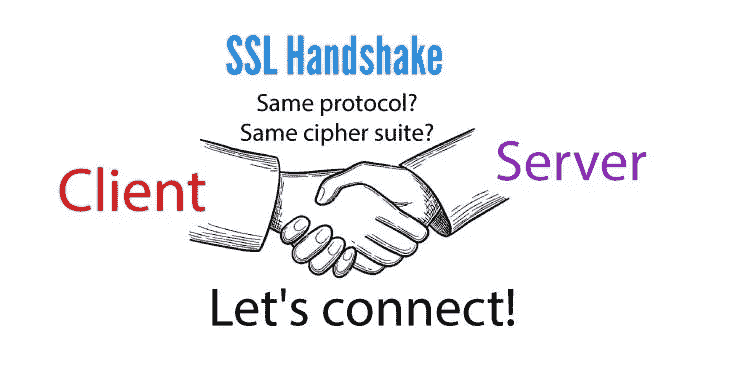

# SSL 握手失败

> 原文：<https://medium.com/codex/ssl-handshake-failure-66ffb42cff4?source=collection_archive---------13----------------------->

安全套接字层(SSL)支持客户端和服务器之间的安全连接。SSL 握手是使这种安全的网络连接成为可能的一系列步骤。

SSL 握手中的步骤摘要:

*   就要使用的加密协议版本达成一致。
*   选择加密算法—要使用的密码套件。