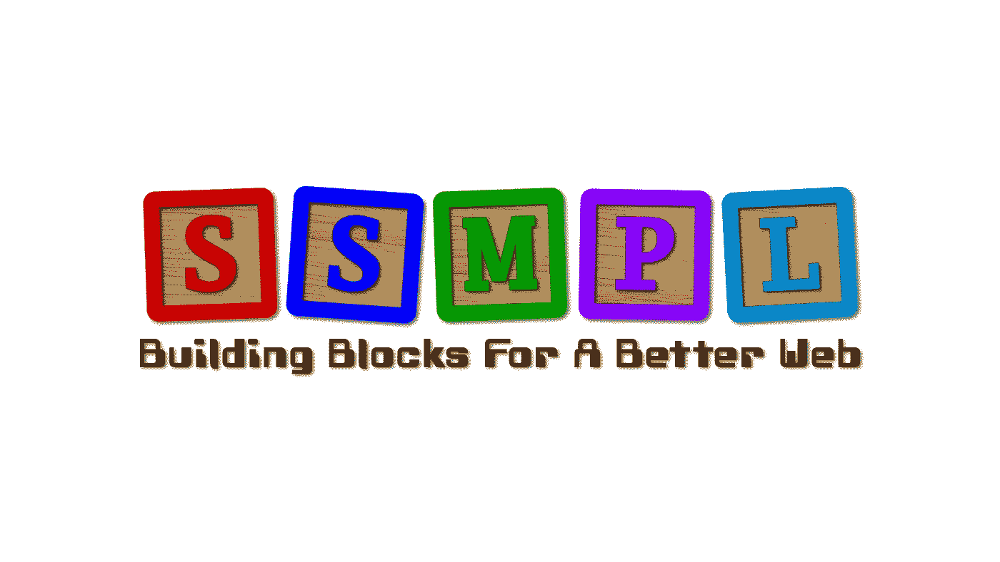

# SSMPL:一厢情愿的 HTML 替代提议。

> 原文：<https://medium.com/codex/ssmpl-a-wishful-thinking-html-replacement-proposal-1e11e8d86bf6?source=collection_archive---------2----------------------->

**第一部分，共…**

占位符徽标和标语。得有个恶心的口头禅。
易变

在过去的二十年里，我读了很多关于人们抱怨 HTML 有多“糟糕”的文章。可悲的是，在大多数情况下，抱怨最多的似乎是那些从未理解语义标记的人。他们要么认为语义对于其他语言是一样的，要么认为它没有任何合法的用途。