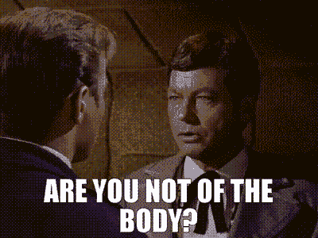

# SSMPL 第三部分，正文/内容

> 原文：<https://medium.com/codex/ssmpl-part-iii-body-content-4ac284627d21?source=collection_archive---------3----------------------->

你会被吸收。一切都好。兰德鲁很温柔。

在之前的系列文章中，我解释了我关于什么应该取代或清理 HTML 的想法。纯粹的幻想，但为什么不至少把我的想法说出来。

到目前为止，我已经实现了外部文档结构。也就是所有的文件包括元数据等等。

现在我们需要讨论页面的实际内容，这是真正的语义标记出现的地方…