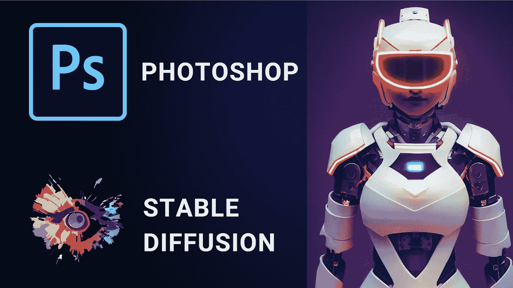

# Photoshop 中实现了稳定的扩散——以下是安装方法

> 原文：<https://medium.com/codex/stable-diffusion-arrives-in-photoshop-heres-how-to-install-3db277491023?source=collection_archive---------0----------------------->

吉姆·克莱德·蒙赫拍摄的图片

在过去的几个月里，人工智能艺术行业经历了令人难以置信的增长。在创意空间引起轰动的第一批工具是 [Dall-E2](/mlearning-ai/openais-dall-e2-is-impressive-as-f-ck-5075aa5fbd29) 和 [MidJourney](/mlearning-ai/midjourney-ai-is-now-publicly-accessible-dont-miss-it-c4c6bb77c375) ，它们都可以通过付费墙访问。

然后是[稳定扩散](/codex/stable-diffusion-finally-released-to-the-public-db1aa417d85b)，一个与 Dall-E2 和 MidJourney 并驾齐驱的开源 AI 模型。