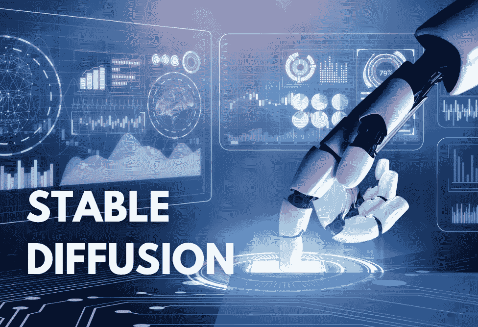

# 稳定扩散:新的免费文本到图像人工智能工具

> 原文：<https://medium.com/codex/stable-diffusion-new-and-free-text-to-image-ai-tool-70f95ea14440?source=collection_archive---------0----------------------->

吉姆·克莱德·蒙赫的图片。与 Canva 一起设计

在文本到图像人工智能生成器模型的世界里， [OpenAI 的 Dall-E2](https://openai.com/dall-e-2/) 显然是目前可用的最佳工具。

然而，它确实有一个明显的人为限制:它不能产生知名人士的图像，包括政治家和名人。此外，使用这项服务是有价格标签的。