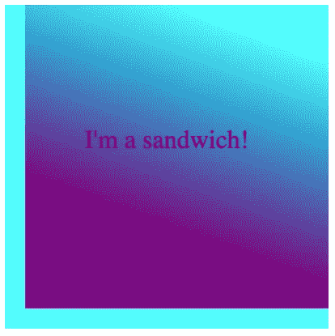

# 堆栈上下文、顺序和 Z 索引

> 原文：<https://medium.com/codex/stack-context-order-and-z-indices-8ef2f465a7bb?source=collection_archive---------14----------------------->


萨姆拉特·卡德卡在 [Unsplash](https://unsplash.com/s/photos/stack-context?utm_source=unsplash&utm_medium=referral&utm_content=creditCopyText) 上拍摄的照片

在我的[上一篇博客](https://jwood206.medium.com/?p=f7004b89892)中，我解释了如何使用 CSS 事件属性将背景色转换成渐变。当我第一次遇到它时，有一个部分让我有点困惑。令我惊讶的是，我可以将一个元素的背景同时放在另一个元素的背景前面，而又在同一个元素的内容后面。我会认为元素必须生活在一边或另一边。然而，这一切都有可能与 z 指数的力量！

第一个难题是我使用的容器的类型。我有一个父 div，并使用 CSS 创建了一个::before 伪元素。这个伪元素将成为创建它的元素的子元素，这是创建堆栈顺序的重要部分。

第二件事是堆叠上下文。堆叠环境中有很多东西。[这里的](https://developer.mozilla.org/en-US/docs/Web/CSS/CSS_Positioning/Understanding_z_index/The_stacking_context)是 Mozilla 列出的影响堆叠顺序变化的元素属性。这些属性按照从最远到最近的顺序显示如下:

> **背景和边框** —构成堆叠上下文的元素。堆栈中的最低级别。
> 
> **负 Z 索引**—Z 索引为负的后代元素的堆叠上下文。
> 
> **块级别框** —流入非内嵌级别非定位后代。
> 
> **浮动框** —非定位浮动
> 
> **内联框** —流入内联级非定位后代。
> 
> **Z-index:0**-已定位的元素。这些形成了新的叠加背景。
> 
> **正 Z 向索引** —已定位的元素。堆栈中的最高级别。

为了正确定位元素，首先需要创建一个堆叠上下文。在我的例子中，这是通过 position 属性和 z-index 属性完成的。

首先，这两个元素都有一个背景，父元素中有一些内容。我将父元素定位为相对元素，将伪元素定位为绝对元素，以保持一切对齐。现在是时候开始堆叠了！

首先，我为父元素创建了一个堆栈上下文。对于我上一篇博文中的过渡效果，我使用了 z-index 属性。这为父元素*创建了一个与页面其余部分*相关的堆栈上下文。然后，我为伪元素创建了一个堆栈上下文。通过给伪元素一个 z-index 属性，我为父元素的内容**创建了一个新的堆栈上下文。您可以通过更改 z 索引来区分它们是不同的堆栈。即使父元素的值为-100，伪元素的值为 100，伪元素仍然位于前面。请记住，这只有在父元素已经建立了堆叠上下文的情况下才有效，否则您将会相对于页面移动子元素。**

```
**#parent** {
  background-color: aqua;
  position: relative;
  width: 400px;
  height: 400px;
  z-index: 0;
  font-size: xx-large;
  text-align: center;
}**#parent::before** {
  background: ***linear-gradient***(20deg, purple 30%, aqua 87%);
  position: absolute;
  content: **""**;
  width: 375px;
  height: 375px;
  top: 0;
  right: 0;
  z-index: -1;
}
```

所以现在我们在父元素的堆栈中有了伪元素。由于堆叠顺序，我们现在可以重新定位父元素的内容。如果我们将伪元素的 z-index 设置为负数，它将移到父元素中所有内容的后面。因为父元素实际上就是父元素，所以它和它的背景在我们的堆栈中总是最远的。然而，父元素内部的内容现在被伪元素创建的堆栈所改变。内部未定位的内容将自动定位在负索引和索引为 0 的元素之间。因此，伪元素可以位于它后面的位置-1。

```
<div id=**"**parent**"**>
  I'm a sandwich!
</div>
```



这些当然不是在页面上移动和定位元素的唯一方法，但是它们展示了如何利用 CSS 来创建一些非常酷的效果。只是需要实践来弄清楚所有这些关系是如何相互作用的。

来源:

[你可能不知道的 Z-Index 房产作者史蒂文·布拉德利](https://webdesign.tutsplus.com/articles/what-you-may-not-know-about-the-z-index-property--webdesign-16892)