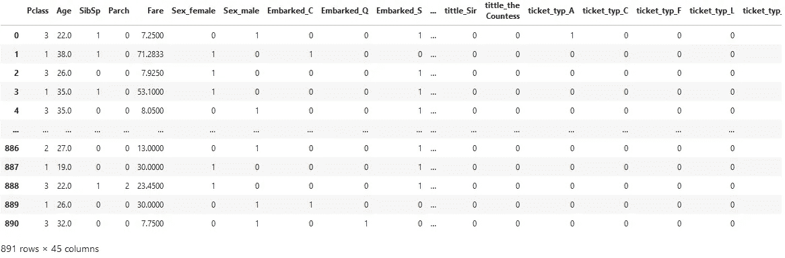
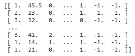

# 堆积系综建模

> 原文：<https://medium.com/codex/stacking-ensemble-modelling-5c1362ab8214?source=collection_archive---------10----------------------->


信用:[普里西拉杜普里兹](https://unsplash.com/@priscilladupreez)(unsplash.com)

堆叠(也称为堆叠概化)是一种集成建模技术，涉及多个模型预测数据的组合，用作生成新模型和进行预测的要素。被组合的模型被称为基础模型，并且它们的被用作训练最终模型的附加特征的预测被称为元特征。

堆叠广泛用于现实应用中，以获得最佳预测精度。这是一个在流行的网飞竞赛中获胜的模型，其中元特征来自单个模型，如奇异值分解(SVD)、受限玻尔兹曼机器(RBMs)和 K-最近邻(KNN)。我将建立在我的 Kaggle [泰坦尼克号](https://usmanbiu.medium.com/titanic-project-breakdown-kaggle-dataset-52cf812face5)解决方案的基础上，在那里我已经做了数据清理和模型开发。我只会结合随机森林的元特征，极端梯度推进和逻辑回归模型。

**导入必要的库**

```
from sklearn.linear_model import LogisticRegression
from sklearn.ensemble import RandomForestClassifier
from xgboost import XGBClassifier
from sklearn.model_selection import KFoldxgb = XGBClassifier(random_state =1)
rf = RandomForestClassifier(random_state = 1)
lr= LogisticRegression(max_iter = 2000)
```

我将使用随机森林分类器和极端梯度推进模型作为我的基础模型，而物流回归模型将是我的堆叠模型。
‘k fold’库将训练数据分成训练和验证文件夹，以防止在对相同数据进行训练和验证模型时发生数据泄漏，从而导致误导模型性能。

看一下“X”

```
X.head
```



# 我们基本型号的个性表现

物流回归

```
lr = LogisticRegression(max_iter = 2000)
cv = cross_val_score(lr,X,y,cv=5)
print(cv)
print(cv.mean())#output
[0.82681564 0.8258427  0.79775281 0.80898876 0.85393258]
0.822666499278137
```

随机森林- rf

```
rf = RandomForestClassifier(random_state = 1)
cv = cross_val_score(rf,X,y,cv=5)
print(cv)
print(cv.mean())#output
[0.83240223 0.80898876 0.84831461 0.75280899 0.8258427 ]
0.8136714581633294
```

极端梯度提升— xgb

```
from xgboost import XGBClassifier
xgb = XGBClassifier(random_state =1)
cv = cross_val_score(xgb,X,y,cv=5)
print(cv)
print(cv.mean())#output
[0.81005587 0.82022472 0.85955056 0.79213483 0.84269663]
0.8249325214989642
```

# 集合模型

是时候将我们的数据分成训练集和测试集了。我将使用清理后的数据集“X”及其相应的输出数据“y”来训练模型。

```
X_train, X_test, y_train, y_test = train_test_split(X, y, test_size=0.2, random_state=42)
```

“X_train”是使用“KFold”函数拆分成训练集和验证集的训练数据，而“X_test”是测试集。随机森林分类器和极端梯度推进模型将是基础模型，而逻辑回归模型将是叠加模型。

**Numpy 数组**

需要两个额外的列来存放来自两个基本分类器预测的元数据，因此，我将使用数据“X_train”和元数据创建并填充一个 Numpy 数组。

```
x_train_with_metapreds = np.zeros((X_train.shape[0], X_train.shape[1]+2)) #create a numpy array with the shape of X_train and additional 2 columns
x_train_with_metapreds[:, :-2] = X_train  #fill the numpy array with X_train
x_train_with_metapreds[:, -2:] = -1   #fill the 2 new columns with -1
print(x_train_with_metapreds)
```



带有两个附加列的 X_train 的 numpy 数组

**训练基本模型的时间**

```
from sklearn.model_selection import KFold
kf = KFold(n_splits=5, random_state=11, shuffle=True) # splitting X_train into 5 folds (4 for training and one for validation)
for train_indices, val_indices in kf.split(X_train):
    kfold_x_train, kfold_x_val = X_train.iloc[train_indices], X_train.iloc[val_indices] #extracting the training and validation folds using the row numbers/indices
    kfold_y_train, kfold_y_val = y_train.iloc[train_indices], y_train.iloc[val_indices]
    rf.fit(kfold_x_train, kfold_y_train) # fiting and training the base model
    rf_pred = rf.predict(kfold_x_val) # making and storing the predictions
    xgb.fit(kfold_x_train, kfold_y_train)# fiting and training the base model
    xgb_pred = xgb.predict(kfold_x_val)  # making and storing the predictions
    x_train_with_metapreds[val_indices, -2] = rf_pred  #filling the predictions into the numpy array
    x_train_with_metapreds[val_indices, -1] = xgb_pred
```

拟合堆栈模型并进行预测

```
lr.fit(x_train_with_metapreds, y_train)
lr_preds_train = lr.predict(x_train_with_metapreds)
```

栈模型已经拟合好了，下一步是在我们的测试集‘X _ test’上重复上面最后两个单元格中的步骤；生成元特征并对测试集进行预测。

创建 Numpy 数组

```
x_test_with_metapreds = np.zeros((X_test.shape[0], X_test.shape[1]+2)) #create a numpy array with the shape of X_train and additional 2 columns
x_test_with_metapreds[:, :-2] = X_test #fill the numpy array with X_test
x_test_with_metapreds[:, -2:] = -1 #fill the 2 new columns with -1
print(x_test_with_metapreds)
```

拟合基本模型并为测试集生成元特征

```
rf.fit(X_train, y_train)
xgb.fit(X_train, y_train)
rf_pred = rf.predict(X_test)
xgb_pred = xgb.predict(X_test)
x_test_with_metapreds[:, -2] = rf_pred
x_test_with_metapreds[:, -1] = xgb_pred
```

是时候做预测了

```
lr_preds_test = lr.predict(x_val_with_metapreds)from sklearn.metrics import accuracy_score
print('Stacked Classifier:\n Accuracy on validation data = {:.4f}'.format(accuracy_score(y_true=y_test, y_pred=lr_preds_test)))#output
Stacked Classifier:
> Accuracy on test data = 0.8436
```

从堆叠模型的精度来看，它优于单个模型，其精度为 rf=0.8137、xgb = 0.8249 和 lr =0.8226。

结束了。