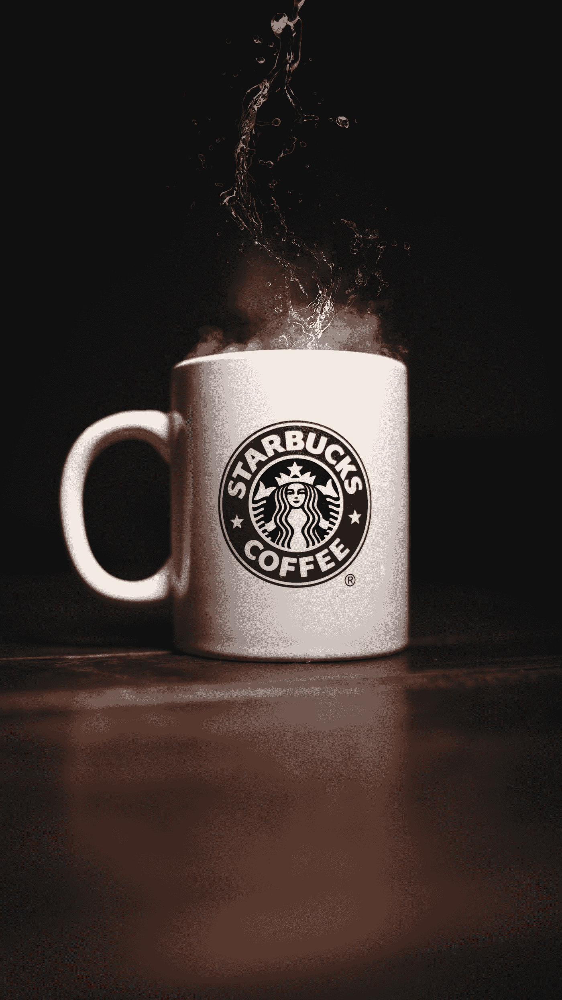

# 星巴克正在出售 NFTs——古驰加密——网飞一周损失 500 亿美元！

> 原文：<https://medium.com/codex/starbucks-is-selling-nfts-gucci-crypto-netflix-loses-50-billion-in-a-week-7d30b98c337?source=collection_archive---------4----------------------->

**星巴克**准备推出新的 **NFTs** 带*【独特的体验和好处】*据 **Techcrunch 报道，**该公司本周宣布，它计划带着独特的 **NFT 系列**进入 **Web3** ，该系列将于今年晚些时候推出。

Anton Ponomarenko 在 [Unsplash](https://unsplash.com?utm_source=medium&utm_medium=referral) 上拍摄的照片

**NFT**将*“为其所有者提供独家内容体验和其他* …