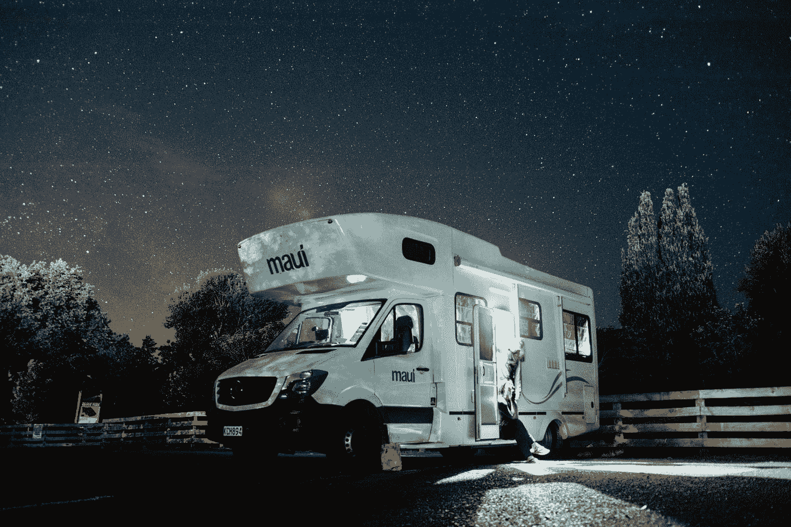

# 房车 Starlink

> 原文：<https://medium.com/codex/starlink-for-rvs-224e5a0d1437?source=collection_archive---------20----------------------->

## SpaceX 已经宣布为 RVs 开发 Starlink，这将消除洗碗的需要

[Hanson Lu](https://unsplash.com/@hansonluu?utm_source=medium&utm_medium=referral) 在 [Unsplash](https://unsplash.com?utm_source=medium&utm_medium=referral) 上的照片

**Starlink 的新房车计划允许顾客为更差的服务支付额外费用，从而绕过排队。**

SpaceX 的 Starlink 互联网卫星星座仍在增长，该服务仅设计用于用户注册的确切地点。