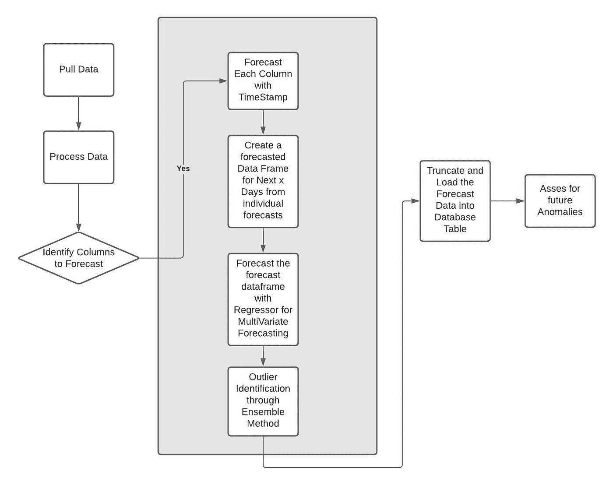

# 我的数据库服务器中的星星 DBA 占星家

> 原文：<https://medium.com/codex/stars-in-my-database-server-a-dba-astrologer-c594b2af3645?source=collection_archive---------26----------------------->

Aabha 是一个活泼的女孩，刚刚毕业去处理一家企业的大型数据库。她非常喜欢观星，除了下班后吃 Pani Puri 和冰淇淋。她总是对她的村庄欣喜若狂，每个星期五晚上她都会飞到那里。那天她过了一个安静的星期五，那是在她工作一个月后。那天她非常兴奋地去了办公室，她的思想集中在晚上，她将在她家的屋顶上看星星。她和她的密友共进了一顿丰盛的午餐，午饭后打了乒乓球，和她最亲密的伙伴在喝茶时交换了计划。她回到了办公桌前，Ting，一个关键的生产数据库发生了严重程度为 1 的事故，该数据库正在运行。

工作站周围的世界很紧张，周围的每个人都戴着免提，眼睛盯着屏幕，在谷歌、Stackoverflow、数据库专家交流、MSDN 之间切换窗口，并在群聊上复制粘贴 DMV 查询。她必须和她的上级协调，让系统回到健康的状态。她所有的计划都暂停了。那一瞬间，她的其他想法完全消失了，只是专注于手中的问题。一个半小时以仅仅几秒钟的相对心理时间跑完了最快的一圈。电话开始慢慢放松，从电话会议中退出的人数激增。她的喘息时刻吊索她的想法对她的计划再次观星。

在正确的时间回到家里，她给自己弄了一盘快餐，然后跳上了屋顶。在那个新月的日子里，她已经准备好了所有的东西，床垫，被子，一个单眼望远镜，一杯可以啜饮的热咖啡。星星闪耀着，闪烁着，直到云层遮住了它。她的心平静地跳动着，她能感觉到时间的停滞，感觉到寒冷的微风，听到树叶的噼啪声。

那些让她的情绪像过山车一样起伏的日子，就像一部动作片。当她感觉自己是拯救地球的复仇者团队的一员时，她笑了，想起她可以让数据库服务器恢复正常。这时，贾维斯提醒了她一些可能性。她开始想，如果我能在问题出现之前就看到它会怎么样。

她给她的男朋友 Arsh 按摩，Arsh 是一个技术狂，他认为外星人是自己最亲密的朋友，而今天人类生活的一切都是有人已经设计好的模拟。他从来不想接受那是上帝。

他看到了一个为他的女朋友设计礼物的机会。他问她的公司是否已经收集了一些有助于预测服务器行为的指标。她确认他们每分钟都在收集服务器的性能指标。Arsh 的第一反应是，哇，多么简单的问题，“我现在有一个钻石矿了。”

Arsh 开始聚合数据以模拟类似的行为，并立即意识到 OLTP 负载正在时间轴上创建模式。所以，他有可能用时间序列方法来预测。他开始清理数据，通过每隔 15 米对数据进行平均采样来使数据正常化。为了对行为进行适当的建模，得出的结论是 3 个月的数据是合适的。做一些相关性和因果关系分析，很明显不是每 1 米收集的 230 个指标都是有用的。所以，它很快被缩短为 9 列，这对时间序列至关重要。在尝试了一些回归技术后，他决定使用脸书的先知来做时间序列预测。

最初的分析是对时间轴的单变量分析。然而，我们有一个多变量的问题。脸书的先知为我们提供了一种在同一个模型中添加额外回归分量的方法。这对阿希来说非常管用。他能够在未来几天重建服务器的整个场景。为了确保这是合适的，他收集了接下来 x 天的数据，并开始几天的比较。这是一个令人吃惊的结果，大部分预测是准确的。

系统需要识别异常(异常值)的未来可能性。这些异常是那些表明严重事件可能会在未来 x 天内排队的信号。一种被称为隔离森林的方法这次非常精确地发挥了作用，以至于与 PCA 或 KNN 方法相比，这些事件恰好在预测的同一时间触发。Arsh 对结果很满意。

Arsh 将代码提交到 Aabha 拥有的 GitHub 存储库中，并为她写下了自述文件。星期一，她回到办公室，对自己的礼物感到兴奋。她想立即向她的同龄人展示这一点。她很快在云上启动了一个虚拟机，重放了问题服务器的负载，并试图预测服务器 5 天的性能。她每天拍摄一些小片段，展示预测和实际情况的对比。

她的团队被引入了魔术。这是一个惊人的壮举，通常不是每个人都注意到的。这个消息传遍了整个楼层，几天后，整个大楼都知道了这个能力。Aabha 是公告板上一个季度的绩优者。

Arsh 的手表随着 Aabha 的提示振动，这是一条令人兴奋的信息，快乐地从他的脑海中弹出。Arsh 非常高兴 Aabha 可以在每周五晚上凝视星星，并想到他为她呈现了这么多闪烁的星星，在她的视网膜内反射，同时她处理它们的名称，颜色，流明。