# 开始使用谷歌趋势作为我们数据分析的一部分

> 原文：<https://medium.com/codex/start-using-google-trends-as-part-of-our-data-analysis-9132607f2e8c?source=collection_archive---------1----------------------->

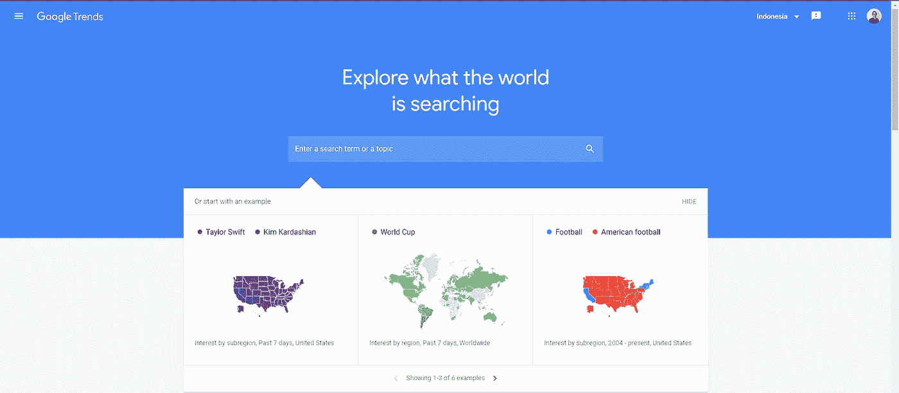

归功于 trends.google.com

大家好，欢迎再次来到我的博客！这次我们将谈论谷歌趋势。基于这里的解释，Google Trends 提供了一个未经过滤的实际搜索请求样本。它是匿名的(没有人是个人身份)、分类的(确定搜索查询的主题)和聚合的(分组)。这使我们能够显示从全球到城市地理的特定主题的兴趣。

> 我第一次读到这篇文章时，我的反应是，“哇，真的吗？真是酷毙了！”

现在，我将尝试分享一些关于谷歌趋势的基础知识，这样你就可以知道这个功能对我们的数据分析生活有多有用。

# 数据可视化使用

假设我们在易贝的一家电子商务公司工作。我们想知道 2021 年我们网站上的交易数量与特定关键词“ebay”的搜索数量之间是否有任何关联。本例中使用的数据是随机的。你可以在这里直接查看数据[。](https://docs.google.com/spreadsheets/d/1CSUtycwyBGvfjJqFJEln43q46rYjGGZ9lQIRldqon30/edit?usp=sharing)

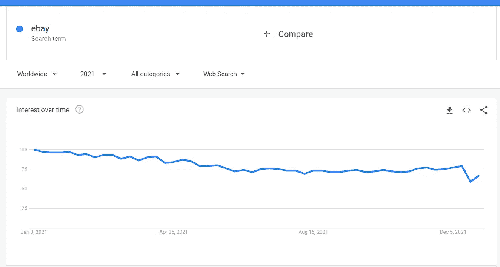

谷歌趋势 2021 年关键词“ebay”

正如我们在上面看到的，我们上面的 Y 轴的刻度是 0 到 100。值 100 是该术语的最高流行度。值为 50 表示该术语的流行程度减半。得分为 0 意味着没有足够的数据用于这个术语。您可以使用图表右上角的下载功能从上图中下载数据。

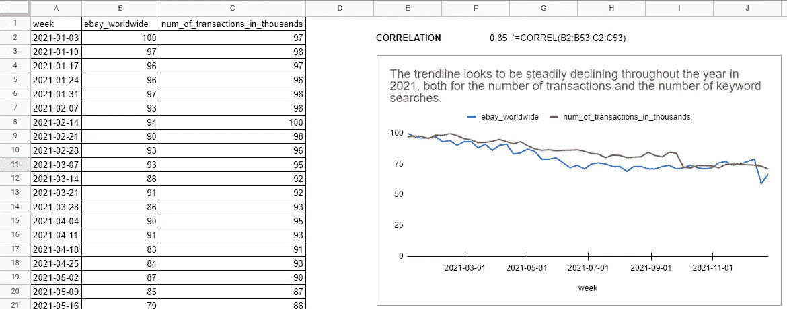

您可以在这里直接查看[的数据。](https://docs.google.com/spreadsheets/d/1CSUtycwyBGvfjJqFJEln43q46rYjGGZ9lQIRldqon30/edit?usp=sharing)

我们在这里发现，我们可以看到关键字“ebay”的搜索次数和交易次数之间存在类似的模式，我们可以通过使用 Google 电子表格中的公式 CORREL()来计算这两个变量之间的相关性。[根据韦氏词典词典](https://www.merriam-webster.com/dictionary/correlation)，相关性的定义是现象或事物之间或数学或统计变量之间存在的一种关系，这种关系往往以一种不仅仅基于偶然的方式变化、关联或一起发生。在这种情况下，线性相关，意味着它们以恒定的速率一起变化。相关值为 0.85，这意味着这两个变量具有很强的正相关性。如果我们说相关值是-0.85，这意味着这两个变量有很强的负相关性。

有了这些发现，最重要的问题是: ***“如何发现上面的相关值是否意味着因果关系？”*** 我们可以创造一些假设来加以检验，例如:

> *推动“ebay”交易数量和搜索关键词数量稳步下降的主要因素是什么？*

我们可以根据每个组成变量来分解变量，直到我们能找到是否有相关的变量。如果我们回头看看交易的数量，我们可以看看主要的转换漏斗，发现交易是因为我们获得了流量。当然，谷歌搜索一些关键词的结果会给我们的网站带来流量。

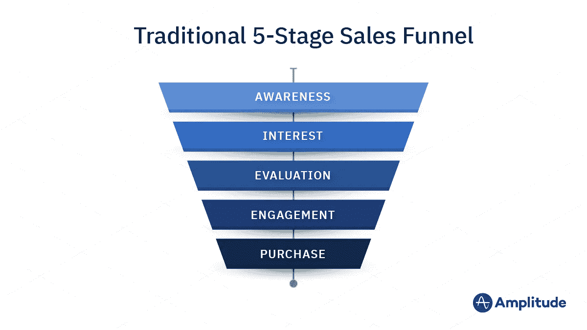

此处归功于振幅

> 就是这样，交通！**也许**它有很强的相关性，因为这两个变量都与交通联系在一起。

之后，我们可以分解我们的流量数字，以进入我们的网站，是否有任何模式类似于我们的交易数量，如果有，这可能是我们正在寻找的“因果关系”点。:)

# 按地区划分的利息

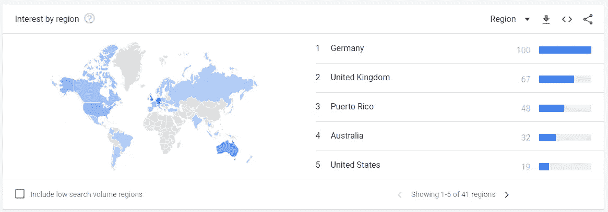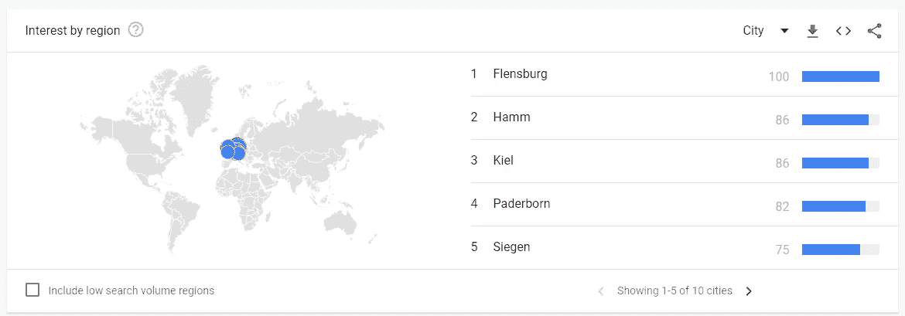

继续我们之前的任务，我们可以看到下面的第一个线形图，谷歌趋势给了我们“按地区的兴趣”,所以我们可以知道搜索趋势提供给我们从哪个地区或领域。正如我们在上面看到的，德国是对我们的数字贡献最大的国家，其次是英国、波多黎各、澳大利亚、美国，等等，你可以改变页面查看其他地区。我们也可以把“地区”改成“城市”。很有用吧，不用做数据追踪就知道位置了:)。

# 相关主题

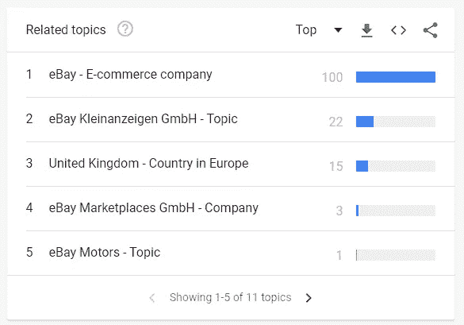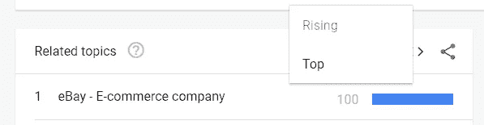

接下来我们能得到的信息是“相关话题”。搜索您的关键词的用户也搜索了这些主题。默认情况下，过滤器将被设置为“Top”，但我们可以将过滤器更改为“Rising”，这意味着自上一期以来搜索频率增加最大的相关主题。

# 相关查询

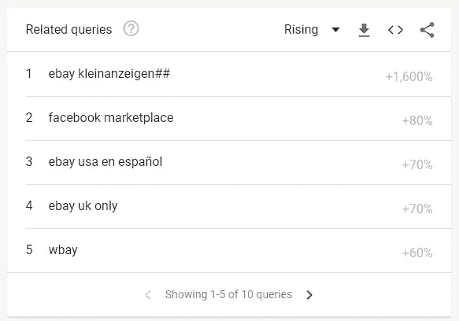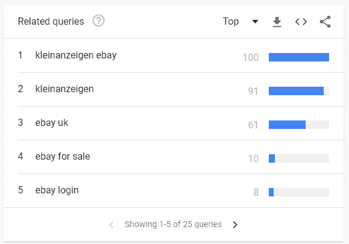

这部分，相关查询，意味着搜索你的术语的用户也搜索了这些查询。利用这些问题，当我们决定通过使用这些特定的关键词来为我们的谷歌广告投入更多预算时，我们可以尝试优化我们的关键词。啊，是的，感觉很好，对吧？:D

# 谷歌趋势的另一个特点

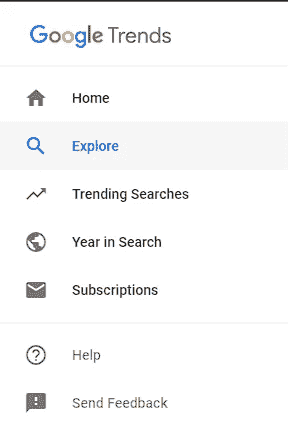

你也可以找到这些很酷的东西，比如“趋势搜索”，它告诉我们什么是最热门的搜索趋势，可以是每日的，实时的，请选择你想调查的特定国家。

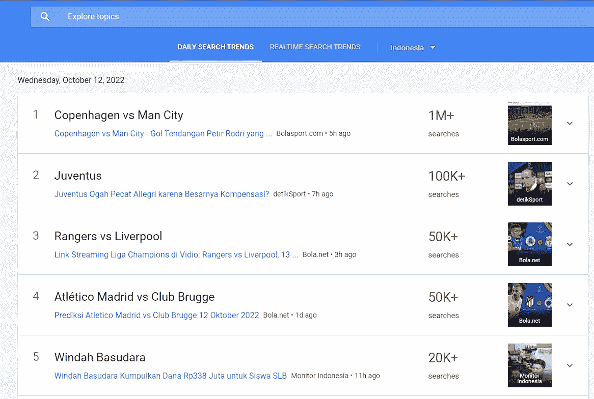

趋势搜索

或者你可以进入“搜索年”，它告诉我们去年的搜索趋势，你也可以按国家过滤。该页面将如下所示:

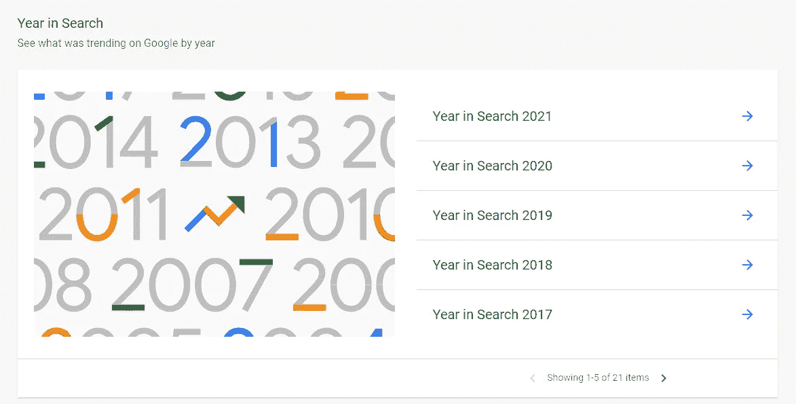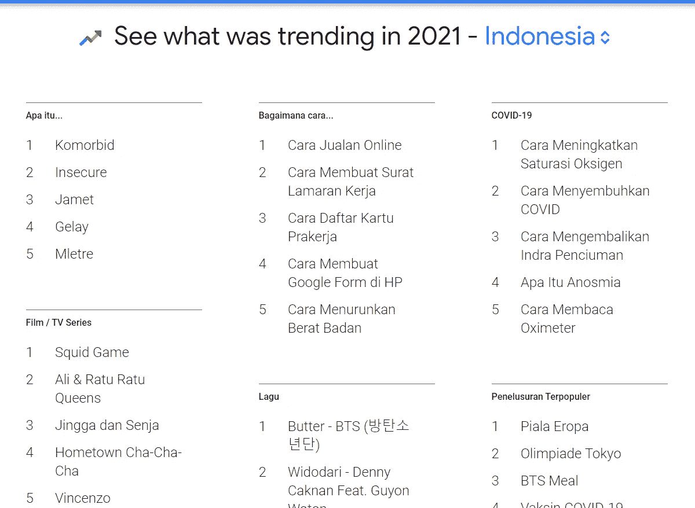

正如我们从“Apa itu(什么是)”中看到的，它与新冠肺炎有很大关系。从“Bagaimana cara (How to)”看来，印度尼西亚的大多数谷歌搜索用户都专注于如何通过成为在线卖家、创建工作申请信、注册“Kartu Prakerja”等方式获得新的、更好的或额外的收入。

这都是我给你介绍谷歌趋势的结果。如果你已经在用了，那就太好了。作为一名数据分析从业者，谷歌的这一功能对我很有帮助。如果你从来没有使用过 Google Trends，并且觉得它对你的数据分析工作来说是很好的额外信息，你可以自己尝试一下。我希望你们会发现这篇文章很有用，非常感谢你们，如果你们一直读到文章结束的话。下次见！:D