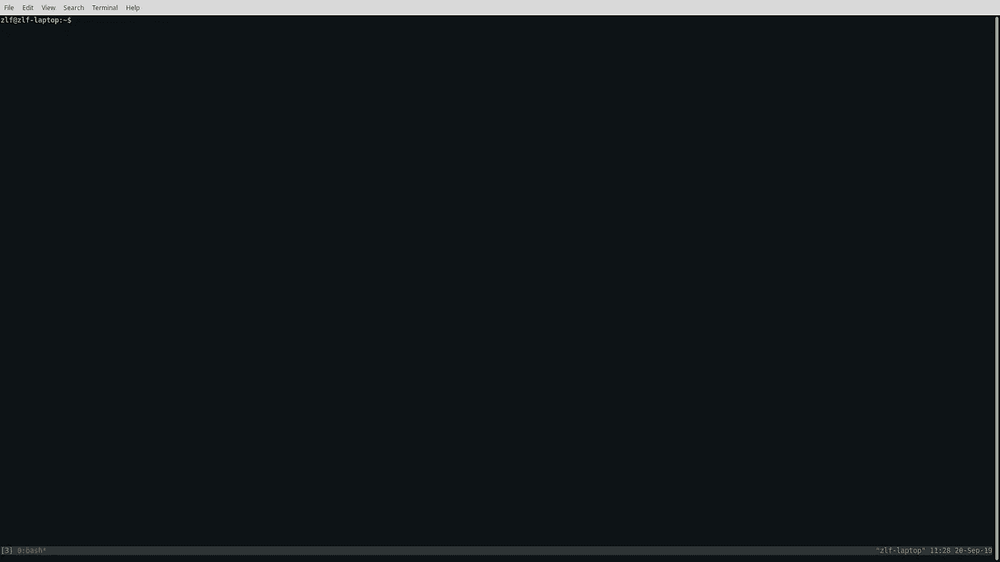
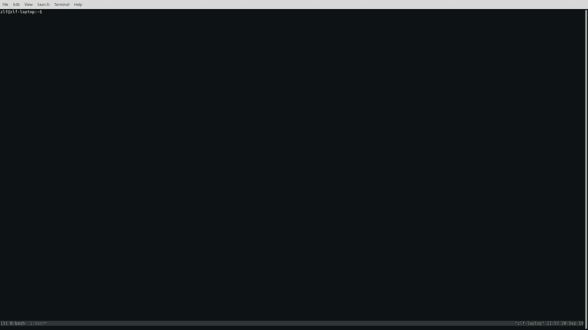
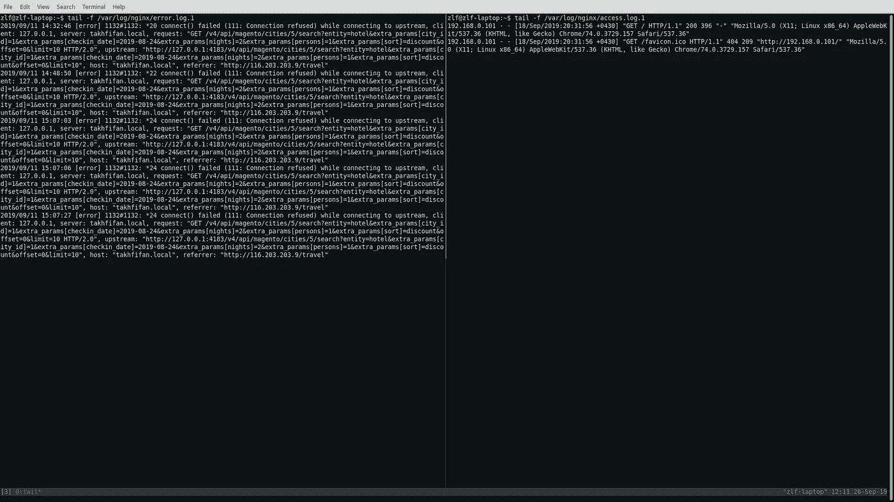
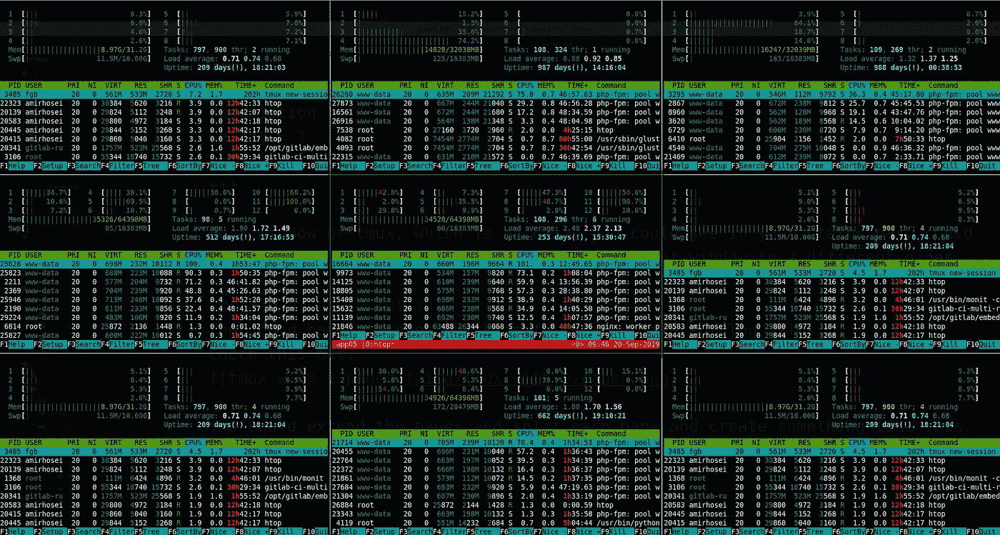
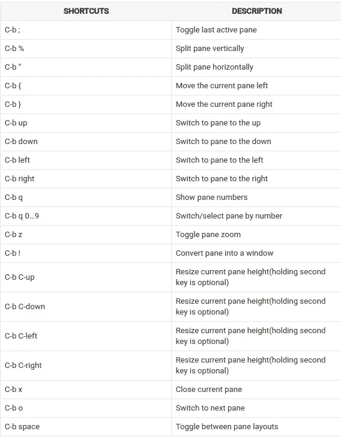
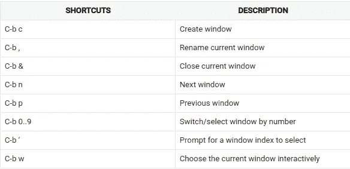

# 开始使用 tmux

> 原文：<https://medium.com/codex/start-using-tmux-3d6ce41ed138?source=collection_archive---------1----------------------->

> tmux 是一个终端多路复用器:它可以在一个屏幕上创建、访问和控制多个终端。
> 
> *tmux 可以从屏幕上拆下并继续在后台运行，然后再重新连接。*

我已经创建了一个帮助你使用 tmux 的网站。这篇文章的大部分内容都来自那个网站。
来看看吧！

[](https://mytmux.com) [## mytmux

### tmux 是一个终端多路复用器:它允许从一个单一的…

mytmux.com](https://mytmux.com) 

# 装置

你可以看一下 tmux 的 github 库，找到合适的安装方式，但是，如果你使用的是通用操作系统，它应该在它的包管理器中。

在 Ubuntu 和 Debian 上安装 tmux

```
$ sudo apt install tmux
```

在 CentOS 和 Fedora 上安装 tmux

```
$ sudo yum install tmux
```

在 macOS 上安装 tmux

```
$ brew install tmux
```

# 你的第一次治疗

这超级简单，打开你的终端，运行这个

```
$ tmux
```

底部的状态栏是它最重要的部分。



# 使用 tmux

使用 tmux 的主要技巧是所有命令的前缀键。

# 前缀键是什么？

默认情况下，前缀为 C-b。

## 阿哈？那是什么意思？

*   C-表示*按住* `*Ctrl*` *键*
*   b 表示*按下 b 键*

现在有意义了，你需要按住 Ctrl 键，然后按 b 键。这只是前缀，之后你可以按不同的快捷键。这是在当前会话中创建新窗口的简单快捷方式。

```
C-b c
```

你明白了吗？按住 Ctrl 键，然后按 b，之后松开 Ctrl 键，并立即按 c 键。现在你应该在你的状态栏中看到两个窗口，如下所示。



# 窗格

tmux 的每个窗口，也就是你可以在状态栏中看到的每个标签，可以有多个窗格。你可以将当前窗口分成两个不同的窗格。

## 它是如何被充分利用的？

你可以有一个窗口，它跟踪不同的日志文件。看看这个。



你可以扩展窗格，分割每个窗格，创建类似这样的东西。



现在让我们来看看最有用的窗格快捷方式



# Windows 操作系统

创建窗格是不够的，我们需要不同的窗口来处理不同的事情。如何组织和分隔窗口取决于您。



# 会议

你可以创建多少个窗口？不限次数但是很混乱。例如，我是一名系统管理员，负责维护公司的 45 台服务器。我们有 6 个不同的应用程序和 10 个数据库。在一个会话中有 45 个不同名字的窗口是可能的，但是老实说那是行不通的。

# 有什么解决办法？

您可以创建不同的会话，并且每个会话都有该会话的相关窗口。例如，您可以为每个应用程序创建一个会话。每个会话都有不同应用程序窗口，如日志、数据库等。

当您运行 tmux 命令时，它会创建一个新会话。运行下面的命令来查看您在 tmux 中的所有会话。

```
$ tmux ls
```

但这并不是 tmux 中会话的唯一优点，最重要的特性是您可以从会话中分离出来，稍后再回到会话中。所以对于一个系统管理员来说，这是最好的选择。她可以创建不同的会话，每次她登录到服务器时，她需要连接到她原来的 tmux 会话，一切都还在。

牛逼？

让我们来看看会话快捷方式。

## 开始新的会话

```
$ tmux$ tmux new$ tmux new-session
```

如果您已经在 tmux 会话中，并且需要在这里创建一个会话，这是快捷方式

```
C-b :new
```

稍后我们将讨论 tmux 命令模式。

## 显示所有会话

```
$ tmux ls$ tmux list-sessions
```

如果您已经在 tmux 会话中

```
C-b s
```

您可以导航到您的会话并按 enter 键进入该会话，或者选择会话名称前( )中的会话索引。

## 从会话中分离

```
C-b d
```

## 重命名会话

```
C-b $
```

## 附加到最后一个会话

```
$ tmux a$ tmux at$ tmux attach$ tmux attach-session
```

## 附加到名为 mysession 的会话

```
$ tmux a -t mysession$ tmux at -t mysession$ tmux attach -t mysession$ tmux attach-session -t mysession
```

## 移至上一个会话

```
C-b (
```

## 移动到下一个会话

```
C-b )
```

# 会议还需要什么吗？

是的，还没完成！

还有一个很酷的功能，可以让不同的人连接到同一个会话并共享它。

## 怎么可能有用？

例如，如果你需要一个不在身边的人的帮助，她可以登录到同一个服务器并连接到你的会话。现在，她可以写命令，而不是聊天和复制粘贴，你可以看到它。

# 卷起

在 tmux 中滚动是很棘手的。在 tmux 中有一个复制模式，你应该首先进入，然后你可以在你的面板上滚动。首先，你需要下面的快捷键来进入复印模式。

```
C-b [
```

然后，您可以使用箭头键或 Page-Up/Page-down 键来滚动窗格。

# 配置

tmux 有一个配置文件，可以让你改变很多东西。它让你改变快捷方式，颜色等。
tmux 配置文件的默认地址是` ~/.tmux.conf`
我会再写一篇关于 tmux 配置文件和它有多方便的帖子。