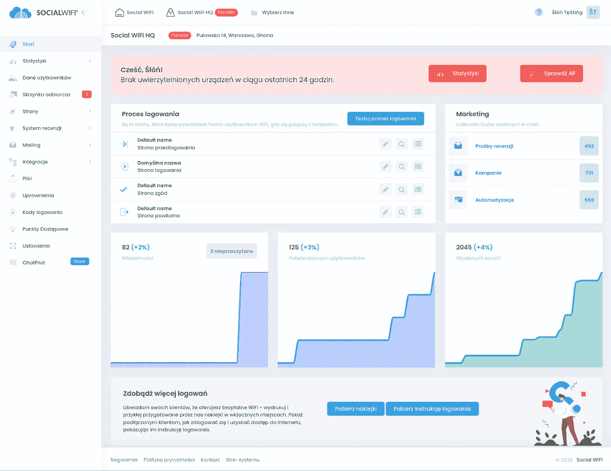
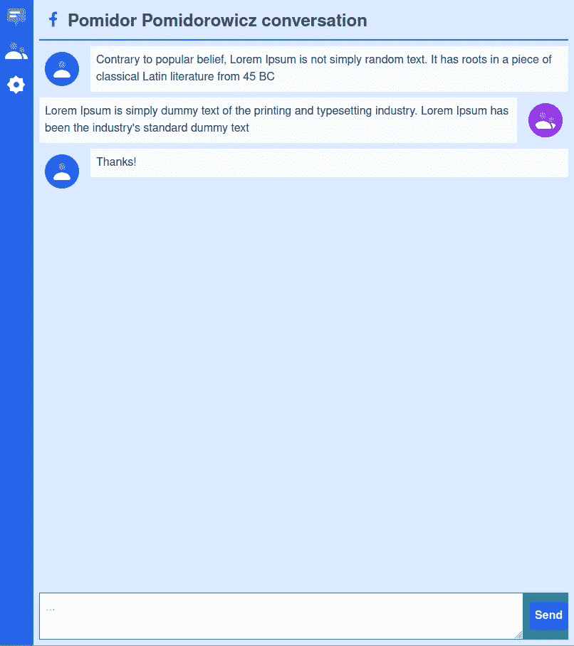
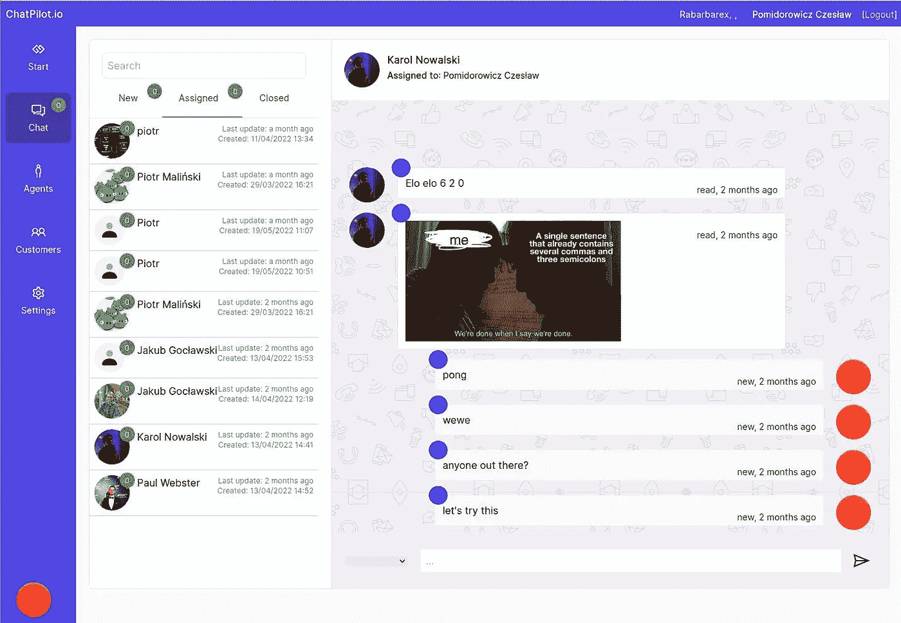
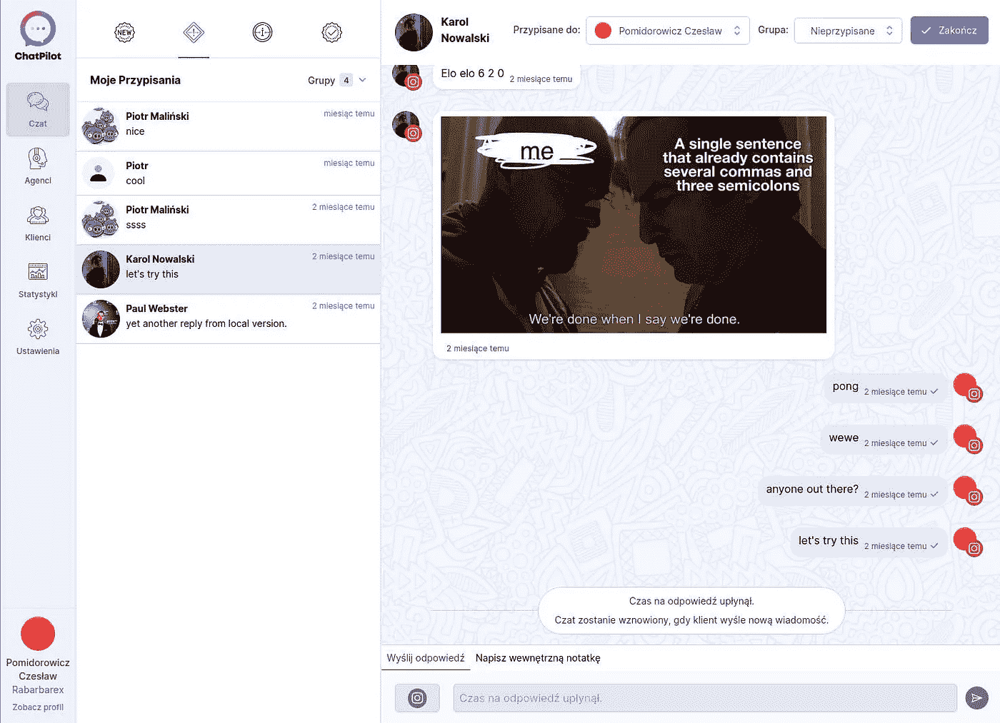

# 从 IT 角度开始新的 web 服务业务— ChatPilot 案例研究

> 原文：<https://medium.com/codex/starting-new-web-service-business-from-it-point-of-view-chatpilot-case-study-cc89c0877d9e?source=collection_archive---------39----------------------->

一家公司想要启动一项新的 web 服务——一个用于客户支持的消息聚合器。你如何从一个想法变成一个 Python/Vue/Socket。IO web 应用？这是 it 开发团队讲的一个 [ChatPilot.io](https://chatpilot.io/) 的故事。

# 通信聚合器

[**ChatPilot**](https://chatpilot.io/) 是一个用于客户支持的通信聚合器。你经营一家企业，你有自己的脸书粉丝页面、Instagram 个人资料，甚至可能有一个 WhatsApp 号码——客户会通过所有这些渠道联系你。为了管理所有这样的通信，公司倾向于使用聚合器。这些应用程序将 Facebook Messenger 或 WhatsApp 等消息平台聚合成一个(通常)网络应用程序，企业员工可以在其中更有效地管理企业与客户的沟通。

有聚合通信的应用程序，甚至有公司提供 API/服务来制作这样的应用程序。这类应用的市场已经相当成熟，与其他在线服务相比，这些服务并不便宜。如果你做了你的聚合器，它将很快面对许多成熟的应用程序，这些应用程序已经有了固定的品牌和客户基础。那么怎么做，怎么做呢？

答案是开发一个比现有应用程序更有价值的应用程序。你不能只做一个应用程序，它必须从一开始就以提供独特的价值为目标，并且非常敏捷地适应早期的客户反馈或商业机会。说起来容易做起来难…

# 团队

我在 [**社交 WiFi**](https://socialwifi.com) 工作，该公司为开放 WiFi 网络提供强制门户服务。从代码方面来看，它由几个微服务组成，其中大多数运行 Flask，并提供某种 API 或处理芹菜队列。很少有像仪表板一样是在 Ember.js 中制作的。该项目部署到谷歌云。这个服务的最初版本，在 5 年多以前，是作为一个整体的 Django 应用程序编写的，随着时间的推移，它开始出现问题，包括地理缩放；)

用 Ember.js 制作的社交 WiFi 仪表盘

ChatPilot 计划作为公司产品组合中的一项附加服务，同时也与强制网络门户服务有一些协同作用。为了这个项目，我们创建了一个 2 人团队:CTO——规划、开发运维、代码评审和 rubber ducky。Fullstack (Python/Fronted)开发人员——也就是我——来完成任务。我们也有一个产品负责人的职位，主要负责 UX/用户界面的规划和审查。

# 研究

在我们开始对公司的业务部分进行编码之前，我们的首席技术官已经做了研究——查看了现有的聚合器，也联系了一些使用这类应用的客户，过了一段时间，他们对这个市场有了一些了解。其中一个发现是，我们的一个合作伙伴的客户使用的是旧的聚合器，不是很好，主要是因为消息在应用程序中显示很慢，或者根本没有显示。低质量/破损的应用程序是你可以与之竞争的，但是你的竞争对手不太可能都有如此明显的问题。

为了启动许多应用程序，你可以使用一个服务提供者来为你做所有的粗活，并公开好的 API 来工作。不利的一面是，它不是免费的，你成为供应商锁定给定的服务提供商。在某些情况下，使用第三方服务来绕过应用程序的一些原始部分可能是值得的——无论是永久地，还是对于在所述原始数据基础上快速交付价值的早期版本。

我们最初确实考察了一家通信服务提供商和该公司的业务部门，甚至与他们进行了交谈，并为开发建立了一个沙盒。然而，很快就发现他们的定价对于早期版本和小规模客户来说是不可行的。因此，我们决定将它们作为未来大批量客户的选择。这样的开发者服务将允许我们快速处理多种渠道，但价格不菲。我们必须开发自己对 Messenger 和 Instagram 的支持，以便能够首先推出和扩展。

# 选择技术

我们的目标是在应用程序和 WhatsApp 或 Messenger 等沟通渠道之间实现近乎实时的沟通。该应用程序必须在消息到达时接收并显示消息，尽可能减少延迟。那么，你如何获得传入的消息呢？您可以拉一个 REST API 端点，但是不断地用 HTTP 请求访问您的后端不是很有效。Websockets 将是首选，尽管浏览器支持和处理仍有一些不同，所以我们要么必须处理它，要么找到一个为我们处理它的库。这样的库确实存在，叫做 **socket.io** 。

使用 socket.io，您可以在 SPA JS 网页中创建一个客户端，连接到用 Python 等语言编写的 socket.io 服务器。业务代理打开仪表板，它将他连接到服务器并等待事件——如新消息、新对话，但也允许他向服务器发送事件，如**发送回复**。你可以在 [socket.io](https://socket.io/) 原例子上看到基本流程。

在开始 ChatPilot 之前，我们使用 Ember.js 作为我们的 SPA 仪表盘，但对于这个项目，我们考虑了其他选项，如 Angular 和 Vue。尽管 Ember 对我们来说工作得很好，但我们还是想看看更受欢迎的平台是否能提供一些优势。有了 Ember，我们可以更快地开始开发应用程序，并且我们会熟悉所有的解决方案和库。有了新的平台，我们将在没有经验或不了解所有细节的情况下全新进入。

那么 **Ember** 还是 **Vue** ？我们有点担心 Ember 较低的受欢迎程度会随着时间的推移限制方便的第三方解决方案的可用性，并且切换到一个更受欢迎的框架会允许我们在未来雇佣已经知道它的开发人员。我们在 Vue 中做了一些 hello world 类型的简单项目，我们检查了 socket.io 集成看起来如何，以及其他开发者如何/是否做了与我们类似的项目。它看起来不错，所以我们决定为这个项目选择 vue 而不是 ember。

*   Flask/JSONApi 微服务
*   Vue.js 仪表板
*   顺风 CSS 和顺风 UI
*   Socket.io 服务器
*   谷歌云
*   Kubernetes 和 Docker
*   敏捷开发

# 原型

项目从原型开始—展示技术并了解项目的风险。我们从一个非常基本的 Vue 项目开始，该项目必须提供一组非常简单的功能，并逐步增加:

1.  连接到 SIO 服务器，并显示服务器在连接事件时发送回的固定消息
2.  发送消息，使服务器发送一个固定的响应。
3.  使用 socket.io room 功能，允许两个独立的连接互相通话(查看对方消息)

对原型的这种增量工作使我们能够验证 Socket.io 和 vue.js，因为它们对我们来说都是新技术。我们确实使用了 **Vue 3** ，这是相当新的，并不是每个第三方 Vue 库都支持它。我们确实遇到过几次这个问题，不得不寻找 vue3 分叉(比如 vue-3-socket.io)之类的。最后，我们放弃了 vue-3-socket.io，转而直接使用 socket.io 客户端，以获得额外的灵活性(如身份验证等)。

第一个带有固定消息的原型

布局的初始版本，在 Tailwind CSS 和 Tailwind UI 的帮助下

# 从原型到生产

第一次使用一个框架，并在一开始就制作一个基本的原型，并不会导致所有的东西都被编码和优化设计，甚至从一开始就是好的。我们使用 Ember，但我们从来没有使用 Vue，所以这种变化是一个学习曲线。我们并没有从一开始就使用所有流行的 Vue 扩展。早期的原型不需要路由，所以没有 vue 路由器，我们甚至没有使用任何像 Vuex 这样的存储层，但后来改用了 Pinia。

我们从一个简单的原型开始，致力于基本特性的列表。随着事情从原型转移到预期的产品特性，我们不得不大量重构代码库——用真实的解决方案重新实现占位符解决方案。像开始时一样，服务器将消息存储在 Python 列表中，然后用数据库替换。从前端/原型方面来看，一切都没有改变(除了在服务器重启后没有丢失消息；)然而项目还是向前推进了。同样的变化也发生在 vue 中——我们使用 JS 阵列，但转移到 Pinia 进行存储处理，并从 Vue 组件中转移此类逻辑。

仪表板的当前版本

做一个非常愚蠢的早期原型让我们开始验证技术和应用程序的想法，更不用说早期的 UX/UI 工作了。由于这还不是生产级别，我们还被允许进行突破性的更改，根据需要创建和删除数据。我们从使用通常愚蠢的占位符解决方案的基本功能原型开始，当它对展示有效时，我们继续将其重构为永久的解决方案。这就形成了一个循环，在这个循环中，企业看到了一些新的功能或工作原型，然后在一段时间内，当我们重构/重新实现事物时，外部没有任何变化，然后就可以开始实现虚拟占位符解决方案不可能实现的功能。这一点已经传达给了企业，因此缺少变化并不意味着什么都没有发生。

即使有永久性的解决方案，这些解决方案也是为早期原型设计的，所以随着时间的推移，很多事情都发生了变化。例如，随着时间的推移，我们从简单的消息模型开始，我们必须开始区分客户和代理消息，然后处理其他特殊的消息类型。您可以开始向表中添加可选列，但这不是很干净。因此，在 SQLAlchemy 模型的帮助下，我们在基本消息模型和从它继承的所有消息类型模型之间建立多态关系。这样，您可以轻松地选择所有消息的时间线/日期范围，并为每种消息类型创建独特的模型。

该项目设法转移到生产，并在开发过程中获得了一些早期客户。事情不能再中断了(消息模型迁移必须有计划，并且 Vue dashboard 与两个版本兼容),但是我们仍然可以继续推进项目。当我们学习新的软件堆栈，当新的东西变得需要或对我们有益时，我们实现并重构，这似乎是早期原型/生产方法的发展方向。

*最初发布于*[*https://rk . edu . pl*](https://rk.edu.pl/en/starting-new-web-service-business-from-it-point-of-view-chatpilot-case-study/)*。*