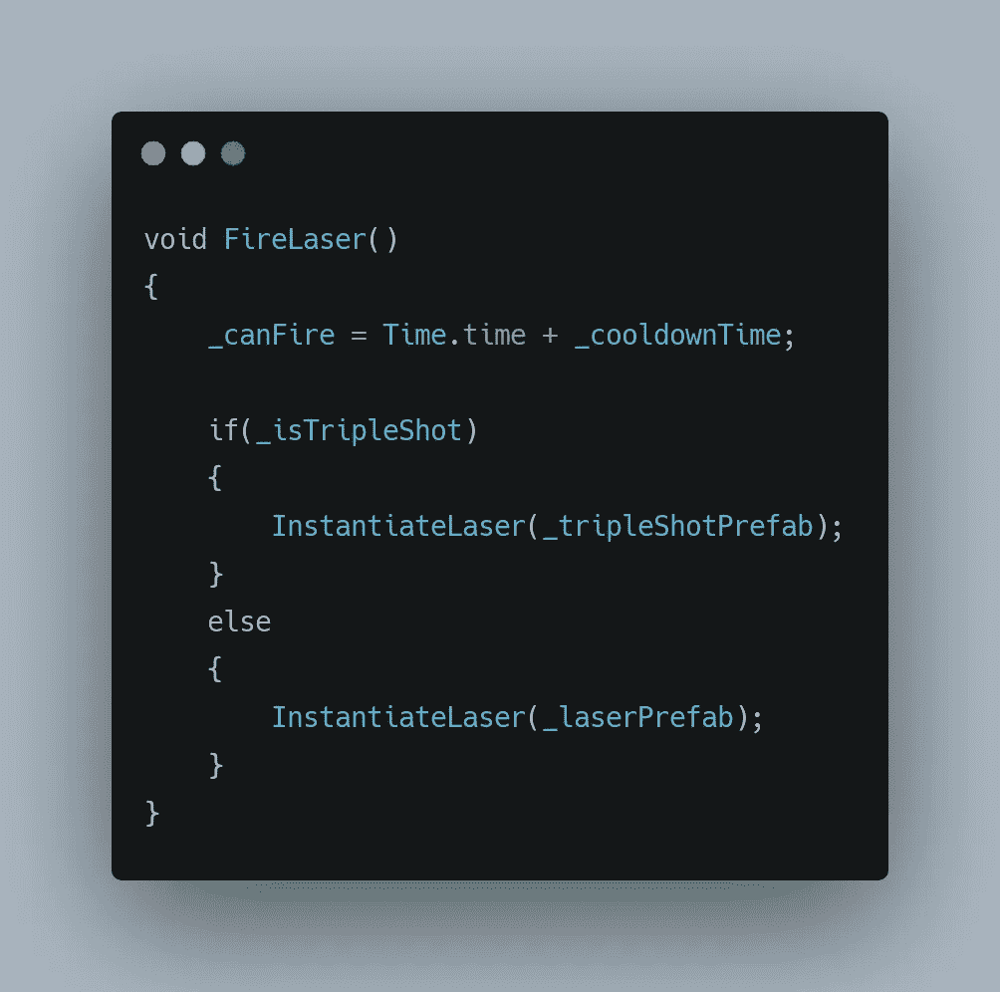

# 开始感觉像一个真正的电子游戏！

> 原文：<https://medium.com/codex/starting-to-feel-like-a-real-video-game-98d19567ca44?source=collection_archive---------9----------------------->

照片由 [Lucas Santos](https://unsplash.com/@_staticvoid?utm_source=medium&utm_medium=referral) 在 [Unsplash](https://unsplash.com?utm_source=medium&utm_medium=referral) 上拍摄

玩家的动作，敌人的部落，武器，和基本的艺术作品，所有这些加在一起确实感觉像一个真正的视频游戏。我们还缺少一些成分，所以让我们从添加一种这样的成分开始。

# ***加电***

异能基本上是一个物体或物品，在消耗时给予**玩家**一个暂时/永久的技能或能力。所以让我们给我们的**玩家**增加一个这样的能力。

# ***三连拍***

为了制作这三个镜头，激光预置被重复使用并放置在它们各自的位置，并且成为一个空游戏对象的父对象。

这个**三连拍**游戏对象包含了我们附加的**激光**行为。换句话说，只有三连拍附带了**激光**脚本，使得**激光**向上行进，一旦脱离屏幕就会自我毁灭。这个现在做成[预制](/codex/basic-overview-of-prefabs-c938a7088792)。

这样做了，我们现在可以继续使用三连拍的电源，一旦接触将使我们能够使用新创建的三连拍。

我将使用由 [GamedevHQ](https://filebase.gamedevhq.com) 提供的资产。这包含一个**箱式碰撞器 2D** 组件和一个**加电**脚本，前者带有**触发器**开关，后者包含其向下运行的行为，并给予**玩家**发射**三发**的能力。

先说动作。

这个方法处理向下移动的行为，并在离开屏幕后自我销毁。

现在我们来看看这个物体与玩家接触时的反应。

这里，我们使用的是 **OnTriggerEnter2D()** 。如果与这个物体碰撞的物体有一个名为**玩家的标签，**只有这样它才会执行随后的命令。它不仅会自我毁灭，还会让我们的玩家发射**三发**炮弹。这里的 **_player** 是类型 **Player** 的变量。这让我们可以访问所有出现在**播放器**脚本中的公共方法和变量。要了解更多关于[触发器](/nerd-for-tech/unity-development-collisions-vs-triggers-740d455757bf)和 [GetComponent](/nerd-for-tech/script-communication-in-unity-using-getcomponent-2eaaea4c49d0) 的细节，你可以参考以前的文章，它们有详细的解释。

现在让我们看看**播放器**脚本，学习如何在有限的时间内使用加电，因为我们要处理的是在一段时间内保持活动，所以我们可以使用[协程](/nerd-for-tech/coroutines-with-unity-fe650a4892f7)。

**IsTripleShotActive()** 如下，

在这种情况下，指定的时间是 5 秒。

**IsTripleShotActive()** 是一个占位符方法，它的功能是运行我们指定的**协程**，在本例中是**powereffectslast()**，当被调用时，它会在指定的时间内将我们的布尔变量设置为 true，然后将其设置回 false。

布尔运算用于决定我们是发射普通炮弹还是发射动力炮弹。这是通过，

该方法负责发射激光，此处的**实例激光**是一个执行以下操作的方法

这负责实例化作为参数传递给该方法的游戏对象，完成后，我们将实例化的对象作为空游戏对象的父对象来清理我们的层次面板。

这给了我们以下结果。

感谢阅读。更多即将推出！！！！