# 从 Git 开始？这是你的指南。

> 原文：<https://medium.com/codex/starting-with-git-here-is-your-go-to-guide-8aaaf0767150?source=collection_archive---------14----------------------->

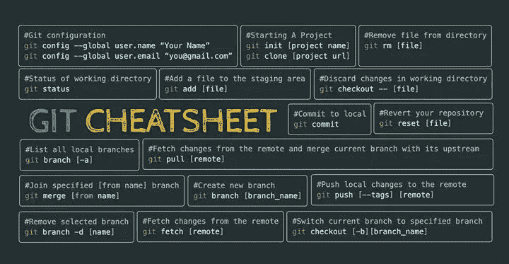

先说基本定义。Git 是一个免费的开源分布式版本控制系统，旨在快速高效地处理从小到大的项目。

我们有不同的方法来使用 Git，现在我们来探讨一下。

Git 可以直接从命令行使用，或者使用图形界面，比如 VS 代码。您可以使用这些工具中的任何一个来执行大多数 Git 命令，并且可以混合和匹配这些工具。例如，您可以使用命令行克隆一个存储库，查看该存储库的变更历史，使用 VS 代码进行新的提交，并使用 GitLab 创建一个合并请求。Git 是驱动所有这些工具的底层引擎，因此它们彼此保持同步。让我们熟悉一下它们。

**Visual Studio Code** 擅长让你对文件进行修改，然后在工作时快速提交。它有一个很棒的“同步”功能，只需点击一下，就可以从远程回购中提取、合并，然后推送您的更改。它还有一个很棒的编辑器来解决合并冲突。

gitLab 是一个基于网络的 Git 服务器，用于托管和协作 Git 库。通过 GitLab 用户界面处理 repo 对于进行快速更改、创建合并请求、审查和评论其他代码或者使用 GitLab CI 监控持续集成作业的进度非常有用。

有些人更喜欢在命令行上使用 **Git** ，如果您需要运行不太常用的 Git 命令，这对每个人都很有用。但是要小心！在运行 Git 命令之前，请确保您知道自己在做什么，因为有些命令可能会产生不良后果。

现在，让我们来了解一下开始工作所需的最基本的知识。

Git 是一个分布式版本控制系统，这意味着尽管托管 Git 存储库的共享副本(例如在 GitLab 上)很重要，但每个开发人员都将整个存储库克隆到他们的本地机器上，并在与共享存储库同步之前在本地跟踪更改。

一旦您使用`git clone <repository>`克隆了您的项目，您就可以按照项目的[分支策略](https://docs.gitlab.com/ee/topics/git/#branching-strategies)创建分支。

```
$ git checkout -b <branch name>
```

一旦您创建了一个新的分支，您就可以开始进行更改了。要查看您所做的更改，请运行

```
$ git status
```

在提交更改之前，您需要将它们移动到临时区域。要转移要提交的文件，请运行

```
$ git add <file_name>
```

要提交阶段性更改，请运行

```
$ git commit -m <commit message>
```

最后，要将更改推送到远程存储库，运行

```
$ git push
```

如果您想要检索远程存储库中的最新变更，运行

```
$ git pull
```

这将把远程更改合并到您的本地副本中。当你拉的时候，你的库应该没有未提交的变更。

如果您和其他人对同一文件中的相同行进行了更改，您将会遇到合并冲突，需要手动解决。VS 代码内置了对合并冲突解决的支持，我们将在接下来讨论。

如果你想马上玩，这里有一个学习 Git 的[互动工具。](https://learngitbranching.js.org/)

# 在 VS 代码中使用 Git

集成 Git 支持是 Visual Studio 代码的最佳特性之一。Git 允许您跟踪您的工作，在版本之间来回移动，并且同时在不同的分支上工作。Visual Studio 代码默认支持 Git，这意味着您不必安装任何包或扩展就可以使用它。侧栏包含一个单独的 Git 视图，您可以通过单击视图栏中的 Git 图标快速打开它。

## 初始化您的存储库

如果您的工作空间还没有被 Git 跟踪，首先您需要初始化一个新的存储库。为此，在 Git 视图中单击 Initialize Repository 按钮。

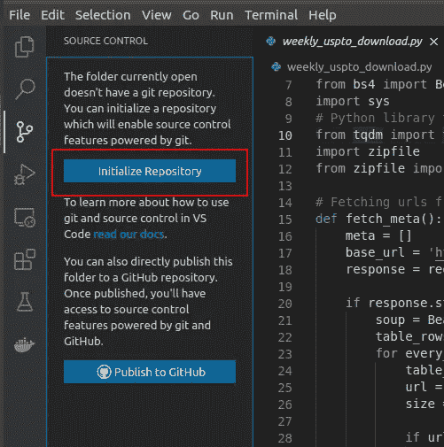

VS 代码将在你的工作空间内创建一个. git 文件夹(你不能从 VS 代码中看到它，因为它是一个隐藏的目录，但是你可以在你的项目的根文件夹中的文件管理器中找到它)，并且它也将你的未被跟踪的文件添加到边栏中。

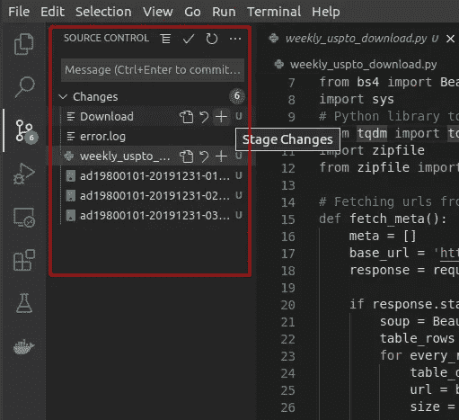

## 阶段变化

设置好 Git 存储库之后，就该创建初始提交了。在提交之前，您需要将想要用 Git 跟踪的文件添加到暂存区，或者换句话说，您需要暂存更改。要暂存文件，请在“更改”部分将鼠标悬停在该文件上时，单击出现的`+`按钮。

单击要暂存的文件后，Visual Studio 代码将该文件从 Changes 文件夹移动到 Staged Changes 文件夹，这意味着它们现在位于暂存区域中。如果您想要一次暂存所有文件，请单击当您将鼠标悬停在更改副标题上时出现的`+`按钮。

## 提交更改

阶段化的变更还没有被记录，您还需要提交它们，以便以后您可以查看或者返回到您的存储库的当前状态。为了提交分阶段的更改，您需要添加一条提交消息，描述自上次提交以来所做的更改。

因为在这个例子中，这将是初始提交，所以让我们使用不太有创意的“初始提交”消息。在侧边栏顶部的输入栏中键入您的提交消息，然后单击小勾号图标。现在您已经进行了第一次提交，并且记录了存储库的初始状态。

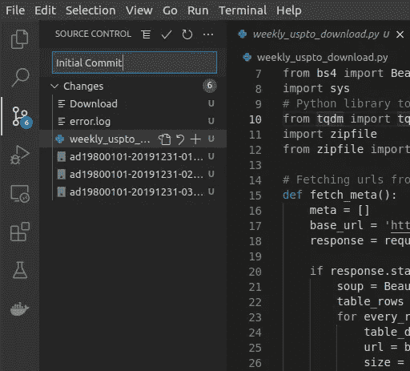

您的 Git 工作目录是干净的，到目前为止您所做的所有更改都被跟踪，您的 Git 视图显示有 0 个更改(它总是将当前状态与您的上次提交进行比较)。如果您在工作区中进行了新的更改，新的更改将再次出现在侧边栏中，一旦您进行了想要记录的重大更改，您需要再次提交它们。

在下面的截图中，你可以看到代码编辑器提交后的样子。

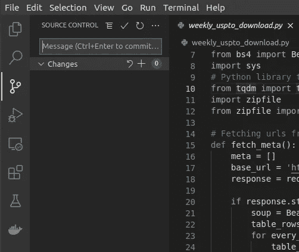

## 创建分支

Git 允许您轻松地创建分支并在分支之间切换。这对于使用合并请求的代码审查很有用。

在 Visual Studio 代码中，您可以通过点击左下方当前分支的名称并选择`+ Create New Branch`来创建新的分支。或者你可以点击`Ctrl+Shift+P`打开命令面板，然后在输入栏中输入`Git: Create Branch`命令。

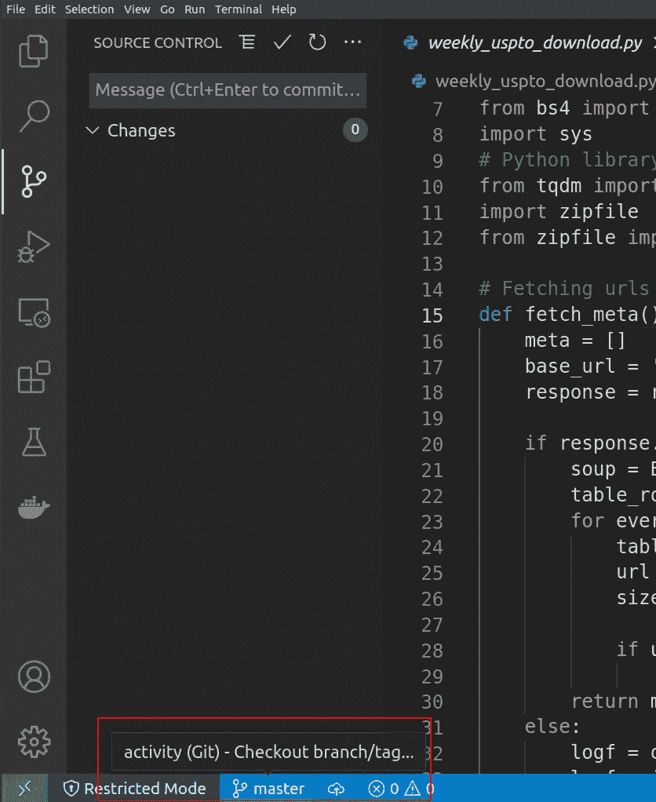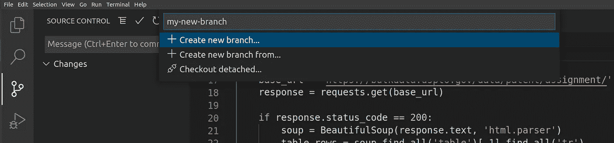

## 结帐分支

要在分支之间切换，请单击左下方当前分支的名称，并从显示的列表中选择新分支。

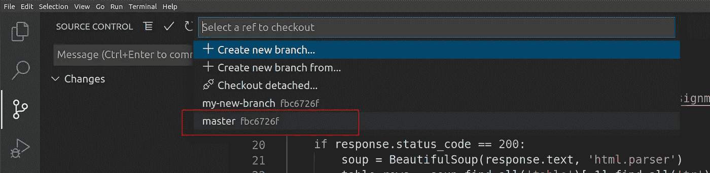

## 使用命令面板中的 Git 命令

您也可以从命令面板访问 Git 命令。您不需要做任何其他事情，只需在命令面板中键入命令`Git`，您就会得到一个下拉列表，其中包含您可以快速选择的可用命令。

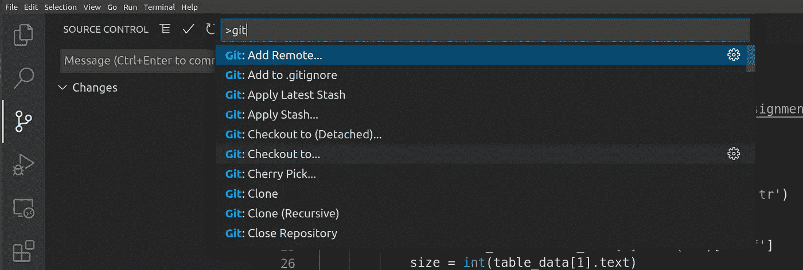

这些是 Visual Studio 代码中跟踪我们工作的基本 Git 操作。VS Studio 代码也有先进的 Git 特性，比如[管理远程存储库](https://code.visualstudio.com/docs/editor/versioncontrol#_remotes)、[合并冲突](https://code.visualstudio.com/docs/editor/versioncontrol#_merge-conflicts)，你甚至可以将 VS 代码配置为你的[外部 Git 编辑器](https://code.visualstudio.com/docs/editor/versioncontrol#_git-patchdiff-mode)。

# **现在来说说 GitLab。**

到目前为止，我们知道它提供了一个有用的 web 界面和额外的特性，比如我们用来管理部署过程的合并请求。

使用 SSH 密钥而不是 HTTPS 是 Git 连接 GitLab 的常见做法，它还提供了增强的安全性。但是，SSH 使用的端口(22)不同于普通的互联网流量，如 HTTPS(端口 443)，因此 SSH 流量可能会在某些公司网络上被阻止。在这些情况下，HTTPS 是一个安全的替代方案，而且它的设置和使用也更简单。

> 永远不要使用不安全的(HTTP)连接。

如果我们讨论 GitLab 成员和项目的权限和安全性，您将看到不同成员的不同可见性和权限级别，您可以为存储库启用这些级别。

例如，为了防止人们在没有审查的情况下修改分支的历史或推送代码，GitLab 允许您创建受保护的分支。[通读文档](https://docs.gitlab.com/ee/development/permissions.html#gitlab-permissions-guide)了解更多信息。

## 合并请求

这些请求是将一个分支拉(或合并)到另一个分支中。例如，CI 流程可以对功能分支执行自动验证，可以为已验证的功能分支创建合并请求，然后允许其他人在将该分支合并到主分支之前对其进行审查和批准。

在将您的更改推送到存储库之后，您可以从命令行而不是代码创建一个合并请求。或者您也可以从 GitLab 中完成。

您必须转到您想要合并您的更改的项目，然后单击 Merge requests 选项卡来创建一个新的合并请求。

选择要合并到的源分支和目标分支。然后比较你的分支继续。

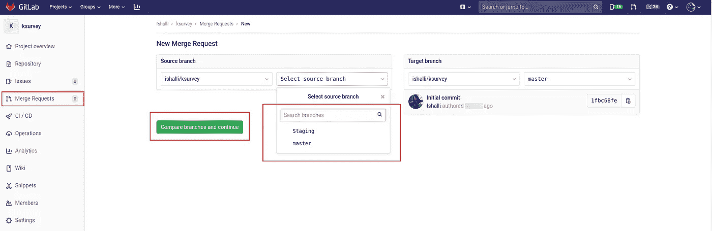

向您的合并请求添加标题和说明。(可选)选择一个用户来复查您的合并请求。您还可以指定里程碑和标签。

准备就绪后，单击提交合并请求按钮。你的请求会被提交。

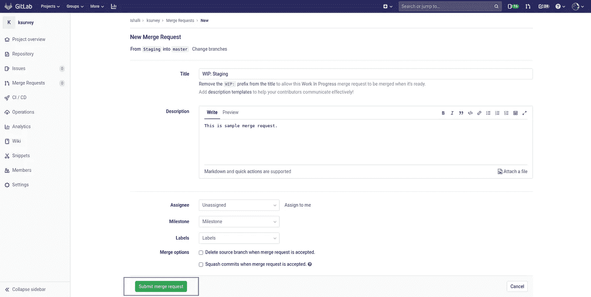

# 连续累计

我最喜欢的部分来了——CI/CD。

简单地说，CI/CD 是软件开发的最佳实践。

当使用 CI 时，开发团队产生的所有代码都合并到一个中央存储库中，在那里自动构建验证它。这种实践有助于开发团队在向客户发布变更之前检测、识别并修复问题和缺陷。

CI 就像一份保险单。你会冒险在没有汽车保险的情况下在城市里开车吗？不会吧！

开发人员应该关注于尽早建立一个简单的持续集成过程。

GitLab CI 是集成在 GitLab 中的 CI/CD 工具。因此，我们无需担心为这一重要流程集成任何第三方工具。

基本上 CI 工具有 3 个部分:组织所有自动化作业的实际 **CI 引擎**、定义要运行的特定作业的**配置**，以及执行这些作业的一个或多个**运行器**。

> 选择 GitLab 的另一个原因是它非常好地整合了所有这些部分。GitLab 本身就是一个版本控制工具。

**GitLab CI 是组织所有自动化的引擎**，它与 GitLab 的其余部分紧密集成。

GitLab CI 的**配置全部包含在一个名为**的简单文本文件中。gitlab-ci.yml** 与您的项目代码一起存在于存储库中，它足够简单，易于阅读，但是足够强大，可以描述几乎任何 CI/CD 配置。要为您的项目设置 ci，您不需要登录和配置任何东西，只需将一个. gitlab-ci.yml 文件放入您的项目 repo 中，整个 CI 系统就活了！**

GitLab runner 通常是一个 Docker 容器——一个超级轻量级的 Linux shell，它允许我们运行我们想要的几乎任何类型的软件和代码。

## 管道

GitLab CI 将所有这些自动化作业组织到管道中。所以它是一组分阶段或分批执行的作业。一个阶段中的所有作业都是并行执行的(如果有足够多的并发运行者)，如果它们都成功了，那么管道就进入下一个阶段。如果其中一个作业失败，则不会执行下一个阶段(除非您已经声明该作业可以“allow_failure”)。您可以在项目的“管道”选项卡中访问“管道”页面。

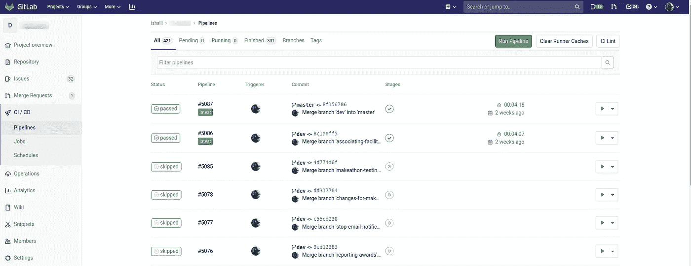

管道是在。gitlab-ci.yml 文件。在该文件中，您可以指定希望特定管道在什么情况下运行。例如，您可能希望某些测试仅在提交到主分支时运行，并且您可能希望提交到不同分支的测试部署到不同的环境中。

## 环境和部署

GitLab CI 不仅仅能够测试或构建您的项目。它还可以用于部署和跟踪部署。在您的`.gitlab-ci.yml`文件中，您可以定义部署到哪个**环境**。

# 现在让我们详细了解一下 **GitLab CI YAML** 文件。

下面是您的`.gitlab-ci.yml`文件的样子。

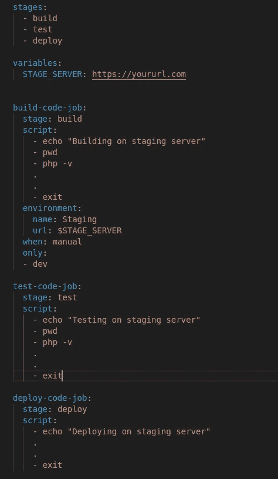

这定义了一组作业，并对它们应该何时运行进行了限制。让我们一步步分析 YAML 的结构和一些基本术语:

## **阶段**

这些基本上是可以被多个不同的工作使用的步骤。指定阶段允许我们创建灵活的多阶段管道。

阶段中元素的顺序定义了作业执行的顺序。同一阶段的作业并行运行，下一阶段的作业在前一阶段的作业成功完成后运行。

## **变量**

GitLab CI 允许您在中设置自己的变量。gitlab-ci.yml .这些变量在作业环境执行时是可用的。这些变量存储在 Git 存储库中，用于存储不敏感的项目配置。这些变量可以在以后所有执行的命令和脚本中使用。

> 凭证和其他秘密应该存储为秘密变量。

## 乔布斯

GitLab CI 允许您指定无限数量的作业。

`build-code-job`是这个 YAML 文件中的作业名称

`script`定义运行程序要执行的 shell 脚本

`environment`将工作标记为部署到特定环境

`when`定义何时运行作业，可以是 on_success、on_failure、always 或 manual

`only`定义将触发作业的 git 引用列表

你还可以探索其他的工作关键词，但这些是你可以开始的基本关键词。

有了 Git 工作流的所有基础知识，您就可以深入了解它了。