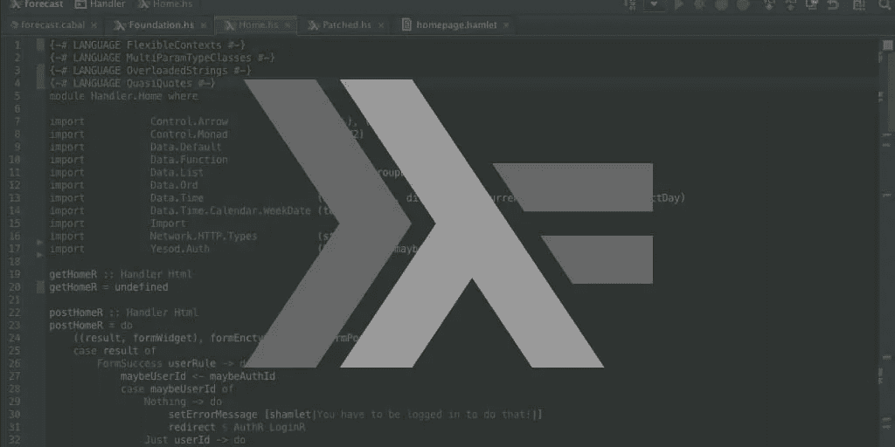
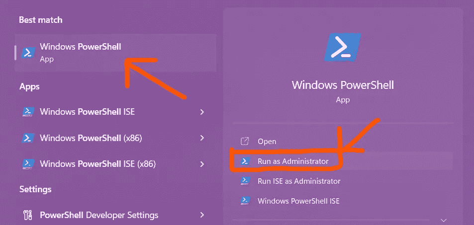

# 从哈斯克尔开始

> 原文：<https://medium.com/codex/starting-with-haskell-24d6027a719e?source=collection_archive---------10----------------------->

## 一种纯函数式编程语言

如果你个人了解我或者已经关注我的内容有一段时间了，你一定想知道我为什么写 Haskell——到 2022 年，它甚至不再被用于任何实际目的。嗯，公平地说，这将是我在大学里学到的，我决定先下手为强，享受我的新生派对🎉。



[来源](https://www.47deg.com/blog/setting-up-haskell/)

# 介绍

Haskell 是一种纯粹的函数式编程语言。它经常被用来向新手程序员传授编程的思想。有人会说 Java 比 Haskell 更好。我同意，但是。。。我没有答案，所以继续前进。

## 什么是函数式语言？

通俗地说，函数就是计算机需要运行的一组指令。如果你想拿这个和现实生活中的例子做比较，考虑一家餐馆。厨师的职责是烹饪食物。烹饪食物包括一套指令和一个工作流程——如果你可以称之为食谱的话。服务员的职责是把厨师的食物送到顾客手中。现在顾客的功能就是填饱肚子，然后出发。我们这里处理的一切都是基于函数的。类似地，Haskell 是一种函数式语言，它完全依赖于执行一组定义在函数内部的指令。

JavaScript 是函数式编程语言的另一个很好的例子；然而，JavaScript 并不完全是功能性的，因为最近的发展引入了其他主题。

# Haskell 的特性

Haskell 的主[网站](https://www.haskell.org)展示了编程语言的特性。

1.  **静态类型化—** Haskell 会给一个变量分配一个特定的类型，这个变量在整个执行过程中保持相同的类型。任何变量的类型都不能在执行过程中改变。
2.  **纯粹的函数性—** 正如我之前提到的那样，Haskell 中的一切都是函数。有这样的语句或指令(本身)，只有表达式不能变异变量。
3.  **类型推断—** 与 Java 不同，你没有明确提到类型。Haskell 将尽最大努力理解代码，并在适用的情况下隐式地分配类型。
4.  **并发—** Haskell 非常适合在不同线程上执行并行操作。它有一个高性能的垃圾收集器(也归功于每个变量都是不可变的)和一个轻量级的并发库。
5.  **懒惰—** 和你一样，Haskell 不喜欢执行操作，除非*真的*需要(我在开玩笑，你可能并不懒惰)。从程序上来说，函数和变量除非被调用，否则不会被计算。
6.  **软件包—** Haskell 有很大的开源贡献，在线托管了各种各样的第三方软件包。

# 装置

我是一个 Windows 用户，因为我已经安装了 Chocolatey，这很简单。如果你没有安装 Chocolately，我建议你先安装它。

## 使用 Powershell 安装 Chocolatey

首先，以管理员身份打开 Powershell。



运行以下命令:

```
Set-ExecutionPolicy Bypass -Scope Process -Force; [System.Net.ServicePointManager]::SecurityProtocol = [System.Net.ServicePointManager]::SecurityProtocol -bor 3072; iex ((New-Object System.Net.WebClient).DownloadString('https://chocolatey.org/install.ps1'))
```

**注意:**安装需要很长时间，在此期间你可以听一些你喜欢的歌曲。

## 安装 Haskell

你离安装 Haskell 只有一步之遥了，

```
choco install haskell-dev
```

每次安装程序要求您运行脚本时，按 enter 并选择“Y”。我希望你能继续听那首音乐，因为这次安装的时间长度差不多。

# GHCI

与 Haskell 一起安装的基本组件是 **Glasgow Haskell 编译器(GHC)** ，，它带有一个叫做 **GHCi** 的交互环境。要启动这个环境，请在您的 Windows Powershell 中运行`ghci`,并等待它加载。

一旦你做到了这一点，这是非常简单的使用。让我们从定义一个变量开始，

```
ghci> let num = 5
ghci> num
5
ghci>
```

您可以通过点击 **Ctrl+L** 来清除控制台，也可以通过输入命令`:q`来退出，类似于 Vim。

我希望你喜欢读我的文章，并学到了一些东西。谢谢大家！✌️

```
**Want to connect?**My [GitHub](https://github.com/cybercoder-naj) profile.
My [Portfolio](https://cybercoder-naj.github.io) website.
```