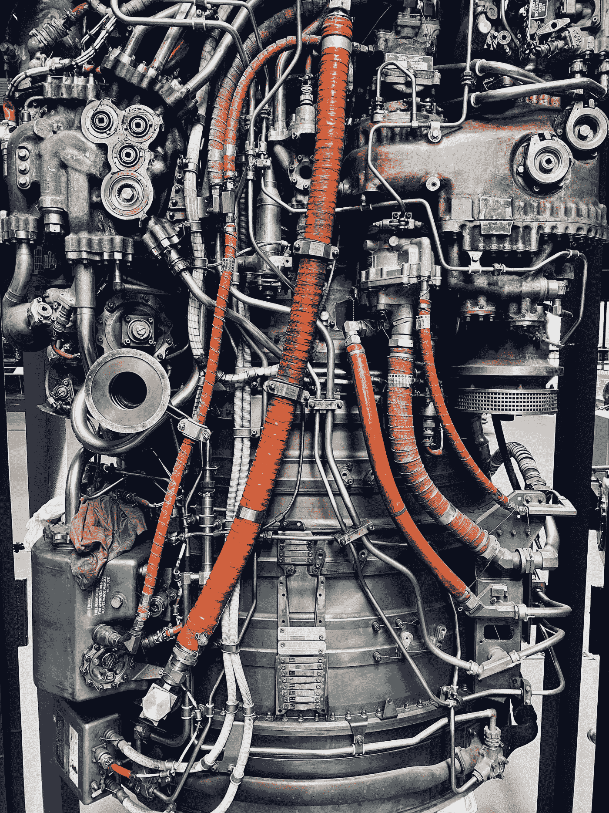
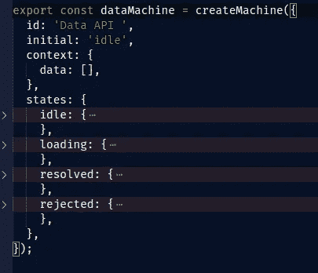
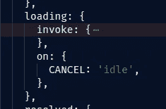
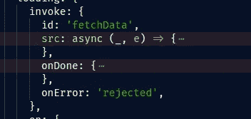
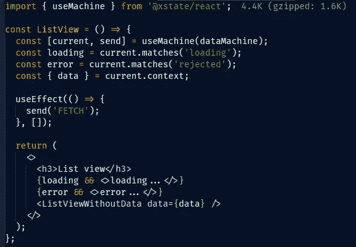

# React 升级后的状态管理:xstate

> 原文：<https://medium.com/codex/state-management-in-react-upgraded-xstate-58840a8962d9?source=collection_archive---------10----------------------->

卢卡·乔纳斯在 [Unsplash](https://unsplash.com?utm_source=medium&utm_medium=referral) 上的照片

# 简介(React 中的有限状态机概念)

inite 状态机的概念已经存在了很长时间，与 React 没有什么特别的关系。我不会在维基百科上全部介绍你，但主要思想是，你有一个有限的状态集，你的应用程序可以在任何一个时间点处于一个状态，并且只能处于一个状态。提供了一定的输入，有限状态机转换到它的另一个状态。现在，这种经过提炼的计算机科学听起来很像国家管理，有一个不变的单一真理来源，你肯定听说过很多。

`[xstate](https://github.com/statelyai/xstate)`库所做的是，它为你提供了一套自己的工具来创建有限状态机(FSM)来管理你的 javascript 应用程序状态。就其本身而言，`xstate`并不偏向于任何一个流行的库/框架——它只是一个概念的 javascript 实现，并且目前作为一个包提供给 [React](https://github.com/statelyai/xstate/tree/main/packages/xstate-react) 、 [Vue](https://github.com/statelyai/xstate/tree/main/packages/xstate-vue) 和 [Svelte](https://github.com/statelyai/xstate/tree/main/packages/xstate-svelte) 。

我最关心的是在组件之间共享状态机。现在，在组件之间共享状态机的最好方法是使用 React 内置的`useContext`钩子。

如果你对`xstate`有些熟悉，或者喜欢按自己的步调进行，请随意查看我曾经尝试过的 [github 库](https://github.com/sinisa-nimcevic/basic-async-call-repository/tree/ARTICLE/first-xstate)。它对状态机和`useContext`的实现进行了测试，这两者**不**包含在下面的内容中。

# 实施

我个人喜欢切换到 FSM 管理状态的原因是易于实现。附件 A —这是您的状态机依赖关系的权重:

关键 xstate 导入的网络开销

一旦你像一个真正的计算机科学家一样在一张纸上设计好了你的状态机，你就可以开始在`xstate`中编写你的第一个有限状态机了。顺便说一下，要想知道如何在纸上画出状态机并给你的朋友留下深刻印象，看看[这个](https://xstate.js.org/viz/)方便的工具，你可以用它来分析你实现的状态机。但稍后会详细介绍。

这是用`xstate`写的 FSM 的基础。

用`xstate`写的 FSM 的基础

这个特殊的 FSM 处理获取一组数据，你会看到它已经

*   一个人类可读的`id`，
*   我们马上设定`initial`状态，
*   它有所谓的`context`(这是你可以在`states`部分操作的)，
*   还有一部分详细描述了您的状态机的`states`。

这就是全部了。`states`部分完全在您的控制之下——本例中提供的状态名称完全由您来命名——没有类似框架的约束。此外，在这些类型的状态管理 API 中没有如此常见的难看的 switch case 语句。一切都整齐地打包在一个配置对象中。

我们看到初始状态被设置为`idle`。为了从一种状态转换到另一种状态，我们使用(是的，你已经猜到了)转换。这就是过渡的实现方式。

`FETCH`和`loading`都是您之前选择的任意名称。多酷啊。因此，如果状态是`idle`，如果机器接收到一个`FETCH`命令，它将转换到称为`loading`的状态。对于在您的`states`中定义的每个状态，您可以有任意数量的`on`对象，每个对象由您打算发送到您的 FSM 的命令命名，并且每个对象通向下一个预期状态。

现在，当处理异步代码时，也就是我们例子中的`loading`状态，事情变得稍微复杂了一些。

`loading`状态在`invoke`属性下有一个调用配置。简化和删减的注释如下所示。

在一个`xstate`状态配置中处理异步状态。

调用分解如下所示:

带有源代码和内置挂钩的调用配置。

我希望我已经清楚地注释了代码的这一部分，并且折叠的、简化的配置截图应该突出了配置异步数据调用的关键要素。

一旦您的状态机准备好了，就将其导入到您的组件中，并使用一个`useMachine`钩子:

useMachine 挂钩的用例示例。

这或多或少是 FSM 的要点，包括一些稍微高级的特性来适应异步代码。

# 但是它是如何扩展的呢？

随着你的应用程序变得越来越复杂，我们面临着所谓的“状态和转换爆炸”。值得庆幸的是，因为 FSM 作为一个概念在 40 年代就已经存在，所以这个问题已经解决了。1987 年，一个叫大卫·哈雷尔的家伙建立了状态图。这在 David Kourdish 在 CSSConf BP 2019 的[演讲中有详细介绍——我将尝试解释的内容就在那里(只是由`xstate`库的作者本人更雄辩地提出)，所以我恳求你，如果你已经走了这么远，并且有大约 40 分钟的空闲时间，请务必查看一下。](https://www.youtube.com/watch?v=0cqeGeC98MA)

因此，为了保持简短，状态图*在概念上*提供:

*   **动作** ( `xstate`对`entry`和`exit`事件有钩状配置，转场是顺便动作等)
*   **守卫**(可以实现条件转换)
*   **层级**(可以有嵌套状态)
*   **正交性**(可以有平行状态)
*   历史(你可以转换回记忆中的状态)

如果你计划将`xstate`添加到你的项目中，确保你记住这一点，并在[官方文件](https://github.com/statelyai/xstate)中找到更多信息。

# 结论

在您的应用程序中使用 FSM 和状态图的主要优势是能够[可视化](https://xstate.js.org/viz)您的软件建模过程，创建易于推理(和测试)的精确逻辑图，出色的测试覆盖率，自动生成的代码，最重要的是，通过所有这些，适应后期的突破性需求变化。

可能会阻碍你的是学习曲线，以及这种思考软件的方式需要提前计划的事实(但是说实话，没有提前计划，不会有很多好的项目发生)。此外，有一个警告——并不是所有的都可以用状态图来建模。

至于我自己，我完全接受这个想法，并期待下次有机会时使用`xstate`。我也希望我已经把你推到了正确的*方向上*，并且前端开发社区将开始更多地意识到使用类似于这里所描述的技术的软件建模。这篇文章只是触及了皮毛。

*如果你认为你对 xstate 有一些见解，而我可能遗漏了或误解了，我鼓励你联系我——这个主题很广泛，可以用无数种方式来处理。如果你想拓展你的人际网络，你也可以在推特上找到我。*