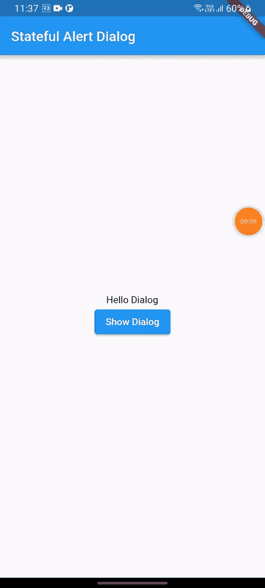

# flutter 中的状态警报对话框

> 原文：<https://medium.com/codex/stateful-alertdialog-in-flutter-adc5a760c5c7?source=collection_archive---------3----------------------->

这里我们将讨论如何使用 alertdialog 和处理状态。

我们的工作应用程序功能如下:



在编码之前，让我们讨论一下我们将在项目中使用的一些术语和部件。

# 有状态小部件

我们使用 **createState()方法**来创建一个有状态的小部件。有状态小部件是通过构建一系列更具体地表示用户界面的其他小部件来描述部分用户接口的小部件。它具有可变的状态，这意味着小部件的任何变量的状态都可以在小部件的生命周期内改变。

# 警报对话框

警告对话框可以被定义为一个小窗口，当我们需要用户的决定或输入额外的信息时显示出来。

# mainAxisSize

它是定义主轴大小的行和列的属性之一。对于**行**，**主轴**是水平的**，**列**是垂直的。**

# 国家建设者

它是一个柏拉图式的小部件，包含状态并调用闭包来获取其子部件。 **StateSetter** 函数被传递给 builder 用于调用一个重建而不是一个典型状态的 State.setState

# 流行音乐

Pop 是一种导航方法。从导航器中弹出最紧密包围给定上下文的最顶层路径。当用户从类或小部件向后导航时，使用或触发它。

# 然后

它注册了将来完成时需要调用的回调。当这个 future 以一个值结束时，`onValue`回调将使用该值被调用。在大多数情况下，单独使用 [catchError](https://api.flutter.dev/flutter/dart-async/Future/catchError.html) ，可能带有一个`test`参数，而不是在一个单独的[然后](https://api.flutter.dev/flutter/dart-async/Future/then.html)调用中同时处理值和错误，这样更具可读性。

请注意，futures 不会延迟错误报告，直到添加了侦听器。如果第一个`then`或`catchError`调用发生在这个期货有错误地完成之后，那么该错误被报告为未处理的错误。参见关于[未来](https://api.flutter.dev/flutter/dart-async/Future-class.html)的描述。

# 下拉按钮

它是一个材质设计按钮，用于从列表中选择项目。它允许用户从多个项目中进行选择。

这些是我们项目中将要用到的术语、小部件和方法。

# 让我们开始吃吧

首先让我们创建一个名为 ***alertItem.dart 的文件。*** 在这里，我们将创建我们将在**警报对话框**中使用的项目。在其中，我们创建了一个有状态的小部件，在那里我们创建了下拉菜单。

在这里，我们映射下拉列表中的项目数组或列表。DropDown 小部件由接受数组映射的**项**参数组成。

```
items: items.map((String items) {
            return DropdownMenuItem(
              value: items,
              child: Text(items),
            );
          }).toList(),
```

在 dropdown 中，当用户从 dropdown 中选择一个项目时，触发 **onChanged** 方法。它取值。

```
onChanged: (String? newValue) {
            setState(() {
              dropdownvalue = newValue!;
            });
          },
```

当选择项目并单击按钮时，我们会在对话框关闭时返回值。

```
Navigator.pop(context,dropdownvalue);
```

*alertItem.dart*

alertItem.dart

接下来，在 **lib** 文件夹中创建 **homepage.dart** 文件。

这里我们有一个名为 **text** 的**字符串**，它在我们从 alertdialog 返回时取值。当 alertdialog 关闭**时，就会触发**方法，我们会从中获取数据。

```
then((value) {
      if (value != null) {
      setState(() {
        text=value;
      });
      }
    });
```

*主页.镖*

主页. dart

最后我们的 **main.dart** 文件。

主.镖

# 让我们连接起来

我们可以成为朋友。在[脸书](https://www.facebook.com/nabin.dhakal.714/)、 [Linkedin](https://www.linkedin.com/in/nabindhakal/) 、 [Github](https://github.com/nbnD) 、 [Youtube](https://www.youtube.com/channel/UCW6oYt_3QSl7J2HSHNqwXWw) 、 [BuyMeACoffee](https://www.buymeacoffee.com/nabindhakal) 和 [Instagram](https://www.instagram.com/nbn_d_/) 上查找。

拜访:[颤振结](https://flutterjunction.com/)

**投稿:** [BuyMeACoffee](https://www.buymeacoffee.com/nabindhakal)

# 结论

希望这篇文章对你有所帮助，让你学到新的东西。我在这篇文章中使用了一些对你们中的一些人来说可能是新的东西。

如果你学到了新的东西或者想提出一些建议，请在评论中告诉我。

如果你喜欢这篇文章，请点击👏图标，它为向大家提供新事物提供了动力。

也请关注令人兴奋的文章和项目的更新。

通过分享学习在学习过程中产生巨大的影响，并使社区越来越大。

分享是吸引其他爱好者的磁石。

因此，让我们迈出一小步，让我们的学习社区变得更大。

与你的朋友分享这篇文章，或者如果你喜欢这篇文章，就在推特上发表。

# **在:**吃得饱

[](https://github.com/nbnD/alertdialog) [## GitHub-nbnD/警报对话框

### 一个新的颤振项目。这个项目是颤振应用的起点。一些帮助您入门的资源…

github.com](https://github.com/nbnD/alertdialog)