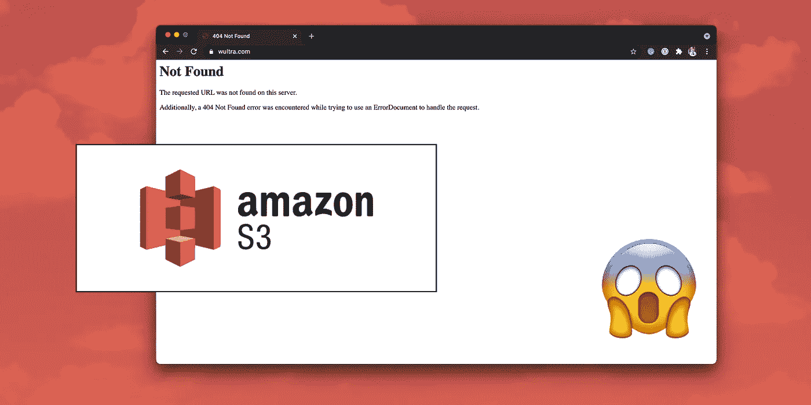
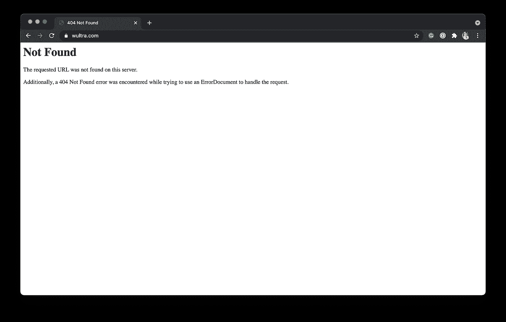
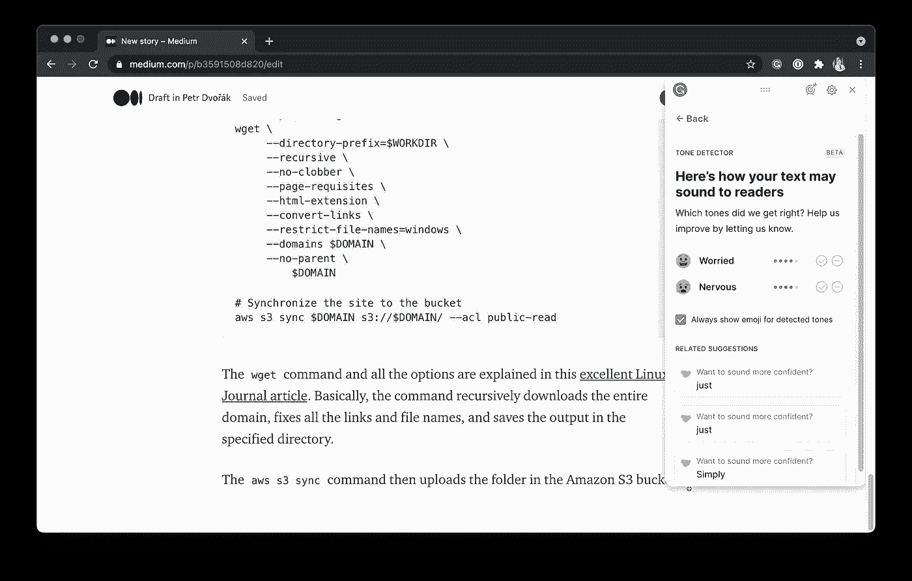
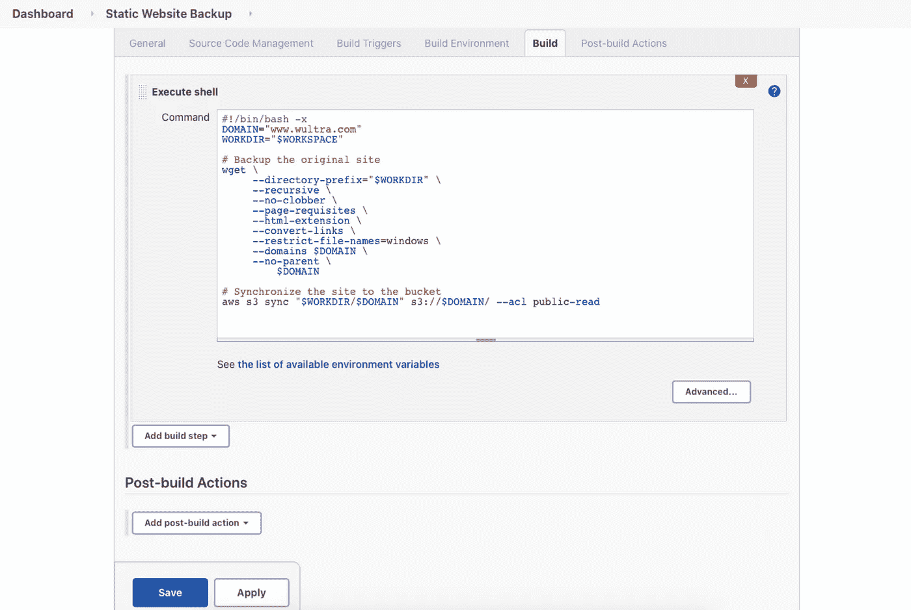
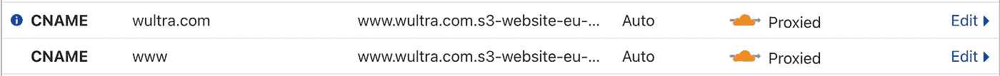
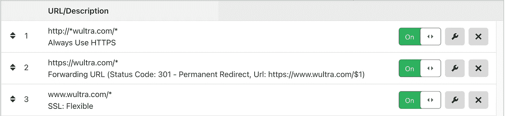
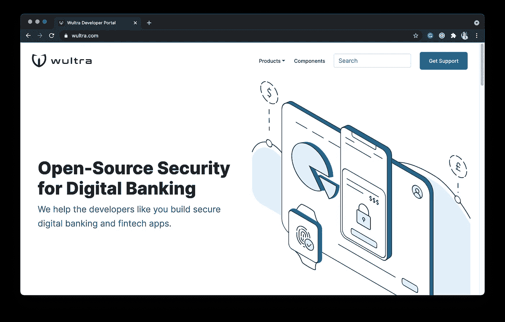

# 静态公司网站备份在亚马逊 S3 桶作为灾难恢复的最后手段

> 原文：<https://medium.com/codex/static-company-website-backup-for-the-last-resort-disaster-recovery-b3591508d820?source=collection_archive---------4----------------------->



## 现在，就在我写这篇文章的时候，我们的[公司网站](https://www.wultra.com/)关闭了。在正常情况下，这将引发立即调查，试图尽快解决问题。但是，我们依赖平台提供商进行托管。一切都不在掌控之中，所以我们只能等待…

已经 8 个小时了，还在继续。我们的网站仍然显示不祥的“404”错误页面。我们无能为力，我们没有后援。平台提供商的沟通很糟糕。我们不知道这个问题什么时候会得到解决，甚至不知道到底发生了什么。云的终极力量可能会以某种方式过快地转变为绝望。



> “我们是一家网络安全公司，帮助确保银行安全。”

这是我们对顾客的推销。现在，我们的网站瘫痪了，我们无法控制局面。ISO 27001 my A$$。我很生气，很惭愧，也很无助，但奇怪的是同时又“在状态中”。在这场风暴中，我们并不孤单。至少有一家银行(！)和一家大型 IT 服务提供商使用相同的网站托管平台，他们拥有与我们一样长的“404”页面。

因此，为了做好准备应对下一次同样的情况，也许为了在未来拯救其他人的生命，我决定写一篇关于如何将网站备份为静态 HTML 页面的帖子，作为最后的退路。

# 建立基础设施

## 创建亚马逊 S3 桶

作为第一步，创建一个新的亚马逊 S3 桶。在亚马逊 S3 桶中托管一个静态网站是一个相对标准的任务，它被很好地记录在的[中。我不会过多地讨论这个话题，以下是概要:](https://docs.aws.amazon.com/AmazonS3/latest/userguide/WebsiteHosting.html)

1.  访问亚马逊 S3 管理控制台:[https://s3.console.aws.amazon.com/](https://s3.console.aws.amazon.com/)
2.  创建一个与您的网站名称相同的新 bucket，在我们的例子中就是`www.wultra.com`。
3.  打开桶细节。
4.  在“属性”标签中启用“静态网站托管”。
5.  在“权限”选项卡中，关闭“阻止公共访问(桶设置)”中的所有限制，以启用对桶的访问。

我们现在有了一个放置静态 HTML 文件的好地方。

## 设置备份用户凭据和访问权限

为了允许从脚本访问我们的 bucket，我们需要创建一个用户。我们可以通过 Amazon 身份和访问管理(IAM)控制台做到这一点。

1.  访问亚马逊 IAM 管理控制台:[https://console.aws.amazon.com/iam/](https://console.aws.amazon.com/iam/)
2.  在左侧菜单中选择“用户”,然后单击“添加用户”按钮。
3.  选择一个用户名，如`website-backup-user`并选择了“程序化访问”类型。
4.  现在，我们只需要创建一个用户。我们稍后将设置权限。重复单击“下一步”按钮，跳过所有步骤，直到用户创建完毕，您可以看到“访问密钥 ID”和“秘密访问密钥”的值。确保复制这些值并保存在您的秘密管理系统(即密码管理器)中。
5.  点击“关闭”完成添加新用户。
6.  打开用户详细信息。在“权限”选项卡上，单击“添加内嵌策略”按钮。
7.  直接跳到 JSON 选项卡，输入下面的策略**(编辑 bucket 名称以包含您的域)**。用您喜欢的名称查看并保存策略，例如`UploadWebsiteBackup`(与我们的 SID 值相同):

```
{
    "Version": "2012-10-17",
    "Statement": [
        {
            "Sid": "UploadWebsiteBackup",
            "Effect": "Allow",
            "Action": [
                "s3:PutObject",
                "s3:PutObjectAcl",
                "s3:GetObjectAcl",
                "s3:GetObject",
                "s3:ListBucket"
            ],
            "Resource": [
                "arn:aws:s3:::[www.wultra.com](http://www.wultra.com)",
                "arn:aws:s3:::[www.wultra.com/*](http://www.wultra.com/*)"
            ]
        }
    ]
}
```

脚本中定义的“动作”代表稍后运行`aws s3 sync`命令所需的最小集合。我们不添加任何删除权限，因为我们希望备份是永久性的。此外，我们只授予用户访问我们之前为备份创建的单个存储桶的权限。总而言之，脚本只包含需要的内容。

## 配置 AWS 命令行访问

如果尚未安装 AWS CLI 工具，请安装。我在 macOS 电脑上使用了自制软件:

```
brew install awscli
```

现在，您可以从命令行配置 AWS 访问。只需运行:

```
aws configure
```

输入您的 AWS 访问密钥 ID、AWS 秘密访问密钥、默认区域名称(使用您托管 S3 存储桶的名称)和默认输出格式(“html”)。

```
$ aws configure
AWS Access Key ID [********************]: ******************** 
AWS Secret Access Key [********************]: ********************
Default region name [default]: eu-west-1 
Default output format [default]: html
```

您现在可以通过脚本创建静态备份了。

# 全能的备份脚本

编写备份脚本是下一步，我认为最困难的部分实际上非常简单。原来`wget`几乎可以做任何事情，包括确保从 HTML 文件中获取所有依赖项的“HTML 扩展”。纯粹的魔法。`aws s3 sync`命令应该负责上传任务。

我准备了以下脚本:

```
#!/bin/bash -xDOMAIN=$1
WORKDIR=${2:-`pwd`}# Backup the original site
wget \
     --directory-prefix="$WORKDIR" \
     --recursive \
     --no-clobber \
     --page-requisites \
     --html-extension \
     --convert-links \
     --restrict-file-names=windows \
     --domains $DOMAIN \
     --no-parent \
         $DOMAIN# Synchronize the site to the bucket
aws s3 sync "$WORKDIR/$DOMAIN" s3://$DOMAIN/ --acl public-read
```

在这篇优秀的 Linux 期刊文章中解释了`wget`命令和所有选项。基本上，该命令递归地下载整个域，修复所有链接和文件名，并将输出保存在指定的目录中。

然后,`aws s3 sync`命令上传亚马逊 S3 桶中的文件夹，该文件夹具有公共网站托管的正确权限。

您可以像这样运行脚本:

```
./backup.sh www.wultra.com
```

或者，您可以将下载文件夹指定为第二个参数:

```
./backup.sh www.wultra.com /tmp
```

所以…现在我需要等到网站恢复，这样我就可以为下次做实际的备份了。在我等待的时候，一个人必须从语法上爱[才能完美地解读情感。这个人工智能的东西越来越令人毛骨悚然…](https://grammarly.com)



# 下一步是什么

在我们结束这篇文章之前，有几个主题需要讨论…

## 定期运行脚本

运行备份脚本的最简单和最“云不可知”的方法是创建一个`cron`配置，或者在一些维护良好且易于访问的机器上使用 Jenkins。我选择了詹金斯方法。我喜欢詹金斯很久了。另外——作为一个积极的副作用——你将在詹金斯的`WORKSPACE`目录中多一份网站副本。



## 在 Cloudflare 上配置 DNS 记录

每当像今天这样的灾难发生时，我们的网站宕机超过 30 分钟，我可以通过 Cloudflare 中的 DNS 设置将我们的网站切换到备用静态 HTML 副本，方法是将`www`子域的`CNAME`记录指向亚马逊 S3 桶。



Cloudflare: DNS 设置

我不得不稍微调整 SSL 设置(使用灵活模式，因为 bucket 不使用 SSL ),并通过 Cloudflare 页面规则配置重定向，以使一切按预期工作:



Cloudflare:页面规则

当然，该解决方案在部署时并不完美。动态表单将无法正常工作，布局可能在某些地方被破坏。但大部分内容仍将对搜索引擎索引和希望查看网站信息或获取联系信息的访问者开放。

*编辑:这里是静态备份网站的预览:*[*http://www.wultra.com.s3-website-eu-west-1.amazonaws.com/*](http://www.wultra.com.s3-website-eu-west-1.amazonaws.com/)*，这里是原文:*[*https://www.wultra.com/*](https://www.wultra.com/)

所以，我写完这篇文章，我们的网站仍然关闭。作为备份解决方案，我部署了开发人员门户的备份。不理想，但至少我们不会用“404”页面问候我们的潜在客户和合作伙伴。



让这成为对我们的一个警告:依赖那些看似不重要的服务，服务水平协议很弱，而且没有对服务不可用的惩罚，可能不是最好的选择。我们从这一事件中吸取了教训——很明显，我们应该对公司网站或类似的不需要备份的服务进行备份。

给我们服务提供商的一个快速提示:

*   您在灾难恢复领域有一个空白。对于网站提供商来说，在一个多小时内恢复部分服务是不可接受的。您应该每季度练习一次基本服务备份恢复。
*   交流一定会更好。设置[状态页面](https://www.atlassian.com/software/statuspage)通过一些标准化的界面交流事件，在您发现事件后立即交流，交流进展情况，提供解决时间的估计值等。