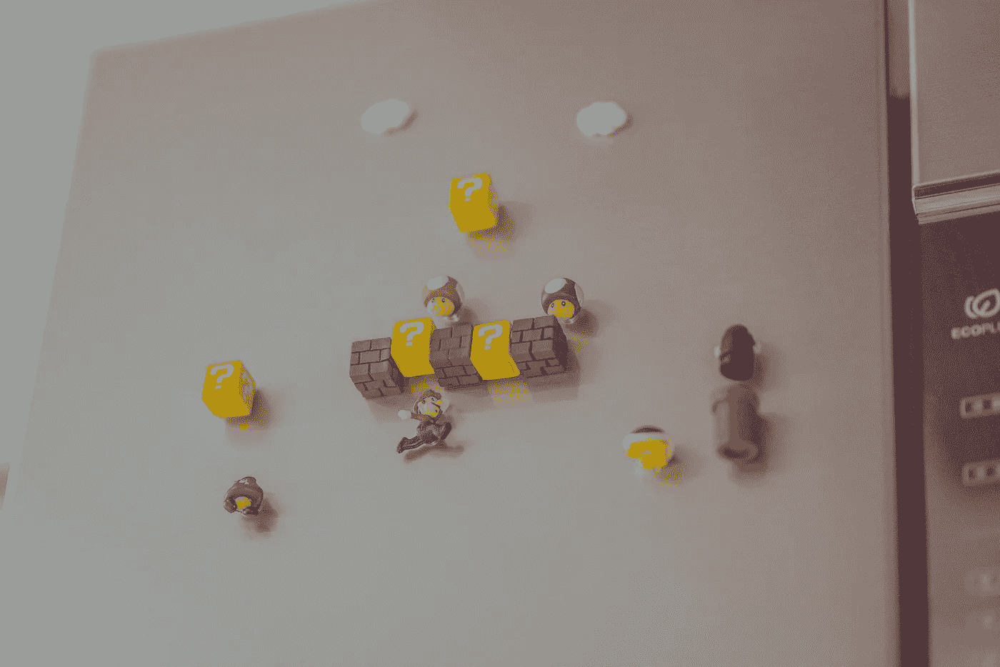

# TypeScript 接口中不支持静态方法

> 原文：<https://medium.com/codex/static-methods-not-supported-in-typescript-interfaces-54a01e1e46ea?source=collection_archive---------6----------------------->

## 暂时

照片由[曾晓林](https://unsplash.com/@linzengxiao?utm_source=unsplash&utm_medium=referral&utm_content=creditCopyText)在 [Unsplash](https://unsplash.com/s/photos/mario?utm_source=unsplash&utm_medium=referral&utm_content=creditCopyText) 拍摄

你好，事情进行得怎么样了？让我向您展示 PHP 和 TypeScript 在面向对象编程中所谓的“接口”方面有多么相似。这是“为什么 TypeScript 和 PHP 是好朋友”系列的第二篇文章，我们将复杂的 PHP 代码库转换成 TypeScript。