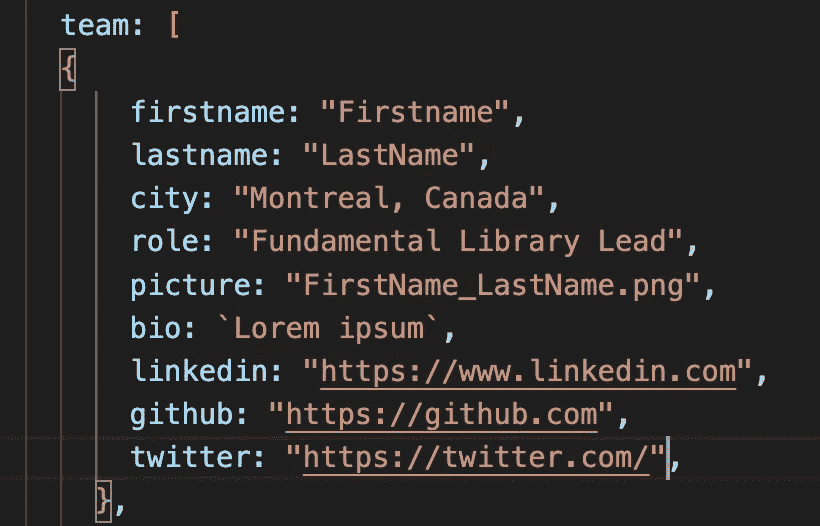

# VUE3 中的静态与动态图像路径

> 原文：<https://medium.com/codex/static-vs-dynamic-images-paths-in-vue3-8f1e5628856d?source=collection_archive---------9----------------------->

## 基础会议 2022 网站

图片由 [Unsplash 的](https://unsplash.com) [Mohammad Rahmani](https://unsplash.com/@afgprogrammer) 拍摄。

如果您希望在 Vue 项目中实现静态或动态图像，那么您来对地方了。虽然 StackOverflow 有许多关于这个主题的帖子，但我将展示两种方法(静态和动态)以及它们的差异，以在您当前的项目中获得 **< img >** 。

作为参考，我将使用[**Fundamental Conference 2022 网站**](https://fundamentalconf.com/#/agenda) 具体来说，我们团队的**页面。如果您没有机会参加会议，我们已经在我们的[**议程页面**](https://fundamentalconf.com/#/agenda) **上附上了所有的录音和演示材料。****

****

**截图来自 [**我们的团队页面**](https://fundamentalconf.com/#/team)**

# **要求**

**该部分的要求是在团队成员列表中显示正确的图片。不同的图片需要分配正确的名称、工作职位等。我将为同一个需求提供两种不同的解决方案。**

**注意:我见过使用不同库的不同解决方案。在我看来，我认为没有必要为了这样的需求而让项目过载库。**

## **静态解决方案**

**对于这种需求，第一个解决方案(也不是最理想的)是静态地指向每个列表项。对于这样的解决方案，我们不需要使用 For 循环，相反，我们需要创建每个列表项。如果我们的团队页面有 6 个成员，我们需要创建 6 个不同的列表。**

****好处****

*   **发送给用户的服务器不改变的对象。**
*   **可用于将来不需要更改的图像(如图标)**

****缺点****

*   **对于上面提到的需求，这种方法不是一个可行的解决方案，因为它会导致大量的重复代码。此外，如果团队成员发生变化，我们需要机械地将其从代码中移除。**

## **动态解决方案**

**第二种解决方案是使用 for 循环遍历所有成员，并显示成员图片。这种方法更符合这篇博文引言中提出的需求。**

****

**“团队阵列”页面的屏幕截图**

**对于这种类型的项目，没有很多数据，所以我们将信息存储在本地，而不是使用数据库。上面的屏幕截图展示了数据是如何存储在源数据数组中的。这个想法是通过循环**团队**并获得图片名称。所有的图像都以 **png** 格式存储。**

**另一种方法是用路径名存储文件名并直接使用它们，但这意味着每个幻灯片名称都有点重复(查看[***干货***](/technology-hits/dry-dont-repeat-yourself-c1a8086530be) )。此外，在这篇文章的后面，你会看到为什么使用路径名不是一个好主意。**

**在上面截取的代码中，我在**

*   **中循环了整个团队，然后提取了图像路径。另外，不要忘记添加**要求()。**如果在 **require()中没有输入路径文件，**将找不到图像。这个方法的问题是,`@/assets/...`是由 Vue 处理的，当作为一个 prop 传递时，要么被当作一个文字，要么没有正确处理文件名散列。在 **require** 中包装图像路径将允许 Vue 获得别名`@/assets/...`，并在文件名散列中正确地找到图像。**

**另一个解决方案是创建一个获取路径的函数，我们只需要在路径中赋值。**

****好处****

*   **如果成员被删除或更新，您不需要在代码中从列表中手动删除该成员。**

****缺点****

*   **对于在整个项目中不会改变或更新的静态图像，这不一定是最可行的解决方案。**

**总的来说，您可以根据您试图解决的问题选择使用下面提出的每个解决方案。对于某个问题或需求，总是有不止一个解决方案。我希望你能发现上面的一个解决方案对你的项目有所帮助。**

**快乐编码:)**