# 统计语言模型:使用 Python 计算单词序列概率的 N-gram。

> 原文：<https://medium.com/codex/statistical-language-model-n-gram-to-calculate-the-probability-of-word-sequence-using-python-2e54a1084250?source=collection_archive---------1----------------------->

## N-gram 分步实施综合指南。

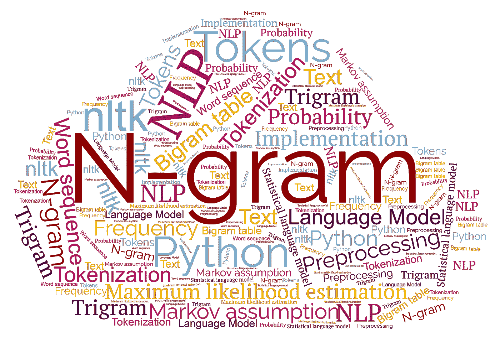

T 这篇文章介绍了 n-gram 的逐步 python 实现，以预测给定数据集的给定句子的概率。本文主要介绍了语言模型的解释 **N 元语法**，以及它在 python 中的实现。实现分为 11 个步骤，每个步骤都有描述和代码，后面是每个代码的输出。

# 目录

*   [*什么是语言模型？*](#ab36)
*   [*什么是统计语言建模？*](#ae2e)
*   [*什么是 N-gram？*](#a14c)
*   [*N-gram 在 python 中的实现*](#d1c9)

# 什么是语言模型？

在自然语言处理中，语言模型是字母序列的概率分布。语言模型分析文本数据来计算单词概率。它使用一种算法来解释数据，这种算法为自然语言中的上下文建立规则。

> 语言建模是确定单词序列概率的艺术。这在许多领域都很有用，包括语音识别、光学字符识别、手写识别、机器翻译和拼写纠正
> 
> ——语言建模的一点进展，2001 年

# 什么是统计语言建模(SLM)？

统计语言建模旨在创建一个能够准确估计自然语言分布的统计语言模型。统计语言模型(SLM)是字符串 S 上的概率分布 P(s ),它试图反映字符串 S 作为短语出现的频率。

# 什么是 N-gram？

N-gram 是一种统计语言模型，它为句子和单词序列分配概率。词序可以是 2 个词、3 个词、4 个词等。比如 n 字。n 元语法也被称为 n 个单词的序列。N-gram 语言模型是基于一系列单词的计数来确定概率的语言模型。根据字数统计，N-gram 可以是:

*   T21:只有一个单词的序列
*   **二元模型**:两个单词的序列
*   **三元组**:三个字的序列

我们用一个例子来理解 N-gram。考虑下面的句子:

“无论你走到哪里，都要保持乐观”

1-gram(或 unigram)是一个单词序列。对于上面的句子，单字可以简单地是:“保持”、“传播”、“积极”、“无论何处”、“你”、“去”。

一个 2-gram(或 bigram)是两个单词的单词序列，像“继续传播”，“传播积极”，“无论何处都是积极的”，“无论你在哪里”，或“你去哪里”。三字格(或三元格)是由三个单词组成的单词序列，如“继续传播积极”、“在任何地方传播积极”、“无论你在哪里都积极”或“无论你去哪里”。

当我们使用二元模型来预测下一个单词的条件概率时，我们因此做出如下近似:

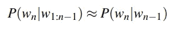

一个词的概率只取决于前一个词的假设叫做**马尔可夫假设。**

一种估计概率的直观方法叫做最大似然估计或 MLE。我们通过从语料库中获取计数，并对计数进行归一化，使它们位于 0 和 1 之间，从而获得 n 元模型参数的**最大似然估计**或 **MLE** 估计。

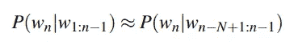

# N 元语法在 Python 中的实现

> 注意:我已经提供了 Python 代码及其输出。在文章的最后，您可以找到完整的全长代码

## 第一步:数据语料库

在这个实现中，我们从用户那里获取输入数据。可以输入 python 中 nltk 模块提供的数据集。

```
d=input("Enter corpus = ")
```

输出:

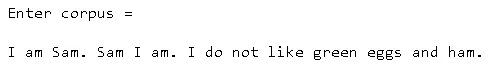

## 第二步:预处理

在这一步中，数据被转换成小写，标点符号(这里是句点符号)被删除，以去除数据中无用的部分或干扰。这里我们使用 eos 标签来标记句子的开始和结束。

输出:

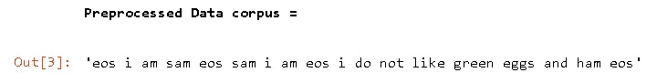

## 步骤 3:标记化

预处理过的数据现在被转换成一系列标记。这些标记有助于理解上下文或开发 NLP 的模型。

输出:

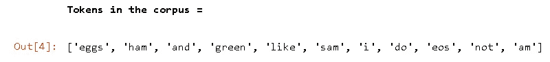

## 步骤 4:计算令牌的频率

在此步骤中，定义一个空字典来保存标记化数据集中每个标记的频率。输出屏幕截图中显示了给定数据集中每个标记的出现频率。

输出:

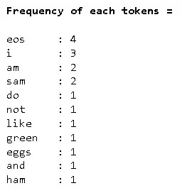

## 第五步:生成 n 元语法

步骤 3 中生成的标记用于生成 n 元语法。这里，代码中的 k 表示 n-grams 中的 n。在这个实现中，我们将使用二元模型(k=n=2)来计算一个句子的概率。

输出:

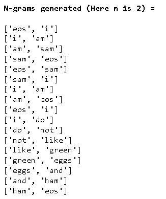

## 第六步:计算 n-gram 的频率

dct1 是包含步骤 5 中生成的 n 元语法作为关键字的字典。计算数据集中每个 n 元语法的频率，并将其作为值添加到字典 dct1 中相应的 n 元语法键。在接下来的步骤中，将需要这些频率来计算概率。

输出:

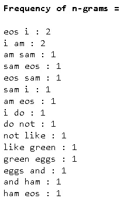

## 步骤 7:概率表/二元表

在这一步中计算每个 n 元文法的概率，并存储在矩阵中(这里是 l)。计算 n-gram 概率的公式如下:

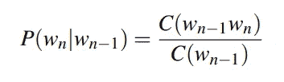

举个例子，

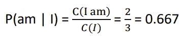

类似地，每个 n-gram 的概率被计算并存储在概率表 refer 输出图像中。这个概率表用于计算给定单词序列的概率。

输出:

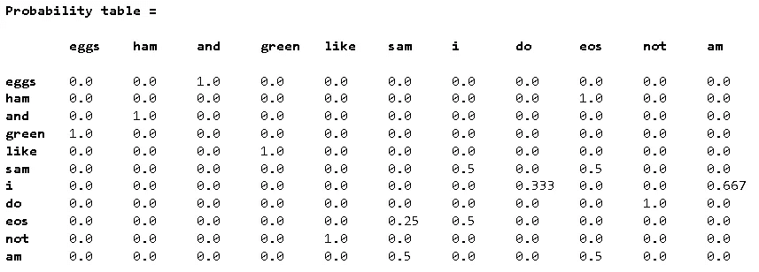

## 步骤 8:输入文本检查概率

拿一句话来计算它的概率。

```
text = input("Enter Text = \n")
```

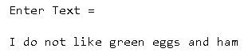

## 步骤 9:对给定的文本重复步骤 2- 6

使用前面步骤中创建的函数对输入文本进行预处理、标记化并生成 n 元语法。

输出:

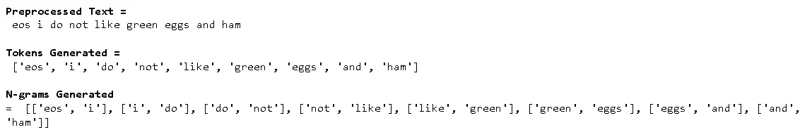

## 步骤 10:计算二元模型概率

在这一步中，计算每个 n 元语法的概率，这将在进一步的步骤中使用。

输出:

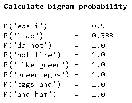

## 步骤 11:计算单词序列的概率

使用**概率链规则计算完整单词序列的概率。**

将概率链规则应用于单词，我们得到:

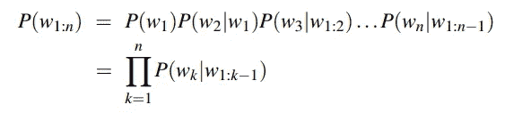

这里，计算句子的概率:

**P("我不喜欢绿色的鸡蛋和火腿")**

= P(I | EOS)* P(do | I)* P(not | do)* P(like | not)* P(green | like)* P(eggs | green)* P(and | eggs)* P(ham | and)* P(EOS | ham)

= 2 * 2 * 1 * 1 * 1 * 1 * 1 * 1 * 1 * 1 * 1 * 1 * 1 * 1

= **0.1665**

输出:

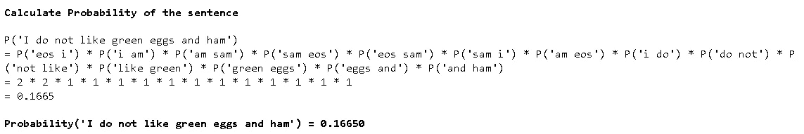

我的 GitHub 上提供了完整的完整实现:[minak shee 25/自然语言处理(github.com)](https://github.com/Minakshee25/Natural-Language-Processing)。

或者访问以下 Repl 存储库:

[](https://replit.com/join/xnuenbxpml-minaksheenaraya) [## 邀请在 Replit 上合作

### 使用 Replit 多人游戏一起编码

replit.com](https://replit.com/join/xnuenbxpml-minaksheenaraya) 

使用这些 n 元语法和某些单词在某些序列中出现的概率可以改进自动补全系统的预测。同样，我们使用 can NLP 和 n-grams 来训练基于语音的个人助理机器人。例如，使用 3-gram 或 trigram 训练模型，机器人将能够理解句子之间的差异，如“温度是多少？”和“设定温度”

希望你觉得这篇中型文章有用！做个好人，如果博客对你有帮助，就为它鼓掌吧:-)

关注我的类似文章！

> 您可以通过以下方式与我联系:
> 
> 领英**🧑‍💼:[https://www.linkedin.com/in/minakshee-n-408b1a199/](https://www.linkedin.com/in/minakshee-n-408b1a199/)**

**如果你喜欢这篇文章，这里有一些你可能喜欢的文章:**

[](/@minakshee.narayankar2000/error-free-installation-of-owncloud-server-on-windows-10-within-30-minutes-using-wsl-6450c38b1ae0) [## 使用 WSL 在 30 分钟内将 Owncloud 服务器无误地安装到 Windows 10 上！

### Owncloud 服务器的安装很繁琐，不是因为步骤冗长，而是因为大多数命令都不够用…

medium.com](/@minakshee.narayankar2000/error-free-installation-of-owncloud-server-on-windows-10-within-30-minutes-using-wsl-6450c38b1ae0)