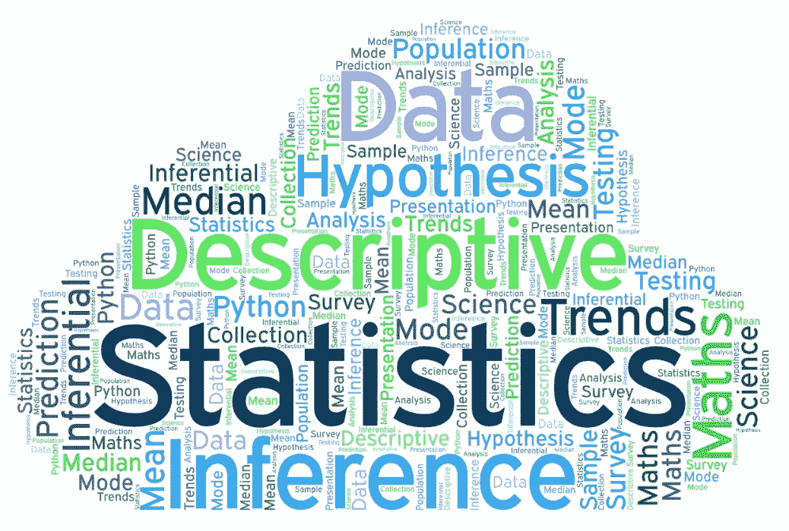
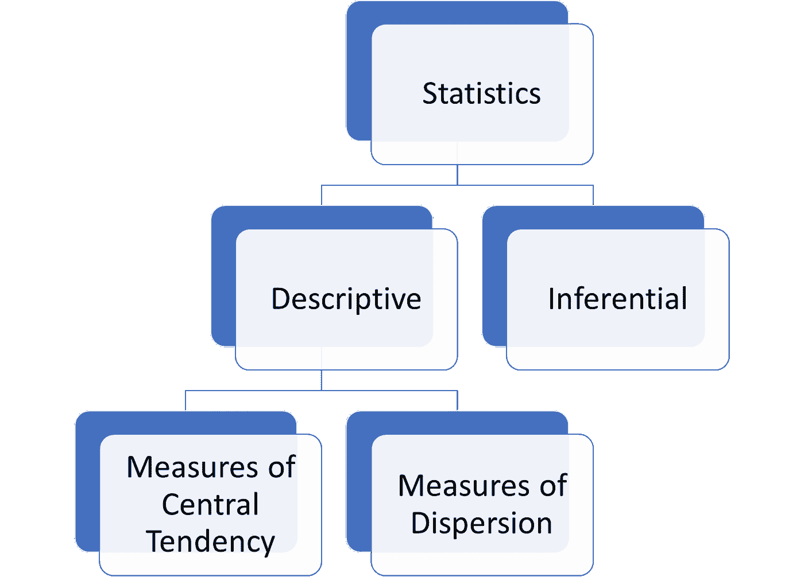
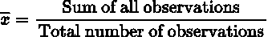
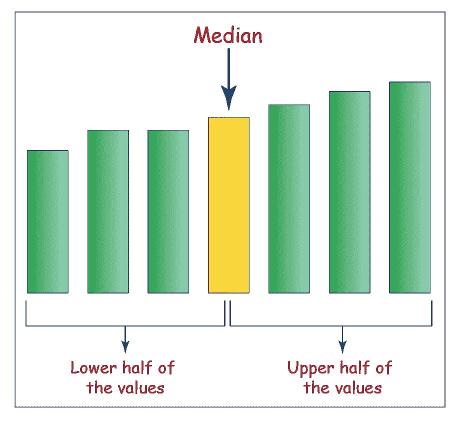
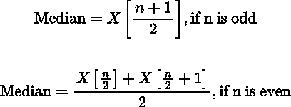
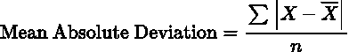
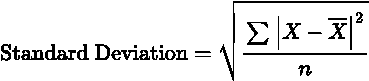

# 数据分析师的统计:使用 Python 的描述性统计

> 原文：<https://medium.com/codex/statistics-for-data-analysts-descriptive-statistics-with-python-cc6e4485209f?source=collection_archive---------5----------------------->


鸣谢:[壁纸 Safari](https://wallpapersafari.com/w/Ty3Uto)

统计学是数据分析的基础。仅仅掌握用于分析的工具或语言是不够的，统计学知识对于从数据中得出准确的推论是很重要的。统计数据存在于数据分析工作流程的所有级别，从数据收集到呈现数据洞察。

统计学的定义本身就表明了它在数据分析中的相关性。简单来说，统计有助于将数据转化为信息，从而获得洞察力。根据卡莉·菲奥莉娜(惠普公司前首席执行官)关于数据分析的目标:

> “目标是将数据转化为信息，将信息转化为见解”

统计学的目的是描述或预测数据。在这个前提下，统计可以分为两类:描述性统计和推断性统计。

本文重点介绍使用 Python 的描述性统计。为了说明，我们将使用学生在考试中表现的案例研究。使用的数据可以在 [**这里**](https://www.kaggle.com/datasets/spscientist/students-performance-in-exams) 找到。该数据包含学生的个人详细信息，如性别、种族等。以及他们在数学、阅读和写作方面的考试成绩。

# 描述统计学



信用:[中等](/geekculture/2-most-popular-statistics-concepts-in-data-science-b2b166b779da)

描述性统计是为了更好地理解而总结或描述数据的行为。要从数据中传达信息，需要以对目标受众有意义的方式对其进行描述和/或总结。描述性统计也可以分为两大类:集中趋势的测量和分散的测量。



# 集中趋势测量

集中趋势的度量试图通过确定数据的中心位置，使用单个值来描述一组数据。3 个最突出的衡量标准是平均中位数和众数。

## 平均

平均值是一种试图通过使用以下公式计算中心位置来汇总数据的方法:



平均值只能应用于一组定量数据。使用学生成绩数据集，只能获得学生成绩的平均值。

平均值是一个非常简单的计算方法，它有助于提供一个可以汇总数据的值。然而，平均值对异常值/极值非常敏感。例如，随机选择的 5 个人的收入可能是 100 美元、200 美元、100 美元、10000000 美元和 50 美元。从该数据中获得平均值不足以代表该数据。对于包含大量极值的数据，平均值可能不是您的首选。


[走向数据科学](https://towardsdatascience.com/this-article-is-about-identifying-outliers-through-funnel-plots-using-the-microsoft-power-bi-d7ad16ac9ccc)

在 Python 中，有几种方法可以计算平均值，其中一些是:

```
**#From Scratch**import math
def mean(list1):
    total = math.fsum(list1)
    n = len(list1)
    mean = total/n
    return meanvalues = [1,2,3,4,5]print ('From Scratch:',mean(values))**#Using Numpy**import numpy as np
print ('Using Numpy:',np.mean(values))**#Using Pandas for the Student Data**import pandas as pd
data = pd.read_csv("student_data.csv")
avg_reading = data['reading score'].mean()
```

## 中位数



信用:[库玛思](https://www.cuemath.com/calculators/median-calculator/)

中位数是对集中趋势的另一种度量，它为一组定量数据找到一个中心值。中位数也很容易计算，它不受平均值等异常值的影响。但是，中值没有考虑所提供数据中的所有数据点。它强调位置而不是价值，有时被称为位置/方位的度量。



```
**# Using Numpy** import numpy as np
np.median(values)**#Using Pandas for Student Data**import pandas as pd
data['writing score'].median()
```

## 方式

这是一组数据中出现频率最高的值。与集中趋势的其他度量不同，该模式是定性/分类数据的理想度量。模式有时也适用于离散数据。应当注意，在一组数据中可以有一个以上的模式。对于很少或没有重复的小数据集，模式可能不是一个足够的度量。

```
import pandas as pd
data['gender'].mode()
data['race/ethnicity'].mode()
```

# 离差的度量

分散度的测量值描述了数据集的分散程度。对于大多数离差的测量，计算数据相对于平均值的变化。这些测量的一些例子是:范围、平均绝对偏差和方差/标准偏差。

## 范围

这是离差/可变性的最简单的度量。它只是一组数据中最大值和最小值之间的差值。正如你可能已经猜到的，这个范围并不是一个很好的离差度量，因为它仅仅基于两个数据点。即使中间值发生变化，范围也不会改变。

```
def range(list1):
    max = list1.maximum()
    min = list1.minimum()
    return max-minrange(values)
```

## 平均绝对偏差

平均绝对偏差也是离差的一种度量，它是数据点与其平均值的绝对偏差的平均值。平均绝对偏差是比范围更好的度量。



```
mad_reading = data['reading score'].mad()
```

## 方差/标准差

像其他离差度量一样，方差描述了数据集的离差程度。它是离差的一种度量，通过计算平均值的方差平均值来计算。标准差计算为方差的平方根。标准差是最常用的离差度量方法，因为它在描述数据集的离差程度方面最为有效。



```
#Using Pandas
data['reading score'].std()
```

# 结论

在数据分析的数据探索阶段，描述性统计非常有用。有时，可能会向目标用户提供统计数据来支持某个观点。一个例子是在健康热线的一份报告中，CDC(疾病控制和预防中心)指出，20 岁及以上的美国男性的平均身高是[5 英尺 9 英寸](https://www.healthline.com/health/average-height-for-men)。

> 感谢阅读！在下一篇博文中，将讨论数据分析师的推断统计学。对学生数据的探索性分析，运用本文中的描述性统计概念，可以在[这里找到](https://www.kaggle.com/awojidemargaret/data-exploration-descriptive-statistics/edit)。我希望你学到了一些东西！请跟我来，这样你就能知道下一篇文章什么时候发表。