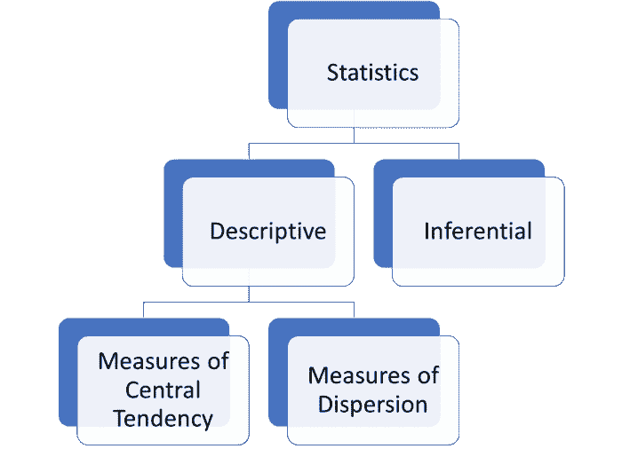
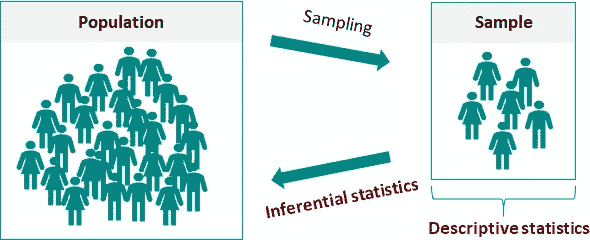
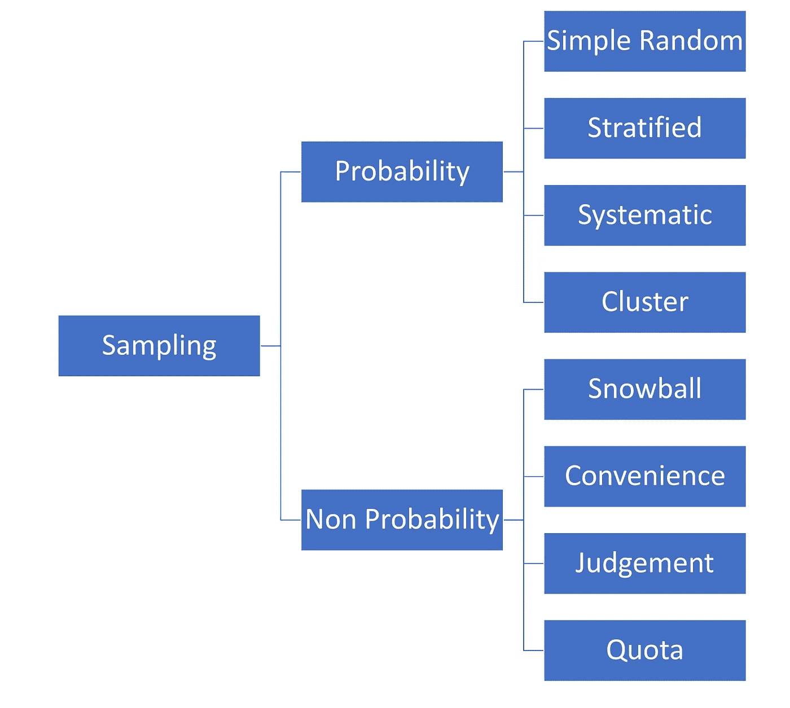
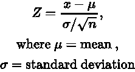
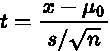
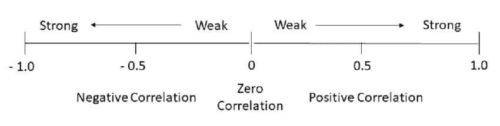
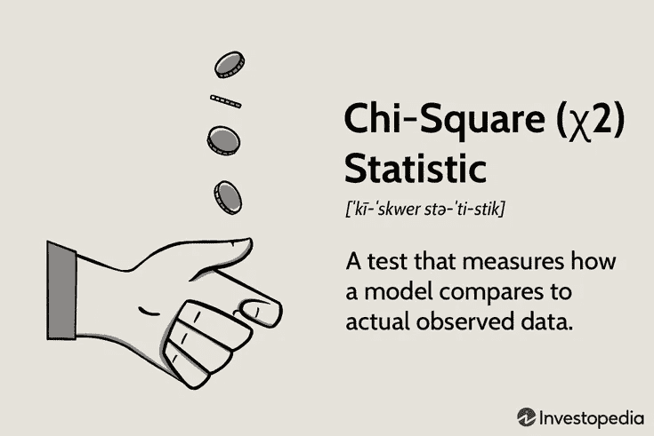

# 数据分析师的统计数据:使用 Python 进行推断统计

> 原文：<https://medium.com/codex/statistics-for-data-analysts-inferential-statistics-with-python-de8b7f49cfa?source=collection_archive---------3----------------------->

# 介绍

信用:[Martech.org](https://martech.org/2-questions-will-make-statistically-significant-marketer/)

在数据分析中，统计学对于理解数据、发现趋势和有效分析数据非常重要，这与数据分析的目的不谋而合。统计学根据目的分为两大类:描述统计学和推断统计学。

> 本文是用于数据分析的**统计系列的第二篇文章**，它仅涵盖使用 Python 的推断统计。点击 [**此处**](/codex/statistics-for-data-analysts-descriptive-statistics-with-python-cc6e4485209f) 查看之前关于 Python 描述性统计的文章。

# 推断统计学

推理统计通常涉及生成关于人口的推断和/或预测。在一些情况下，使用样本对总体进行推断。与描述已知样本/总体数据的描述性统计不同，推断性统计使用样本数据得出总体结论。

贷方:[数据表](https://datatab.net/tutorial/descriptive-inferential-statistics)

# 取样和取样技术

收集全部人口的信息非常困难，在某些情况下甚至是不可能的。由于这种限制，使用收集的样本数据来分析人口中的一小部分(称为样本)并做出关于人口的推断。应该注意的是，从总体中收集的样本必须是总体的代表，以便进行正确的推断。通常，这取决于样本大小和所用的采样技术等因素。

## 取样技术

一般来说，有两种抽样类别:随机/概率抽样和非概率抽样。对于前者，抽样是随机进行的，没有偏见。然而，对于非概率抽样，抽样是通过故意选择。例如，您可能希望选择最优秀的学生代表学校参加竞赛，而不是随机选择学生。在这两大类下有几种取样技术。

点击 [**此处**](https://www.scribbr.com/methodology/sampling-methods/) 了解更多采样技术

简单随机抽样是最简单也是最常见的技术。在这里，群体中的每个元素都有平等的机会被选中。另一种流行的概率抽样方法是分层抽样技术。在这种情况下，人口被分成称为阶层的相关元素的组。然后从每一层收集样本。例如，可以从不同年龄组的人群中收集数据，而不是完全随机地收集。

在 python 中， *random.sample()* 函数通常用于从总体中选择样本，其中要收集的样本数量作为参数传递。

点击[这里](https://docs.python.org/3/library/random.html)获取 Python 文档

# 假设检验

假设检验是一种统计推断技术，用于使用提供的样本数据来确认或反驳关于总体的陈述。我们可以把假设检验看作一个实验，在实验开始之前就提出了一个假设。经过实验，我们将确认结果是否与陈述一致。

照片由[亚历克斯·康德拉蒂耶夫](https://unsplash.com/@alexkondratiev?utm_source=medium&utm_medium=referral)在 [Unsplash](https://unsplash.com?utm_source=medium&utm_medium=referral) 上拍摄

假设检验是推断统计学最重要的方面之一。假设检验中应用了几种检验，具体使用哪种检验取决于数据和检验的目的。作为一名数据分析师，您需要熟悉几个假设检验。本文涵盖了以下测试:

*   z 检验和 T 检验
*   相关性检验
*   卡方检验

## z 检验和 T 检验

正态分布图像由[简单地心理学](https://www.simplypsychology.org/bell-curve.jpg)

Z 检验是一种假设检验，通常用于确定两个总体的均值是否显著不同，或者总体的均值是否大于、小于或等于特定值。当总体的方差已知时，使用该检验。当数据遵循[正态分布](https://www.investopedia.com/terms/n/normaldistribution.asp)时也适用。当样本量较大时，还假设数据遵循正态分布。

查看 [**此处**](https://www.cuemath.com/data/z-test/) 了解更多关于 Z 测试的信息

通过对两个班级学生表现的案例研究，可以使用 Z 检验来确定分数是否有显著差异。在这种情况下，零假设是两个类的平均分数相等。假设检验将使我们能够支持或反驳这一主张。通常，对于假设检验，应用 5%**的显著性水平，如果产生的 [**p 值**](https://www.scribbr.com/statistics/p-value/) 小于显著性水平，则该主张被拒绝。**

**查看文档测试 [**此处**](https://www.statsmodels.org/dev/generated/statsmodels.stats.weightstats.ztest.html)**

**T 检验的目的与 Z 检验相似。但是，它适用于总体标准偏差未知的情况，或者适用于样本量较小的样本(n < 30).**

****

**Check [**此处**](https://www.scribbr.com/statistics/t-test) 用于 T 检验)**

**让我们描绘另一个场景，一个教练训练初级运动员跑 100 米。教练认为她学生的平均速度是 10 秒。为了证实这一点，她挑选了 10 名运动员。**

**查看文档 [**此处**](https://docs.scipy.org/doc/scipy/reference/generated/scipy.stats.ttest_1samp.html)**

## **相关性检验**

**相关性描述了两个(或多个)变量之间的关联程度。例如，练习的时间和整体表现之间可能存在正相关关系:“*你练习得越多，你的考试成绩就越好*”。**

**相关性检验测试这些变量之间的关系是否具有统计学意义。皮尔逊相关系数是一个常用的相关系数，用于测量两个变量之间的线性关系。**

****

**[弗明·罗德里格斯](https://www.researchgate.net/profile/Fermin-Rodriguez-3)在[研究门](https://www.researchgate.net/publication/344691053_Very_Short-Term_Load_Forecaster_Based_on_a_Neural_Network_Technique_for_Smart_Grid_Control/figures?lo=1)上的照片**

**例如，测试分数和考试分数之间的关系可以使用皮尔逊相关来测试。Scipy 上的 *pearsonr* 函数返回相关系数并测试相关性是否显著。相关性检验的零假设是变量之间没有相关性。**

**点击 [**此处**](https://docs.scipy.org/doc/scipy/reference/generated/scipy.stats.pearsonr.html) 获取文档**

## **卡方检验**

****

**信用:[投资媒介](https://www.investopedia.com/terms/c/chi-square-statistic.asp)**

**卡方检验有 3 种类型:**

*   **独立性卡方检验**
*   **卡方拟合优度检验**
*   **同质性卡方检验**

**这些测试中最流行的是独立性卡方测试和拟合优度测试。**

**卡方拟合优度检验主要用于确定样本数据是否真实代表总体。另一方面，独立性的卡方检验用于确定两个分类变量之间的关系是否显著。它不同于相关性检验，因为与侧重于定量变量的相关性检验不同，卡方检验处理的是分类变量。**

***scipy* 的 [stats.chisquare](https://docs.scipy.org/doc/scipy/reference/generated/scipy.stats.chisquare.html) 函数用于计算拟合优度测试，而[chi2 _ contingency](https://docs.scipy.org/doc/scipy/reference/generated/scipy.stats.chi2_contingency.html)函数用于计算独立性的卡方测试。**

**对于每个潜在的数据分析师来说，推断统计是一个非常有价值的工具。从在你的数据收集过程中应用抽样技术到应用假设检验从你的数据中推断，它太有价值了，不容忽视。值得一提的是，本文并没有穷尽现有的所有采样技术和假设检验。然而，它涵盖了您可能会遇到的一些重要且广泛使用的工具。**

> **谢谢你读到这篇文章的结尾，☺！如果你想了解一个概念的更多细节，请点击链接文本。如果你从中有所收获，不要忘记分享和鼓掌。谢谢。**