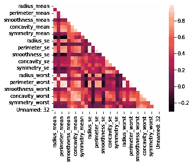

# 数据科学统计学:两种方法的比较

> 原文：<https://medium.com/codex/statistics-for-data-science-comparing-two-means-2749eb6c1ff?source=collection_archive---------8----------------------->

## 学生的 t 检验

对于那些熟悉数据分析/科学的人来说，你知道这一领域最常见的问题之一是需要比较两个均值或两个比例，无论是来自两个不同的样本(或总体)，来自同一样本但在不同时间，甚至来自同一样本但不同变量。为了解决这个问题…