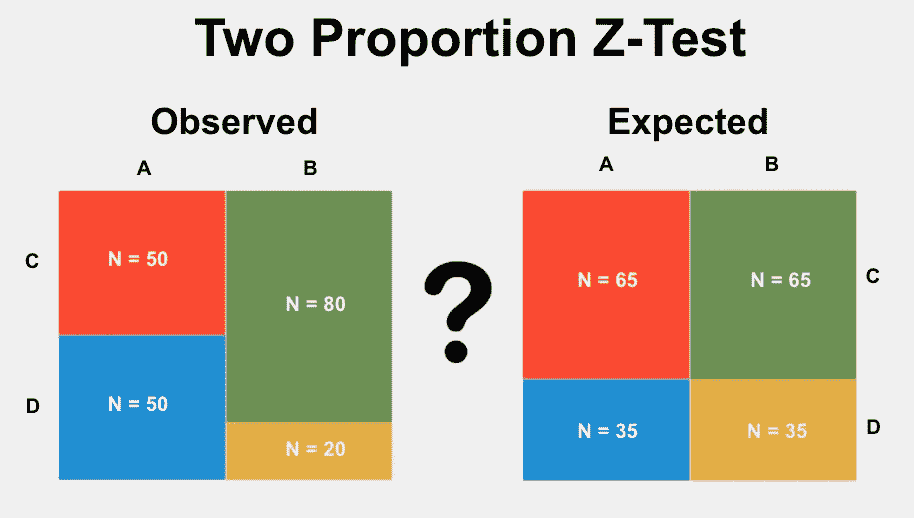

# 数据科学统计学:比较不同样本的两个比例

> 原文：<https://medium.com/codex/statistics-for-data-science-comparing-two-proportions-from-different-samples-f1729db3798c?source=collection_archive---------4----------------------->

## 双样本 z 检验

在上一篇文章中，我们学习了如何使用 z-test 比较同一样本的两个比例，现在我们将学习如何比较不同样本的两个比例，以及如何比较同一样本的三个或更多比例。如果你错过了上一篇文章，你可以在这里找到它: