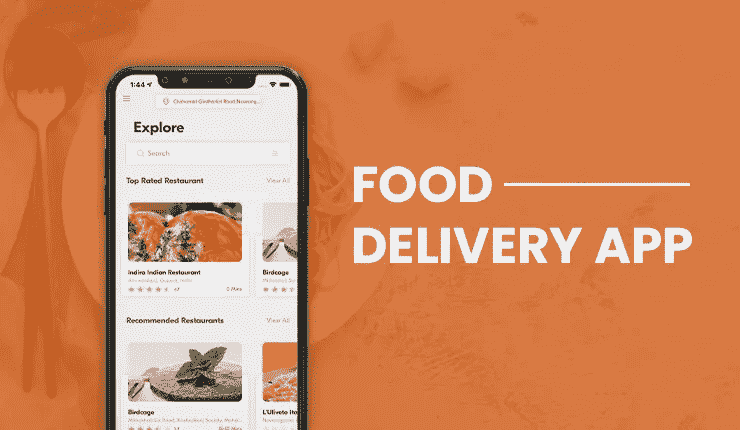
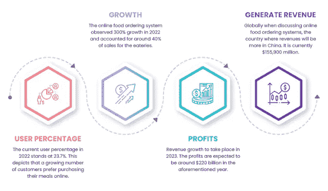

# 送餐应用统计:构建一个创收应用

> 原文：<https://medium.com/codex/stats-of-food-delivery-app-build-a-revenue-generating-app-8506f5aa86b8?source=collection_archive---------11----------------------->

计划通过在线订餐系统将您的餐厅设置数字化？你一定很了解他们。

这些应用一经问世，就简化了顾客的送餐服务。这让他们很容易找到附近的餐馆，然后点餐，并让他们送货上门。这无疑提高了这些解决方案的受欢迎程度，并给了它们一个充满希望、有利可图的未来。

想知道造成这种情况的因素吗？您是否也想了解一下市场统计数据，以便更好地了解这一领域？阅读这篇文章，全面了解这两个方面，这样你就可以创建一个创收的食品配送帝国。

## 为什么网上订餐系统会流行？

想知道促成网上订餐系统的因素吗？下面来看看吧。

## 1.市场统计

看看这些吸引人的数字，深入了解网上订餐系统的利润本质。

*   目前的应用收入为[，2022 年为 3233.0 亿美元](https://www.statista.com/outlook/dmo/eservices/online-food-delivery/worldwide)
*   2022 年至 2027 年，利润将以 7.60%的 [CAGR 增长](https://www.statista.com/outlook/dmo/eservices/online-food-delivery/worldwide)
*   到 2027 年，应用的市场规模将达到[4662 亿美元](https://www.statista.com/outlook/dmo/eservices/online-food-delivery/worldwide)
*   到 2027 年，用户数量将达到约[26.132 亿](https://www.statista.com/outlook/dmo/eservices/online-food-delivery/worldwide)

## 2.应用功能

该应用程序以无缝的方式运行。它操作简单。

1.客户进入应用程序并添加他们的位置信息。执行此操作后，他们会连接到附近的餐馆。此后，他们选择一个符合他们的喜好，并订购膳食。

2.订单请求被发送到餐馆，餐馆接受订单请求，并指派一名送货司机执行订单提货。

3.司机得到同样的通知，然后他接受取货请求并到达餐馆取货。将同样的情况通知给客户。

4.司机到达餐厅，拿起订单，前往客户所在地提供送货服务。在这一阶段，用户和司机可以相互跟踪，直到最终的交付完成。

5.最后，送餐给顾客。

 [## 送餐商业模式如何提升餐厅利润？

### Ankit Patel 年 9 月 16 日 5 分钟阅读食品订购应用程序让传统的餐厅设置在…

www.fooddeliveryclone.com](https://www.fooddeliveryclone.com/blog/food-delivery-business-models/) 

## 3.独特的创收渠道

通过这款应用，顾客可以灵活地在线订餐。这确保了创收是一个简化的过程。

**以下是收入流-**

1.分别来自送货司机和客户的佣金

2.餐馆在平台上注册的会员费

3.餐馆在应用程序上进行促销的广告费

现在知道了这些解决方案背后的原因，让我们告诉您一些统计数据，让您了解为什么在运营中纳入这些解决方案是必要的。

## 你应该知道的网络订餐 App 统计

查看这些统计数据，深入了解为什么在线订餐系统是传统餐馆的必需品。

那么你准备好带着 app 踏入这个前景广阔的行业了吗？在[订餐应用开发](https://www.fooddeliveryclone.com/)过程中执行这些操作，让顾客无缝在线订餐，最终提高你的利润。

## 如何进行订餐 App 开发？

要像专业人士一样开发订餐应用程序，请将这些要点放在手边。

1.研究竞争对手，评估客户和目标市场。

2.分析设计策略并实施用户友好的策略。

3.添加适当的功能，简化应用程序的送餐流程。

4.与值得信赖的合作伙伴联系，获得一款能够增加收入并让送餐无缝实现的应用。

## 包扎

这篇全面的文章让我们了解到，在线订餐系统对餐馆来说是一个有利可图的提议，尤其是那些离线经营的餐馆。这就是为什么你很好地了解市场统计数据是至关重要的，这样收入就会随着知名度的提高而增加。立即获得应用优势。简化顾客网上订餐的方式并获得利润。