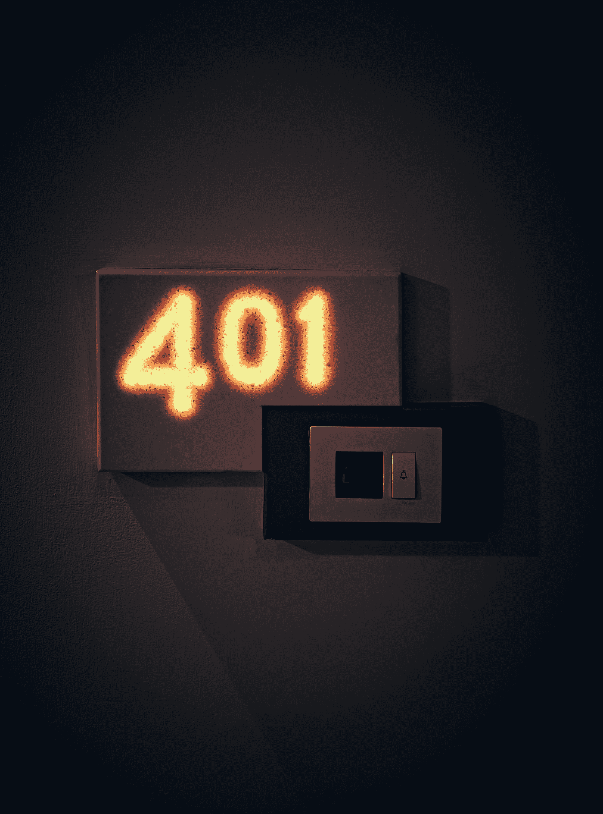

# 状态代码和 HTTP 标头

> 原文：<https://medium.com/codex/status-codes-http-headers-b8af2b8f8d45?source=collection_archive---------18----------------------->

阿什维尼·乔德里(蒙蒂)在 [Unsplash](https://unsplash.com?utm_source=medium&utm_medium=referral) 拍摄的照片

**状态代码 101(交换协议)**

请求者请求服务器切换协议，服务器同意这样做。

**状态代码 102(处理(WebDAVRFC 2518)**

一个 WebDAV 请求可能有几个与文件操作相关的子请求，这需要一段时间才能完成。此代码表示服务器已经收到请求并正在处理。因此，客户端不会超时，认为请求不成功。

**状态代码 200(正常)**

根据所使用的请求方法，实际答案会有所不同。对 GET 请求的响应将包括对应于被请求的资源的实体。描述或包含动作结果的实体将包含在对 POST 请求的响应中。

**状态代码 201(已创建)**

根据被批准的请求，开发了新的资源。

**状态码 207 多状态(WebDAV**

根据发出的子请求的数量，默认情况下，随后的消息体是一个 XML 消息，可能包含许多单独的响应代码。

**状态代码 301(永久移动)**

将此请求和任何即将到来的请求发送到提供的 URI。

**状态代码 303(见其他(自 HTTP/1.1))**

通过使用 GET 技术，可以在不同的 URI 下检索对请求的响应。当服务器响应 POST(或 PUT/DELETE)而返回数据时，客户端应该假设服务器已经收到了数据，并应该向指定的 URI 发送一个新的 GET 请求。

**状态代码 305(使用代理(从 HTTP/1.1 开始))**

结果包含代理的地址，因为这是访问所请求资源的唯一方式。出于安全考虑，许多 HTTP 客户端(包括 Mozilla Firefox 和 Internet Explorer)拒绝使用这个状态代码。结果包含代理的地址，因为这是访问所请求资源的唯一方式。出于安全考虑，许多 HTTP 客户端(包括 Mozilla Firefox 和 Internet Explorer)拒绝使用这个状态代码。

**状态代码 306(交换机代理)**

后续请求应该利用所选择的代理，这是最初的意图。

**状态代码 307(临时重定向(从 HTTP/1.1 开始))**

应该使用不同的 URI 再次发送请求，但是后续请求应该继续使用第一个 URI。当重新发布原始请求时，不能修改请求方法，这与之前 302 的做法不同。以另一个 POST 请求为例，应该重复一个 POST 请求。

**状态代码 403(禁止)**

服务器验证了请求的有效性和合理性，但是它推迟了任何进一步的操作。这可能是因为用户没有资源所需的权限，需要某种形式的帐户，或者执行了非法操作(例如，在只允许一个记录的情况下创建重复记录)。当服务器拒绝为响应 WWW-Authenticate 头字段质询而提供的身份验证时，也经常使用该号码。不要再提要求了。

**状态代码 404(未找到)**

找不到请求的资源，但它以后可能会变得可用。用户可以自由地提出进一步的要求。

**状态代码 505(不支持 HTTP 版本)**

服务器不支持请求中使用的 HTTP 协议版本。