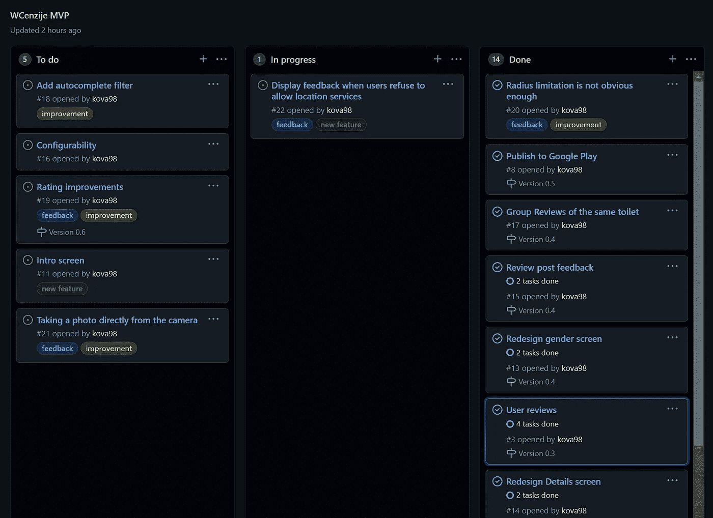
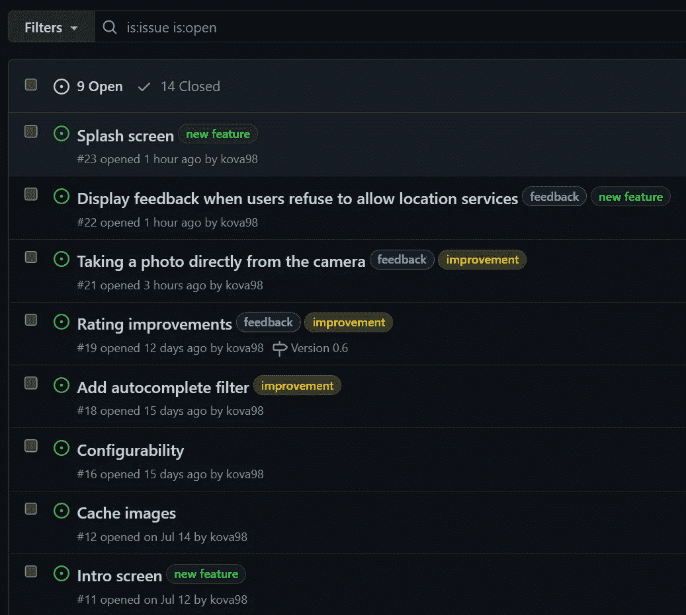
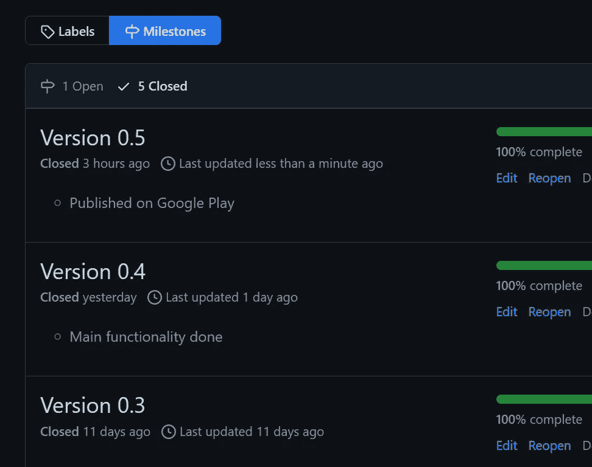

# GitHub 项目进展顺利

> 原文：<https://medium.com/codex/staying-on-track-with-github-projects-167fce34d818?source=collection_archive---------10----------------------->

## 为什么你应该使用 Github 的项目规划功能来规划你的下一个爱好项目

罗曼·辛克维奇·🇺🇦在 [Unsplash](https://unsplash.com?utm_source=medium&utm_medium=referral) 上拍摄的照片

# 介绍

首先，我想声明我不是项目经理、业务分析师、产品负责人，也不是{ *插入吉拉董事会成员的最新头衔* }。然而，作为一名软件开发人员，我非常重视辛勤规划项目的工作，以及由此带来的所有利益。

# 为什么要计划什么？

我知道你在想什么:“但是 Roko，计划就是工作！我讨厌工作！爱好项目的全部意义就在于获得乐趣！”虽然我在某种程度上理解这一点，但规划你的项目实际上可能会让它变得更有趣。

## 基本问题解决

解决任何问题的基本前提是有一个计划，不管这个计划有多简单。另一个先决条件是能够**减少问题**，把它分成更小的、更容易管理的块，并战略性地“攻击”它。这本质上是提前计划让我们可以做的。

## 背后的心理学

有一个清晰的方向感和一个跟踪进展的方法会让你更容易保持动力和进展。

将问题分开，完成较小的任务**会产生一种动力**，这反过来会在你朝着更大的目标努力时提高生产力。

不仅**完成**这些任务会产生**多巴胺反应**，而且**预期**将任务从“进行中”转为“完成”的快感也会产生。或者至少心理学家是这么说的。

一个简单的看板项目板

## 上下文开关程序

最大的生产力杀手之一无疑是上下文切换。在不相关的任务(甚至项目)之间切换需要一些时间来“进入”你正在解决的问题。对于业余爱好项目，这一点由于以下事实而变得更加突出:在每次编码会议之间有时会花费超过一周的时间，这意味着在再次从事你的爱好项目之前，你将会处理十几个不同的问题和/或具有完全不同的领域和背景的不同项目。

这就是项目规划工具可能派上用场的地方。从你停下的地方重新开始会容易得多，如果你把工作分成很小的块，浪费的时间会很少。

# 为什么选择 GitHub 项目？

有许多免费的项目规划工具，有大的社区和许多可用的资源。为什么不选择像吉拉这样的品牌呢？

## 将所有东西放在一个地方

由于我的爱好项目大多是开源的，我把它们放在 GitHub 上，我想如果我能把所有与项目相关的东西**放在一个地方**会很棒。将存储库、问题跟踪和项目概述放在一个地方，可以轻松地将提交与问题联系起来，实现董事会自动化，并允许任何对项目感兴趣的人跟踪进度。

## **发行整合**

GitHub 问题与项目完全集成。事实上，板上的每个项目本身就是一个问题，这有助于统一的体验，并使所有的 bug、请求、待办事项和其他笔记都放在一个地方变得容易。

GitHub 的问题跟踪很好地集成到项目中。

## 很简单

事实是，GitHub 项目使用起来非常简单。

在大多数协作工具中存在的混乱的消失，比如*吉拉*可能是我最喜欢的项目。这种简单性使人们很容易进入并专注于重要的事情。

如果您已经有了一个帐户和一个存储库，那么只需要很少的设置。这是几个点击的问题。

## 它很强大

尽管它们提供的工具很简单，但您仍然可以用它们做很多事情。

使用**里程碑**，你可以将问题分组，设定日期目标并跟踪进度。

使用**标签**，您可以按各种类别组织和分类标签。

强大的**过滤**和**搜索**将帮助您通过标签、问题类型、评论、反应、语言和[等等](https://docs.github.com/en/search-github/searching-on-github/searching-issues-and-pull-requests)找到问题。

将问题分成里程碑——非常简洁！

# 更进一步

我所涉及的都包含在**经典项目**中。然而，如果你的项目变得需要更强大的东西，试一试闪亮的新项目，装载更强大和更广泛的特性。

如果发生这种情况，您的所有数据仍会存在，而且会有问题！不需要迁移。

# 最后的想法

你计划你的爱好项目吗？有没有你更喜欢的其他软件？让我知道你的想法。