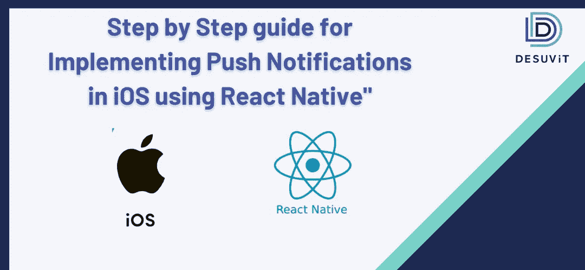

# 使用 React Native 在 iOS 中实现推送通知的分步指南

> 原文：<https://medium.com/codex/step-by-step-guide-for-implementing-push-notifications-in-ios-using-react-native-b5360c477356?source=collection_archive---------7----------------------->

据说在互联网上，你想学的任何东西都已经为你准备好了，你只需要知道如何去寻找它。然而，事实并非总是如此。尽管网上有超过 44 zet 字节的数据，我们仍然会偶然发现无数的主题，这些主题的信息不够详细，或者没有按要求的顺序排列，或者…