# Python 中简单和多元线性回归的分步指南

> 原文：<https://medium.com/codex/step-by-step-guide-to-simple-and-multiple-linear-regression-in-python-867ac9a30298?source=collection_archive---------0----------------------->

## 在 Python 中构建和评估 SLR 和 MLR 机器学习模型


由[像素](https://www.pexels.com/)上的[像素](https://www.pexels.com/@pixabay)生成的图像

# 线性回归

> 线性回归是一种统计模型，它检查两个(简单线性回归)或多个(多元线性回归)变量(因变量和自变量)之间的线性关系。“线性关系意味着当一个(或多个)自变量增加(或减少)时，因变量也会增加(或减少)。”

# Python 实现

在 python 中建立线性回归模型有两种主要方法，即使用“Statsmodel”或“Scikit-learn”。在本文中，我们将在 Statsmodel 和 Scikit 中构建 SLR 和 MLR 模型——学习预测汽车的二氧化碳排放量。在构建我们的模型之前，有必要导入和处理数据，并为我们的回归模型确定变量。

**第一步:导入并处理数据**

输出:

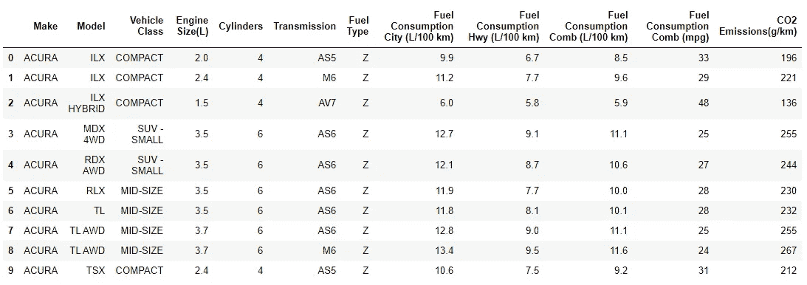

作者图片

现在，我们对我们的数据集有了一个概念。接下来，有必要看一下我们数据集的统计摘要。

输出:

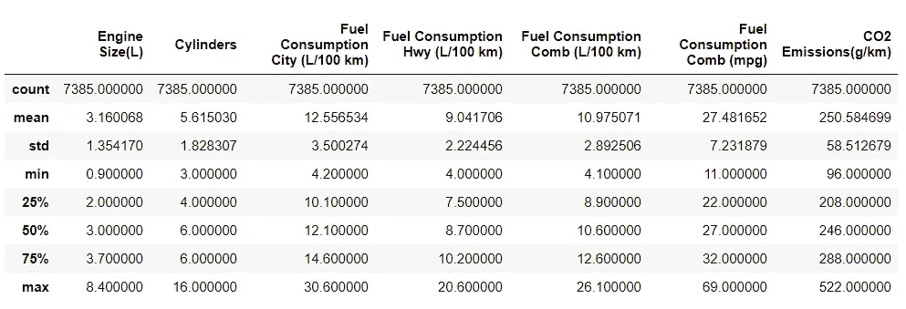

作者图片

现在，我们对数据集的结构和统计概要有了一个清晰的概念。接下来，我们必须删除一些可能会破坏我们的回归模型的字符列。

因此，我们已经清理和处理了我们的数据，我们现在准备好一些可视化，以便找到变量之间的一些线性关系。

**第二步:寻找线性关系**

以二氧化碳排放量为因变量，我们必须通过实施散点图来找到一些正的或负的线性关系。这些变量进一步用于构建我们的 SLR 和 MLR 模型。对于统计可视化，最好使用 seaborn 库，因此，让我们导入它。

类似于对我们的数据进行统计总结，让我们对变量之间进行统计可视化。

输出:

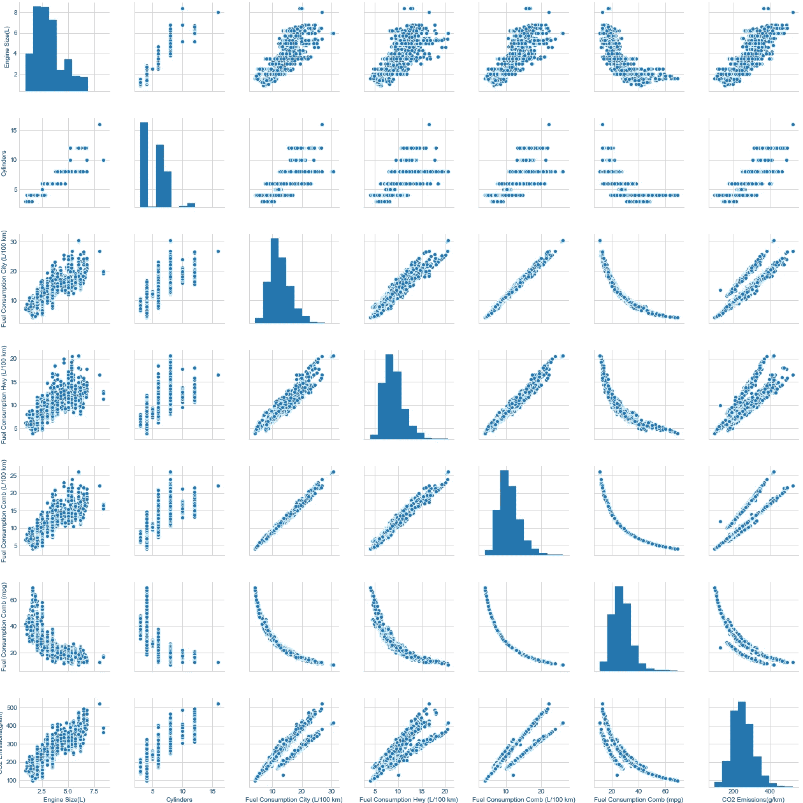

作者图片

现在，我们将绘制任何一个独立变量与因变量(即二氧化碳排放量)的关系图，找出它们之间的线性关系。用 python 来做吧！

(一)发动机尺寸/二氧化碳排放量:

输出:

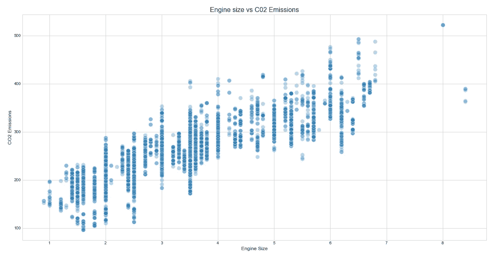

作者图片

通过绘制发动机尺寸变量与因变量的关系图，我们可以观察到正的线性关系。因此，我们可以把发动机尺寸作为我们模型的独立变量。

(ii)油耗组合(升/100 公里)/二氧化碳排放量:

输出:

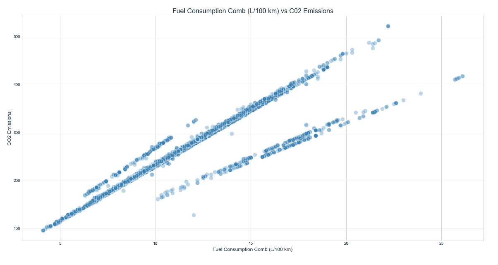

作者图片

与发动机尺寸类似，油耗梳(L/100 km)也代表了正线性关系。因此，它可以作为我们模型的独立变量

(三)公路油耗(升/100 公里)/二氧化碳排放量:

输出:

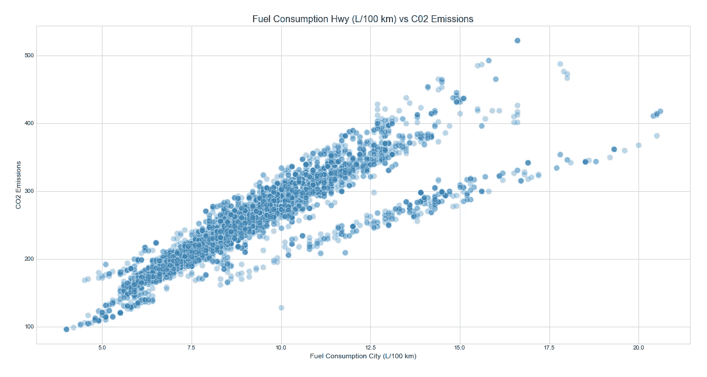

作者图片

由于燃料消耗 Hwy (L/100 km)与 CO2 排放量呈正相关，因此可以将其作为构建模型的独立变量。

(四)城市油耗(升/100 公里)/二氧化碳排放量:

输出:

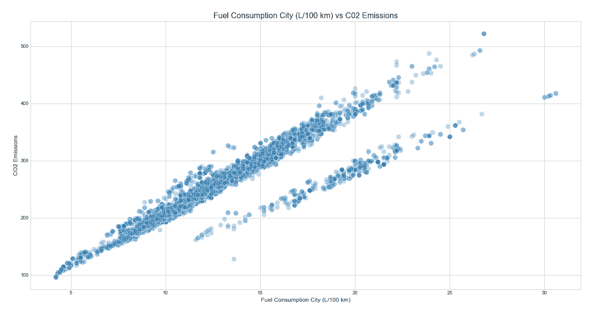

作者图片

与上述所有变量一样，城市油耗(L/100 km)与二氧化碳排放量呈正线性关系。所以，这也可以被认为是我们模型的独立变量。

现在，我们有四个独立变量可以用来训练和建立我们的回归模型。不浪费一点时间，让我们用 Python 来构建我们的机器学习模型吧！

**单反型号**

要建立一个简单的线性回归(SLR)模型，我们必须有一个自变量和一个因变量。对于我们的 SLR 模型，我们将把发动机尺寸作为自变量，无疑将二氧化碳排放量作为因变量。让我们用 Python 来定义变量:

正如我之前所说，我们将首先使用 statsmodels 构建一个模型，然后使用 scikit-learn。

㈠统计模型:

代码解释:首先，我们已经导入了我们的主包“statsmodels.api”。接下来，我们定义了一个变量“slr_model”来存储我们的普通最小二乘(OLS)模型，最后，我们将拟合的模型存储到变量“slr_reg”中。

现在让我们看看我们的模型的性能结果。

输出:

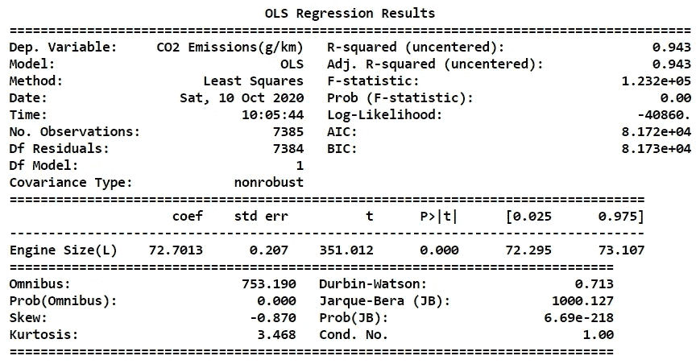

作者图片

在分析我们的结果摘要时，我们可以注意到模型的 R 平方为 0.943 (94.3%)，这清楚地表明我们的模型表现良好，可以用于解决问题的真实案例。

㈡sci kit-learn:

就像我们如何在 statsmodels 中使用 OLS 模型一样，使用 scikit-learn，我们将使用“train_test_split”算法来处理我们的模型。用 Python 来做吧！

代码解释:首先，我们正在导入我们的主要包“线性回归”和“训练测试分割”。使用 train_test_split 算法，我们对大小为原始数据集 30%的训练数据集和测试数据集进行分类。在 train_test_split 算法中，我已经传递了一个命令“random_state = 0 ”,这意味着，在对训练和测试数据进行分类时，不应该自动对数据进行随机洗牌。接下来，我们将我们的线性模型存储到变量“lr ”,并使模型适合变量。最后，我们将预测值存储到变量“yhat”中。

现在，为了检查我们的 scikit-learn 模型的准确性，我们将计算斜率和截距，并将这些值拟合到我们的模型中。此外，我们将计算模型的 R 平方值。用 Python 来做吧！

输出:

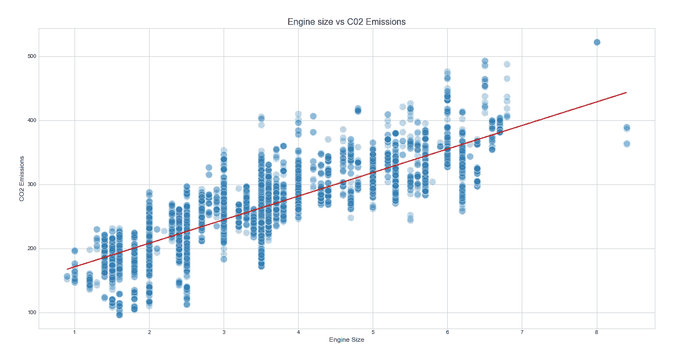

作者图片

现在让我们通过 scikit-learn 计算我们模型的 R 平方值。按照代码计算 R 平方值:

输出:

```
**R-squared :** 0.7162770226132333
```

我们可以注意到，scikit-learn 模型中 R 平方的值不同于 statsmodels 模型。这是因为我们没有给 statsmodels 模型中的自变量添加常数值。在即将推出的 MLR 模型中，我们将为 statsmodels 中的独立变量添加一个常数值。

我们已经使用 statsmodel 包和 scikit-learn 包成功地创建了我们的单反模型。现在让我们开始构建多元线性回归(MLR)模型。

**MLR 型号**

要建立多元线性回归(MLR)模型，我们必须有多个自变量和因变量。对于我们的 MLR 模型，我们将采用四个独立变量，无疑还有二氧化碳排放量作为因变量。让我们用 Python 来定义变量:

请记住，向模型中添加越来越多的独立变量可能会导致“过度拟合”。在我们的二氧化碳数据中，我们只有少量的属性，但在大量数据的情况下，我们必须更加谨慎地选择独立变量。因此，强烈建议只选择与因变量相关的自变量。

㈠统计模型:

你可以注意到，我们在自变量中加入了一个常数值。现在我们已经拟合了模型，让我们来查看结果摘要。

输出:

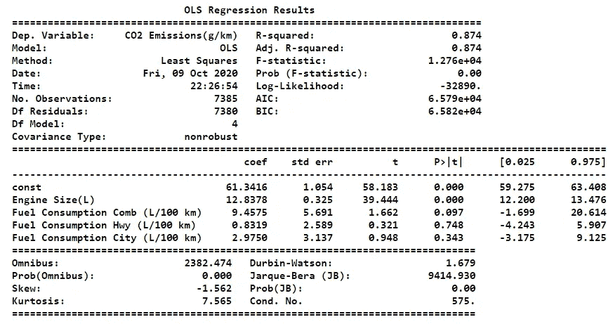

作者图片

当分析我们的结果摘要时，我们可以注意到模型的 R 平方为 0.874 (87.4%)，该值是通过包含自变量的常数值而得到的。所以我们可以说这个模型可以用来解决现实世界的案例。

㈡sci kit-learn

代码实现和使用的算法与 SLR 模型相同，但是在自变量上添加了额外的属性。

为了检查 scikit-learn 模型的准确性，我们可以计算 R 平方得分，并且我们可以引入一种新的方法，即通过分布图。首先，让我们用 Python 计算 R 平方值:

输出:

```
**R-Squared :** 0.8655946234480003
```

我们可以观察到 scikit-learn 模型的 R 平方值几乎与 statsmodels 模型的值 0.87 相似。这是因为我们在构建 statsmodels MLR 模型时为自变量添加了一个常数值。

检查 MLR scikit-learn 模型准确性的第二种方法是通过组合预测值和实际值来构建分布图。按照代码生成一个分布图:

输出:

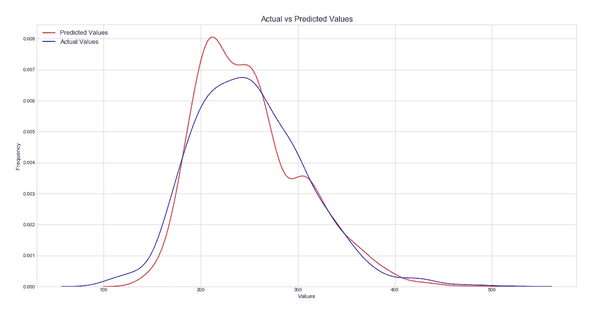

作者图片

该分布图显示，我们的预测值几乎与我们的实际值完全一致，但也有一些异常值值得注意。这是因为我们已经建立了一个非常基本的线性回归模型来精确预测结果。

# 最后的想法！

我们已经成功地运行了一整套旨在用 python 构建和评估 SLR 和 MLR 模型的流程，当然，我们已经实现了我们的目标。除了 SLR 和 MLR，还有更多关于线性回归的发现，如多项式和非多项式回归，岭等等。在本文中，我们只使用了几种方法来评估我们的模型，但是还有更多的方法可以深入研究。此外，线性回归背后的数学是公式的海洋。即使 python 中有强大的包来处理公式，你也不能总是依赖它们。学习并深入了解数学部分是值得的。我希望，这篇文章能帮助你，永远不要停止学习。如果您忘记了遵循任何代码部分，不要担心，我已经在下面提供了完整的代码。

**机器学习快乐！**

完整代码: