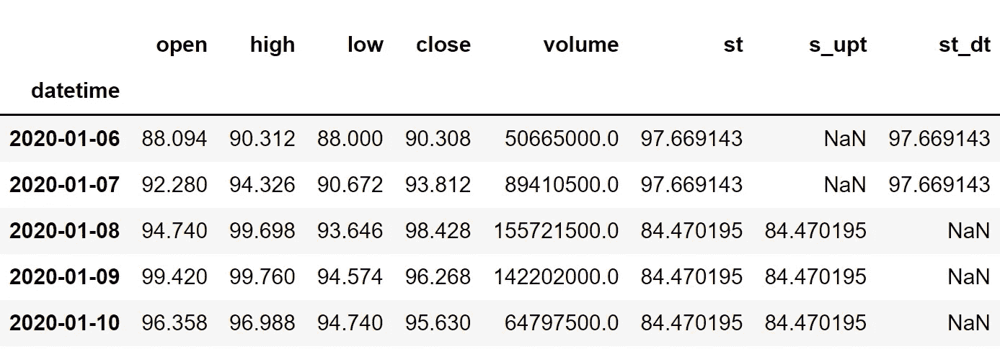

# 用 Python 实现超级趋势指示器的分步指南

> 原文：<https://medium.com/codex/step-by-step-implementation-of-the-supertrend-indicator-in-python-656aa678c111?source=collection_archive---------0----------------------->

## 学习使用 python 中的超级趋势指标构建强大的交易策略


奥斯卡·伊尔迪兹在 [Unsplash](https://unsplash.com?utm_source=medium&utm_medium=referral) 上拍摄的照片

我根据大量的技术指标对很多交易策略进行了回溯测试。其中，一些指标的结果超出了图表的范围，我称之为溢价指标。在今天的文章中，我们将讨论一个趋势跟踪指标，它加入了关于其性能和效率的高级指标的独家列表。不是别人，正是超级趋势指标。

我们将首先探讨这个指标是怎么回事及其复杂的计算。然后，我们将继续用 Python 从头构建指标，并基于它构建一个简单的交易策略。最后，我们将对 Tesla 的股票进行回溯测试，并将该策略的表现与 SPY ETF(一种专门用于跟踪标准普尔 500 市场指数走势的 ETF)的回报进行比较。事不宜迟，让我们直接进入正题。

在继续之前，如果你想在没有任何代码的情况下回溯测试你的交易策略，有一个解决方案。这是[的后验区](https://www.backtestzone.com/)。这是一个平台，可以免费对不同类型的可交易资产的任意数量的交易策略进行回溯测试，无需编码。点击这里的链接，你可以马上使用这个工具:[https://www.backtestzone.com/](https://www.backtestzone.com/)

# 平均真实范围

在发现超级趋势指标之前，有必要知道什么是平均真实范围(ATR ),因为它涉及到超级趋势指标的计算。

平均真实范围是一个技术指标，用来衡量一项资产的平均变动幅度。这是一个滞后指标，意味着它考虑了资产的历史数据来衡量当前价值，但它不能预测未来的数据点。在使用 ATR 时，这不被认为是一个缺点，因为它是更准确地跟踪市场波动的指标之一。ATR 是一个滞后指标，也是一个非方向性指标，意味着 ATR 的运动与市场的实际运动成反比。要计算 ATR，必须遵循两个步骤:

*   **计算真实范围(TR):** 资产的真实范围通过取三个价格差的最大值来计算，这三个价格差是:市场高点减去市场低点，市场高点减去先前的市场收盘，先前的市场收盘减去市场低点。它可以表示如下:

```
**MAX** [ {**HIGH - LOW**}, {**HIGH - P.CLOSE**}, {**P.CLOSE - LOW**} ]where,
MAX = Maximum values
HIGH = Market High
LOW = Market Low
P.CLOSE = Previous market close
```

*   **计算 ATR:** 平均真实范围的计算很简单。我们只需对指定数量的周期取之前计算的真实范围值的平滑平均值。平滑平均线不是普通的均线或均线，而是怀尔德·怀尔斯自己创造的一种平滑平均线，但是使用其他均线没有任何限制。在本文中，我们将使用指数移动平均线(EMA)来计算 ATR，而不是指标创始人为了简单起见而创建的自定义移动平均线。以 14 作为周期数的传统设置来计算 ATR 可以表示如下:

```
**ATR 14** = **EMA 14** [ **TR** ]where,
ATR 14 = 14 Period Average True Range
SMA 14 = 14 Period Simple Moving Average
TR = True Range
```

当使用 ATR 作为交易指标时，交易者必须确保他们比以往更加谨慎，因为该指标非常滞后。现在我们已经了解了平均真实范围是什么。现在让我们深入到这篇文章的主要概念，超级趋势指标。

# 超级趋势指示器

顾名思义，超级趋势指标跟踪趋势市场的方向。众所周知，这个指标能精确地发现交易中有效的买卖信号。老实说，超级趋势的计算有点复杂，但我会把它分成几部分，让你更好地理解。

该指标的计算涉及两个主要部分，即回望期和乘数。回顾期只不过是计算中要考虑的数据点的数量，乘数是用来乘以 ATR 的值。超级趋势指标的传统设置是 10 作为回望周期，3 作为乘数。考虑到这些设置，让我们继续计算超级趋势指标的步骤。

计算的第一步是使用我们之前讨论的公式确定 10 天 ATR。第二步，确定基本的上下波段。为了计算这两个波段，我们需要首先找到高低平均值(我们现在称之为 HLA ),它是通过将股票的高低值相加并除以 2 来计算的。使用这些 HLA 值，通过首先将 10 天 ATR 值乘以乘数(为 3)并将乘积与 HLA 值相加来计算上限。同样的过程也适用于基本低频段的计算，但我们需要减去 HLA 值的乘积，而不是相加。两个波段的计算可以用数学方法表示如下:

```
**BASIC UPPER BAND** = **HLA** + [ **MULTIPLIER** * **10-DAY ATR** ]
**BASIC LOWER BAND** = **HLA** -[ **MULTIPLIER** * **10-DAY ATR** ]where,
HLA = High Low Average
MULTIPLIER = 3
```

然后是最终上下波段的计算，这是计算超级趋势指标的核心部分。没有计算最终级别的公式，而是传递条件，并将值附加到满足条件的级别。当前最终高频带的条件如下:

*   如果当前的基本上限小于先前的最终上限，或者股票的先前收盘价大于先前的最终上限，则当前的最终上限的值就是当前的基本上限。
*   如果条件未能满足，则当前最终上限的值是先前最终上限的值。最终高频带的条件可以表示如下:

```
IF **C.BUB** < **P.FUB** OR **P.CLOSE** > **P.FUB**: **C.FUB** = **C.BUB** IF **THE CONDITION IS NOT SATISFIED: C.FUB** = **P.FUB**where,
C.BUB = Current Basic Upper Band
P.FUB = Previous Final Upper Band
P.CLOSE = Previous Closing Price of the Stock
C.FUB = Current Final Upper Band
```

当前低频带的条件如下:

*   如果当前的基本下限高于先前的最终下限，或者股票的先前收盘价低于先前的最终下限，则当前的最终下限的值就是当前的基本下限。
*   如果当前最终低频带的这一条件未能得到满足，则当前最终低频带是先前的最终低频带。该条件可以表示如下:

```
IF **C.BLB** > **P.FLB** OR **P.CLOSE** < **P.FLB**: **C.FLB** = **C.BLB**
IF **THE CONDITION IS NOT SATISFIED: C.FLB** = **P.FLB**where,
C.BLB = Current Basic Lower Band
P.FLB = Previous Final Lower Band
P.CLOSE = Previous Closing Price of the Stock
C.FLB = Current Final Lower Band
```

现在我们有了决定超级趋势指标值的所有基本要素。就像我们如何使用条件来计算最终波段值一样，这同样适用于超级趋势指标的计算。虽然决定最终波段值的条件只有一个，但超级趋势指标有四种不同的条件。当前超级趋势值的条件如下:

*   如果先前的超级趋势指标值等于先前的最终上限，并且股票的当前收盘价小于当前的最终上限，则当前的超级趋势指标值就是当前的最终上限。
*   如果先前的超级趋势指标值等于先前的最终上限，并且股票的当前收盘价大于当前的最终上限，那么，当前的超级趋势指标值就是当前的最终下限。
*   如果先前的超级趋势指标值等于先前的最终较低波段，并且股票的当前收盘价大于当前的最终较低波段，则当前的超级趋势指标值就是当前的最终较低波段。
*   如果先前的超级趋势指标值等于先前的最终较低波段，并且股票的当前收盘价小于当前的最终较低波段，则当前的超级趋势指标值就是当前的最终较高波段。

当把所有这些条件放在一起时，这些条件的总数可以表示如下:

```
IF **P.ST** == **P.FUB** AND **C.CLOSE** < **C.FUB**: **C.ST** = **C.FUB**
IF **P.ST** == **P.FUB** AND **C.CLOSE** > **C.FUB**: **C.ST** = **C.FLB**
IF **P.ST** == **P.FLB** AND **C.CLOSE** > **C.FLB**: **C.ST** = **C.FLB**
IF **P.ST** == **P.FLB** AND **C.CLOSE** < **C.FLB**: **C.ST** = **C.FUB**where,
P.ST = Previous SuperTrend indicator value
P.FUB = Previous Final Upper Band
P.FLB = Previous Final Lower Band
C.CLOSE = Current Closing Price of the Stock
C.ST = Current SuperTrend indicator value
C.FUB = Current Final Upper Band
C.FLB = Current Final Lower Band
```

这就是计算超级趋势指标值的整个过程。为了更好地理解该指标及其工作原理，让我们来研究一个图表，其中股票的收盘价与超级趋势指标的读数一起绘制。


作者图片

在上面的图表中，蓝色的线代表特斯拉股票的收盘价，红色和绿色的线代表超级趋势指标的读数。如果指标读数低于收盘价，超级趋势指标的线变成绿色，如果高于收盘价，线变成红色。正如我之前所说，超级趋势指标是一个趋势跟踪指标，从图表中可以看出，该指标更准确地直接揭示了市场的当前趋势。

交易者使用超级趋势指标线上观察到的颜色变化或趋势变化来标记他们交易的买入和卖出信号。更详细地说，如果指标线从收盘价线的上方交叉到下方，交易者就做多(买入股票)，同样，如果指标线从收盘价线的下方交叉到上方，他们就做空(卖出股票)。这种超级趋势策略被称为交叉策略。该策略可以表示如下:

```
IF **PREV.ST** > **PREV.CLOSE** AND **CUR.ST** < **CUR.CLOSE** ==> **BUY SIGNAL**
IF **PREV.ST** < **PREV.CLOSE** AND **CUR.ST** > **CUR.CLOSE** ==> **SELL SIGNAL**
```

这也是我们将在本文中实现的策略。许多其他策略也可以基于超级趋势指标实施，但为了使事情简单易懂，我们将采用交叉策略。这就结束了我们关于超级趋势指标的理论部分。现在，让我们转到编码部分，我们首先从头开始构建指标，构建我们刚刚讨论过的交叉策略，然后将我们的策略的性能与 Python 中 SPY ETF 的回报进行比较。来做点编码吧！在继续之前，关于免责声明的一个注意事项:本文的唯一目的是教育人们，必须被视为一个信息，而不是投资建议等。

# 用 Python 实现

编码部分分为以下几个步骤:

```
**1\. Importing Packages
2\. Extracting Stock Data from Twelve Data
3\. SuperTrend Calculation
4\. Creating the Crossover Trading Strategy
5\. Plotting the Trading Lists
6\. Creating our Position
7\. Backtesting
8\. SPY ETF Comparison**
```

我们将按照上面列表中提到的顺序，系好安全带，跟随每一个即将到来的编码部分。

## 步骤 1:导入包

将所需的包导入 python 环境是一个不可跳过的步骤。主要的包是处理数据的 Pandas，处理数组和复杂函数的 NumPy，用于绘图的 Matplotlib，以及进行 API 调用的请求。二级包是数学函数的 Math 和字体定制的 Termcolor(可选)。

**Python 实现:**

```
import pandas as pd
import numpy as np
import matplotlib.pyplot as plt
import requests
from math import floor
from termcolor import colored as cl

plt.style.use('fivethirtyeight')
plt.rcParams['figure.figsize'] = (20,10)
```

现在我们已经将所有需要的包导入到 python 中。我们用十二数据的 API 端点来拉特斯拉的历史数据。

## 步骤 2:从 12 个数据中提取数据

在这一步，我们将使用由[twelvedata.com](https://twelvedata.com/)提供的 API 端点提取特斯拉的历史股票数据。在此之前，请注意 twelvedata.com:十二数据公司是领先的市场数据提供商之一，拥有大量各种市场数据的 API 端点。它非常容易与十二数据提供的 API 进行交互，并且拥有有史以来最好的文档。此外，确保你有一个 twelvedata.com[的账户，只有这样，你才能访问你的 API 密匙(用 API 提取数据的重要元素)。](https://twelvedata.com/)

**Python 实现:**

```
def get_historical_data(symbol, start_date):
    api_key = 'YOUR API KEY'
    api_url = f'https://api.twelvedata.com/time_series?symbol={symbol}&interval=1day&outputsize=5000&apikey={api_key}'
    raw_df = requests.get(api_url).json()
    df = pd.DataFrame(raw_df['values']).iloc[::-1].set_index('datetime').astype(float)
    df = df[df.index >= start_date]
    df.index = pd.to_datetime(df.index)
    return df

tsla = get_historical_data('TSLA', '2020-01-01')
tsla
```

**输出:**


作者图片

**代码解释:**我们做的第一件事是定义一个名为‘get _ historical _ data’的函数，该函数将股票的符号(‘symbol’)和历史数据的起始日期(‘start _ date’)作为参数。在函数内部，我们定义了 API 键和 URL，并将它们存储到各自的变量中。接下来，我们使用“get”函数提取 JSON 格式的历史数据，并将其存储到“raw_df”变量中。在对原始 JSON 数据进行清理和格式化之后，我们将以干净的 Pandas 数据帧的形式返回它。最后，我们调用创建的函数来提取特斯拉从 2020 年开始的历史数据，并将其存储到“tsla”变量中。

## 步骤 3:超级趋势计算

在这一步，我们将按照之前讨论过的方法来计算超级趋势指标的值。

**Python 实现:**

```
def get_supertrend(high, low, close, lookback, multiplier):

  **  # ATR**

    tr1 = pd.DataFrame(high - low)
    tr2 = pd.DataFrame(abs(high - close.shift(1)))
    tr3 = pd.DataFrame(abs(low - close.shift(1)))
    frames = [tr1, tr2, tr3]
    tr = pd.concat(frames, axis = 1, join = 'inner').max(axis = 1)
    atr = tr.ewm(lookback).mean()

  **  # H/L AVG AND BASIC UPPER & LOWER BAND**

    hl_avg = (high + low) / 2
    upper_band = (hl_avg + multiplier * atr).dropna()
    lower_band = (hl_avg - multiplier * atr).dropna()

    **# FINAL UPPER BAND**final_bands = pd.DataFrame(columns = ['upper', 'lower'])
    final_bands.iloc[:,0] = [x for x in upper_band - upper_band]
    final_bands.iloc[:,1] = final_bands.iloc[:,0] for i in range(len(final_bands)):
        if i == 0:
            final_bands.iloc[i,0] = 0
        else:
            if (upper_band[i] < final_bands.iloc[i-1,0]) | (close[i-1] > final_bands.iloc[i-1,0]):
                final_bands.iloc[i,0] = upper_band[i]
            else:
                final_bands.iloc[i,0] = final_bands.iloc[i-1,0]

  **# FINAL LOWER BAND** 
    for i in range(len(final_bands)):
        if i == 0:
            final_bands.iloc[i, 1] = 0
        else:
            if (lower_band[i] > final_bands.iloc[i-1,1]) | (close[i-1] < final_bands.iloc[i-1,1]):
                final_bands.iloc[i,1] = lower_band[i]
            else:
                final_bands.iloc[i,1] = final_bands.iloc[i-1,1]

 **# SUPERTREND** 
    supertrend = pd.DataFrame(columns = [f'supertrend_{lookback}'])
    supertrend.iloc[:,0] = [x for x in final_bands['upper'] - final_bands['upper']]

    for i in range(len(supertrend)):
        if i == 0:
            supertrend.iloc[i, 0] = 0
        elif supertrend.iloc[i-1, 0] == final_bands.iloc[i-1, 0] and close[i] < final_bands.iloc[i, 0]:
            supertrend.iloc[i, 0] = final_bands.iloc[i, 0]
        elif supertrend.iloc[i-1, 0] == final_bands.iloc[i-1, 0] and close[i] > final_bands.iloc[i, 0]:
            supertrend.iloc[i, 0] = final_bands.iloc[i, 1]
        elif supertrend.iloc[i-1, 0] == final_bands.iloc[i-1, 1] and close[i] > final_bands.iloc[i, 1]:
            supertrend.iloc[i, 0] = final_bands.iloc[i, 1]
        elif supertrend.iloc[i-1, 0] == final_bands.iloc[i-1, 1] and close[i] < final_bands.iloc[i, 1]:
            supertrend.iloc[i, 0] = final_bands.iloc[i, 0]

    supertrend = supertrend.set_index(upper_band.index)
    supertrend = supertrend.dropna()[1:]

   ** # ST UPTREND/DOWNTREND**

    upt = []
    dt = []
    close = close.iloc[len(close) - len(supertrend):]

    for i in range(len(supertrend)):
        if close[i] > supertrend.iloc[i, 0]:
            upt.append(supertrend.iloc[i, 0])
            dt.append(np.nan)
        elif close[i] < supertrend.iloc[i, 0]:
            upt.append(np.nan)
            dt.append(supertrend.iloc[i, 0])
        else:
            upt.append(np.nan)
            dt.append(np.nan)

    st, upt, dt = pd.Series(supertrend.iloc[:, 0]), pd.Series(upt), pd.Series(dt)
    upt.index, dt.index = supertrend.index, supertrend.index

    return st, upt, dt
```

**输出:**



作者图片

**代码解释:**我们首先定义一个名为“get_supertrend”的函数，它将股票的高点(“高点”)、低点(“低点”)、收盘点(“收盘点”)、回望周期(“回望”)和乘数(“乘数”)作为参数。函数内部的代码可以分为六个部分:ATR 计算、HLA 和基本波段计算、最终上波段计算、最终下波段计算、超级趋势指标计算、确定指标的涨跌趋势。

ATR 计算:为了确定平均真实范围的读数，我们首先计算三个差值，并将它们存储到各自的变量中。然后，我们使用“concat”函数将所有三个差异合并到一个数据帧中，并从三个总体差异中取出最大值，以确定真实范围。然后，使用“ewm”和“mean”函数，我们对指定周期数的真实范围进行指数移动平均，以获得 ATR 值。很多人在决定超级趋势时喜欢用 SMA 来计算 ATR，但我用 EMA 是为了更准确。

HLA 和基本波段计算:在计算基本上下波段之前，我们需要先确定高低平均值。要计算 HLA 的值，我们首先要找到一只股票的最高价和最低价的总和，然后将总和除以 2。使用存储在“hl_avg”变量中的 HLA 值，我们通过遵循我们讨论的公式来确定上限和下限，并将值分别存储在“upper_band”和“lower_band”中。

最终上限带计算:在直接计算最终上限带值之前，我们首先创建一个名为“final_bands”的数据帧来存储最终上限带和下限带。然后，为了用值填充数据帧，我们减去高频带本身，以存储与高频带序列长度匹配的零，以便它可以用于迭代。创建数据帧的这一步是可选的，但强烈推荐，因为它减少了未来的数据处理和所有类似的工作。创建数据帧后，我们将传递一个 for 循环来创建我们之前讨论过的条件，以确定最终的高频段值。

最终较低波段计算:用于确定最终较低波段的代码结构最类似于最终较高波段计算，但只是条件发生了变化。但是现在，让我们深入探讨一下我们传递的 for 循环内部发生了什么，以获得最终低频带的值。首先，我们传递一个 for 循环，该循环遍历我们之前创建的“final_bands”数据帧的长度。在 for 循环中，我们首先定义一个 if 语句，如果当前迭代值为零，该语句将最后一个低频带的值附加为 0。该 if 语句的目的是将最后一个低频段的第一个值填充为零。在 if 语句之后，我们将定义嵌套的 else 语句，如果我们之前讨论的条件得到满足，它将追加最终较低波段的值作为基本较低波段值，否则，它将追加之前的最终较低波段值。

超级趋势计算:我们首先创建一个名为“超级趋势”的数据帧来存储超级趋势指标的值。就像我们之前用零填充数据帧来匹配基本波段系列的长度一样，我们在这里也做了同样的事情来匹配最终的波段系列。然后是 for 循环来确定 SuperTrend 指示器的值，该指示器附加了四个条件中满足哪个条件的值。在 for 循环之后，我们正在进行一些数据处理，以对数据帧进行一些修改和清理。

上升趋势/下降趋势判断:这一步是可选的，因为我这样做只是为了使指标的可视化变得简单一些，但是你也可以尝试这样做。这一步的主要目的是将超级趋势指标的周期分为两类:低于收盘价的超级趋势(上升趋势)，高于收盘价的超级趋势(下降趋势)。话虽如此，让我们深入研究一下所涉及的方法。我们首先定义两个名为‘up’和‘down’的空列表，在其中分别追加上升趋势和下降趋势的值。我们还减少了收盘价数据的长度，以匹配超级趋势数据的长度，只有这样，迭代才有可能。接下来，我们将传递一个 for 循环来迭代 SuperTrend 数据的长度，以确定上升趋势和下降趋势的值并将其附加到各自的变量中。将附加在 for 循环中定义的关于满足哪个条件的值。如果满足任一条件，上升趋势和下降趋势的值都将被附加为“NaN”(未定义)。然后，我们将我们创建的存储上升趋势和下降趋势的列表转换成 Pandas 系列，这样使用起来会更方便。

在计算完所有这些值之后，我们最终将返回超级趋势指标值，以及上升趋势和下降趋势的读数。然后，我们调用创建的函数来存储特斯拉的超级趋势指标值以及上升趋势和下降趋势读数，10 为回望期，3 为乘数。从显示的输出可以看出，每当收盘价高于超级趋势指标时，下降趋势读数(' st_dt ')代表' NaN '。同样，每当收盘价低于超级趋势指标，上升趋势读数(“st_upt”)代表“NaN”。

## 步骤 4:创建交易策略

在这一步，我们将在 python 中实现讨论过的超级趋势指标交叉交易策略。

**Python 实现:**

```
def implement_st_strategy(prices, st):
    buy_price = []
    sell_price = []
    st_signal = []
    signal = 0

    for i in range(len(st)):
        if st[i-1] > prices[i-1] and st[i] < prices[i]:
            if signal != 1:
                buy_price.append(prices[i])
                sell_price.append(np.nan)
                signal = 1
                st_signal.append(signal)
            else:
                buy_price.append(np.nan)
                sell_price.append(np.nan)
                st_signal.append(0)
        elif st[i-1] < prices[i-1] and st[i] > prices[i]:
            if signal != -1:
                buy_price.append(np.nan)
                sell_price.append(prices[i])
                signal = -1
                st_signal.append(signal)
            else:
                buy_price.append(np.nan)
                sell_price.append(np.nan)
                st_signal.append(0)
        else:
            buy_price.append(np.nan)
            sell_price.append(np.nan)
            st_signal.append(0)

    return buy_price, sell_price, st_signal

buy_price, sell_price, st_signal = implement_st_strategy(tsla['close'], tsla['st'])
```

**代码解释:**首先，我们定义一个名为‘implement _ ST _ strategy’的函数，它将股票价格(‘prices’)和超级趋势指标(‘ST’)的值作为参数。

在这个函数中，我们创建了三个空列表(buy_price、sell_price 和 st_signal ),在创建交易策略时，这些值将被追加到这些列表中。

之后，我们通过 for 循环实施交易策略。在 for 循环内部，我们传递某些条件，如果条件得到满足，相应的值将被追加到空列表中。如果购买股票的条件得到满足，买入价将被追加到“buy_price”列表中，信号值将被追加为 1，表示购买股票。类似地，如果卖出股票的条件得到满足，卖价将被追加到“sell_price”列表中，信号值将被追加为-1，表示卖出股票。

最后，我们返回附加了值的列表。然后，我们调用创建的函数并将值存储到各自的变量中。除非我们画出这些值，否则这个列表没有任何意义。所以，让我们画出创建的交易列表的值。

## 第五步:绘制交易信号

在这一步，我们将绘制已创建的交易列表，以使它们有意义。

**Python 实现:**

```
plt.plot(tsla['close'], linewidth = 2)
plt.plot(tsla['st'], color = 'green', linewidth = 2, label = 'ST UPTREND')
plt.plot(tsla['st_dt'], color = 'r', linewidth = 2, label = 'ST DOWNTREND')
plt.plot(tsla.index, buy_price, marker = '^', color = 'green', markersize = 12, linewidth = 0, label = 'BUY SIGNAL')
plt.plot(tsla.index, sell_price, marker = 'v', color = 'r', markersize = 12, linewidth = 0, label = 'SELL SIGNAL')
plt.title('TSLA ST TRADING SIGNALS')
plt.legend(loc = 'upper left')
plt.show()
```

**输出:**


作者图片

**代码解释:**我们正在绘制超级趋势指标的读数，以及交易策略产生的买入和卖出信号。我们可以观察到，每当超级趋势指标线从收盘价线的上方穿越到下方时，图表中就会出现绿色的买入信号。类似地，当超级趋势指标线从收盘价线下方穿越到收盘价线上方时，图表中会出现红色的卖出信号。

## 步骤 6:创建我们的职位

在这一步中，我们将创建一个列表，如果我们持有股票，该列表将指示 1；如果我们不拥有或持有股票，该列表将指示 0。

**Python 实现:**

```
position = []
for i in range(len(st_signal)):
    if st_signal[i] > 1:
        position.append(0)
    else:
        position.append(1)

for i in range(len(tsla['close'])):
    if st_signal[i] == 1:
        position[i] = 1
    elif st_signal[i] == -1:
        position[i] = 0
    else:
        position[i] = position[i-1]

close_price = tsla['close']
st = tsla['st']
st_signal = pd.DataFrame(st_signal).rename(columns = {0:'st_signal'}).set_index(tsla.index)
position = pd.DataFrame(position).rename(columns = {0:'st_position'}).set_index(tsla.index)

frames = [close_price, st, st_signal, position]
strategy = pd.concat(frames, join = 'inner', axis = 1)

strategy
```

**输出:**


作者图片

**代码解释:**首先，我们创建一个名为‘position’的空列表。我们传递两个 for 循环，一个是为“位置”列表生成值，以匹配“信号”列表的长度。另一个 for 循环是我们用来生成实际位置值的循环。在第二个 for 循环中，我们对“signal”列表的值进行迭代，而“position”列表的值被附加到满足哪个条件上。如果我们持有股票，头寸的价值仍为 1；如果我们卖出或不持有股票，头寸的价值仍为 0。最后，我们正在进行一些数据操作，将所有创建的列表合并到一个数据帧中。

从显示的输出中，我们可以看到，在前两行中，我们在股票中的头寸仍然是 1(因为超级趋势指标信号没有任何变化)，但是当超级趋势指标交易信号代表卖出信号(-1)时，我们的头寸突然变成-1。我们的头寸将保持为 0，直到交易信号发生一些变化。现在是时候实现一些回溯测试过程了！

## 步骤 7:回溯测试

在继续之前，有必要知道什么是回溯测试。回溯测试是查看我们的交易策略在给定股票数据上表现如何的过程。在我们的例子中，我们将对 Tesla 股票数据的超级趋势指标交易策略实施回溯测试过程。

**Python 实现:**

```
tsla_ret = pd.DataFrame(np.diff(tsla['close'])).rename(columns = {0:'returns'})
st_strategy_ret = []

for i in range(len(tsla_ret)):
    returns = tsla_ret['returns'][i]*strategy['st_position'][i]
    st_strategy_ret.append(returns)

st_strategy_ret_df = pd.DataFrame(st_strategy_ret).rename(columns = {0:'st_returns'})
investment_value = 100000
number_of_stocks = floor(investment_value/tsla['close'][-1])
st_investment_ret = []

for i in range(len(st_strategy_ret_df['st_returns'])):
    returns = number_of_stocks*st_strategy_ret_df['st_returns'][i]
    st_investment_ret.append(returns)

st_investment_ret_df = pd.DataFrame(st_investment_ret).rename(columns = {0:'investment_returns'})
total_investment_ret = round(sum(st_investment_ret_df['investment_returns']), 2)
profit_percentage = floor((total_investment_ret/investment_value)*100)
print(cl('Profit gained from the ST strategy by investing $100k in TSLA : {}'.format(total_investment_ret), attrs = ['bold']))
print(cl('Profit percentage of the ST strategy : {}%'.format(profit_percentage), attrs = ['bold']))
```

**输出:**

```
**Profit gained from the ST strategy by investing $100k in TSLA : 55764.2**
**Profit percentage of the ST strategy : 55%**
```

**代码解释:**首先，我们使用 NumPy 包提供的‘diff’函数计算 Tesla 股票的回报，并将其作为数据帧存储到‘tsla _ ret’变量中。接下来，我们将传递一个 for 循环来迭代' tsla_ret '变量的值，以计算我们从超级趋势指标交易策略中获得的回报，这些回报值将被追加到' st_strategy_ret '列表中。接下来，我们将“st_strategy_ret”列表转换为数据帧，并将其存储到“st_strategy_ret_df”变量中。

接下来是回溯测试过程。我们将通过投资 10 万美元到我们的交易策略中来回测我们的策略。首先，我们将投资金额存储到“投资值”变量中。之后，我们正在计算使用投资金额可以购买的特斯拉股票数量。你可以注意到，我使用了 Math package 提供的“floor”函数，因为当投资金额除以特斯拉股票的收盘价时，它会输出一个十进制数。股票数量应该是整数，而不是小数。使用“底数”函数，我们可以去掉小数。请记住,“floor”函数比“round”函数要复杂得多。然后，我们传递一个 for 循环来查找投资回报，后面是一些数据操作任务。

最后，我们打印了我们通过投资 10 万到我们的交易策略中得到的总回报，并且显示我们在一年中获得了大约 55，000 美元的利润。那还不错！现在，让我们将我们的回报与 SPY ETF(一种旨在跟踪标准普尔 500 股票市场指数的 ETF)的回报进行比较。

## 第八步:间谍 ETF 对比

这一步是可选的，但强烈推荐，因为我们可以了解我们的交易策略相对于基准(间谍 ETF)的表现如何。在这一步中，我们将使用我们创建的“get_historical_data”函数提取 SPY ETF 的数据，并将我们从 SPY ETF 获得的回报与我们在 Tesla 上的 SuperTrend 指标交易策略回报进行比较。

**Python 实现:**

```
def get_benchmark(start_date, investment_value):
    spy = get_historical_data('SPY', start_date)['close']
    benchmark = pd.DataFrame(np.diff(spy)).rename(columns = {0:'benchmark_returns'})

    investment_value = investment_value
    number_of_stocks = floor(investment_value/spy[-1])
    benchmark_investment_ret = []

    for i in range(len(benchmark['benchmark_returns'])):
        returns = number_of_stocks*benchmark['benchmark_returns'][i]
        benchmark_investment_ret.append(returns)

    benchmark_investment_ret_df = pd.DataFrame(benchmark_investment_ret).rename(columns = {0:'investment_returns'})
    return benchmark_investment_ret_df

benchmark = get_benchmark('2020-01-01', 100000)
investment_value = 100000
total_benchmark_investment_ret = round(sum(benchmark['investment_returns']), 2)
benchmark_profit_percentage = floor((total_benchmark_investment_ret/investment_value)*100)
print(cl('Benchmark profit by investing $100k : {}'.format(total_benchmark_investment_ret), attrs = ['bold']))
print(cl('Benchmark Profit percentage : {}%'.format(benchmark_profit_percentage), attrs = ['bold']))
print(cl('ST Strategy profit is {}% higher than the Benchmark Profit'.format(profit_percentage - benchmark_profit_percentage), attrs = ['bold']))
```

**输出:**

```
**Benchmark profit by investing $100k : 22445.78**
**Benchmark Profit percentage : 22%**
**ST Strategy profit is 33% higher than the Benchmark Profit**
```

**代码解释:**此步骤中使用的代码几乎与前一回测步骤中使用的代码相似，但我们不是投资于 Tesla，而是通过不实施任何交易策略来投资 SPY ETF。从输出可以看出，我们的超级趋势指标交易策略已经跑赢 SPY ETF 33%。太好了！

# 最后的想法！

经过一个漫长的理论和编码的过程，我们已经成功地了解了超级趋势指标是什么，它的计算，以及如何在 python 中基于它建立一个简单的交叉交易策略。我们在这篇文章中设法完成的一件重要事情是理解指标背后的复杂数学，这将有助于显著增加你对指标的理解。

由于超级趋势指标刚刚开始获得动力，还有很大的提升空间。其中一个重要的领域就是战略优化。我几乎在我的每一篇文章中都谈到这一点，因为它应该被认为是至关重要的。

对于那些不知道什么是策略优化的人来说，它是调整交易算法以达到最佳状态的过程。您可以通过试验不同的设置来调整超级趋势指示器。在本文中，我们使用 14 作为回望周期、3 作为乘数的传统设置来构建指标，但是您可以尝试更改这些值，并对每个更改进行回测，以确认其性能。这样做将帮助你达到指标的最佳设置，从而跑赢市场。

我们在这篇文章中没有考虑这样做，因为唯一的目的不是建立一个乐观的交易策略，而是建立一个对超级趋势指标的强烈直觉。但是，强烈建议您亲自尝试该指标，并向自己介绍一种全新的可能性。话虽如此，你已经到了文章的结尾。如果您忘记了遵循任何编码部分，不要担心。我在文章末尾提供了完整的源代码。希望你能从这篇文章中学到一些有用的东西。编程快乐！

## 完整代码:

```
**# IMPORTING PACKAGES** 
import pandas as pd
import numpy as np
import matplotlib.pyplot as plt
import requests
from math import floor
from termcolor import colored as cl

plt.style.use('fivethirtyeight')
plt.rcParams['figure.figsize'] = (20,10)

**# EXTRACTING DATA** 
def get_historical_data(symbol, start_date):
    api_key = YOUR API KEY
    api_url = f'https://api.twelvedata.com/time_series?symbol={symbol}&interval=1day&outputsize=5000&apikey={api_key}'
    raw_df = requests.get(api_url).json()
    df = pd.DataFrame(raw_df['values']).iloc[::-1].set_index('datetime').astype(float)
    df = df[df.index >= start_date]
    df.index = pd.to_datetime(df.index)
    return df

tsla = get_historical_data('TSLA', '2020-01-01')
print(tsla)**# SUPERTREND CALCULATION**def get_supertrend(high, low, close, lookback, multiplier):

    # ATR

    tr1 = pd.DataFrame(high - low)
    tr2 = pd.DataFrame(abs(high - close.shift(1)))
    tr3 = pd.DataFrame(abs(low - close.shift(1)))
    frames = [tr1, tr2, tr3]
    tr = pd.concat(frames, axis = 1, join = 'inner').max(axis = 1)
    atr = tr.ewm(lookback).mean()

    # H/L AVG AND BASIC UPPER & LOWER BAND

    hl_avg = (high + low) / 2
    upper_band = (hl_avg + multiplier * atr).dropna()
    lower_band = (hl_avg - multiplier * atr).dropna()

    # FINAL UPPER BAND

    final_bands = pd.DataFrame(columns = ['upper', 'lower'])
    final_bands.iloc[:,0] = [x for x in upper_band - upper_band]
    final_bands.iloc[:,1] = final_bands.iloc[:,0]

    for i in range(len(final_bands)):
        if i == 0:
            final_bands.iloc[i,0] = 0
        else:
            if (upper_band[i] < final_bands.iloc[i-1,0]) | (close[i-1] > final_bands.iloc[i-1,0]):
                final_bands.iloc[i,0] = upper_band[i]
            else:
                final_bands.iloc[i,0] = final_bands.iloc[i-1,0]

    # FINAL LOWER BAND

    for i in range(len(final_bands)):
        if i == 0:
            final_bands.iloc[i, 1] = 0
        else:
            if (lower_band[i] > final_bands.iloc[i-1,1]) | (close[i-1] < final_bands.iloc[i-1,1]):
                final_bands.iloc[i,1] = lower_band[i]
            else:
                final_bands.iloc[i,1] = final_bands.iloc[i-1,1]

    # SUPERTREND

    supertrend = pd.DataFrame(columns = [f'supertrend_{lookback}'])
    supertrend.iloc[:,0] = [x for x in final_bands['upper'] - final_bands['upper']]

    for i in range(len(supertrend)):
        if i == 0:
            supertrend.iloc[i, 0] = 0
        elif supertrend.iloc[i-1, 0] == final_bands.iloc[i-1, 0] and close[i] < final_bands.iloc[i, 0]:
            supertrend.iloc[i, 0] = final_bands.iloc[i, 0]
        elif supertrend.iloc[i-1, 0] == final_bands.iloc[i-1, 0] and close[i] > final_bands.iloc[i, 0]:
            supertrend.iloc[i, 0] = final_bands.iloc[i, 1]
        elif supertrend.iloc[i-1, 0] == final_bands.iloc[i-1, 1] and close[i] > final_bands.iloc[i, 1]:
            supertrend.iloc[i, 0] = final_bands.iloc[i, 1]
        elif supertrend.iloc[i-1, 0] == final_bands.iloc[i-1, 1] and close[i] < final_bands.iloc[i, 1]:
            supertrend.iloc[i, 0] = final_bands.iloc[i, 0]

    supertrend = supertrend.set_index(upper_band.index)
    supertrend = supertrend.dropna()[1:]

    # ST UPTREND/DOWNTREND

    upt = []
    dt = []
    close = close.iloc[len(close) - len(supertrend):]

    for i in range(len(supertrend)):
        if close[i] > supertrend.iloc[i, 0]:
            upt.append(supertrend.iloc[i, 0])
            dt.append(np.nan)
        elif close[i] < supertrend.iloc[i, 0]:
            upt.append(np.nan)
            dt.append(supertrend.iloc[i, 0])
        else:
            upt.append(np.nan)
            dt.append(np.nan)

    st, upt, dt = pd.Series(supertrend.iloc[:, 0]), pd.Series(upt), pd.Series(dt)
    upt.index, dt.index = supertrend.index, supertrend.index

    return st, upt, dt

tsla['st'], tsla['s_upt'], tsla['st_dt'] = get_supertrend(tsla['high'], tsla['low'], tsla['close'], 10, 3)
tsla = tsla[1:]
print(tsla.head())

**# SUPERTREND PLOT** 
plt.plot(tsla['close'], linewidth = 2, label = 'CLOSING PRICE')
plt.plot(tsla['st'], color = 'green', linewidth = 2, label = 'ST UPTREND 10,3')
plt.plot(tsla['st_dt'], color = 'r', linewidth = 2, label = 'ST DOWNTREND 10,3')
plt.legend(loc = 'upper left')
plt.show()

**# SUPERTREND STRATEGY** 
def implement_st_strategy(prices, st):
    buy_price = []
    sell_price = []
    st_signal = []
    signal = 0

    for i in range(len(st)):
        if st[i-1] > prices[i-1] and st[i] < prices[i]:
            if signal != 1:
                buy_price.append(prices[i])
                sell_price.append(np.nan)
                signal = 1
                st_signal.append(signal)
            else:
                buy_price.append(np.nan)
                sell_price.append(np.nan)
                st_signal.append(0)
        elif st[i-1] < prices[i-1] and st[i] > prices[i]:
            if signal != -1:
                buy_price.append(np.nan)
                sell_price.append(prices[i])
                signal = -1
                st_signal.append(signal)
            else:
                buy_price.append(np.nan)
                sell_price.append(np.nan)
                st_signal.append(0)
        else:
            buy_price.append(np.nan)
            sell_price.append(np.nan)
            st_signal.append(0)

    return buy_price, sell_price, st_signal

buy_price, sell_price, st_signal = implement_st_strategy(tsla['close'], tsla['st'])

**# SUPERTREND SIGNALS** 
plt.plot(tsla['close'], linewidth = 2)
plt.plot(tsla['st'], color = 'green', linewidth = 2, label = 'ST UPTREND')
plt.plot(tsla['st_dt'], color = 'r', linewidth = 2, label = 'ST DOWNTREND')
plt.plot(tsla.index, buy_price, marker = '^', color = 'green', markersize = 12, linewidth = 0, label = 'BUY SIGNAL')
plt.plot(tsla.index, sell_price, marker = 'v', color = 'r', markersize = 12, linewidth = 0, label = 'SELL SIGNAL')
plt.title('TSLA ST TRADING SIGNALS')
plt.legend(loc = 'upper left')
plt.show()**# GENERATING STOCK POSITION**position = []
for i in range(len(st_signal)):
    if st_signal[i] > 1:
        position.append(0)
    else:
        position.append(1)

for i in range(len(tsla['close'])):
    if st_signal[i] == 1:
        position[i] = 1
    elif st_signal[i] == -1:
        position[i] = 0
    else:
        position[i] = position[i-1]

close_price = tsla['close']
st = tsla['st']
st_signal = pd.DataFrame(st_signal).rename(columns = {0:'st_signal'}).set_index(tsla.index)
position = pd.DataFrame(position).rename(columns = {0:'st_position'}).set_index(tsla.index)

frames = [close_price, st, st_signal, position]
strategy = pd.concat(frames, join = 'inner', axis = 1)

strategy.head()
print(strategy[20:25])**# BACKTESTING**tsla_ret = pd.DataFrame(np.diff(tsla['close'])).rename(columns = {0:'returns'})
st_strategy_ret = []

for i in range(len(tsla_ret)):
    returns = tsla_ret['returns'][i]*strategy['st_position'][i]
    st_strategy_ret.append(returns)

st_strategy_ret_df = pd.DataFrame(st_strategy_ret).rename(columns = {0:'st_returns'})
investment_value = 100000
number_of_stocks = floor(investment_value/tsla['close'][-1])
st_investment_ret = []

for i in range(len(st_strategy_ret_df['st_returns'])):
    returns = number_of_stocks*st_strategy_ret_df['st_returns'][i]
    st_investment_ret.append(returns)

st_investment_ret_df = pd.DataFrame(st_investment_ret).rename(columns = {0:'investment_returns'})
total_investment_ret = round(sum(st_investment_ret_df['investment_returns']), 2)
profit_percentage = floor((total_investment_ret/investment_value)*100)
print(cl('Profit gained from the ST strategy by investing $100k in TSLA : {}'.format(total_investment_ret), attrs = ['bold']))
print(cl('Profit percentage of the ST strategy : {}%'.format(profit_percentage), attrs = ['bold']))**# SPY ETF COMPARISON**def get_benchmark(start_date, investment_value):
    spy = get_historical_data('SPY', start_date)['close']
    benchmark = pd.DataFrame(np.diff(spy)).rename(columns = {0:'benchmark_returns'})

    investment_value = investment_value
    number_of_stocks = floor(investment_value/spy[-1])
    benchmark_investment_ret = []

    for i in range(len(benchmark['benchmark_returns'])):
        returns = number_of_stocks*benchmark['benchmark_returns'][i]
        benchmark_investment_ret.append(returns)

    benchmark_investment_ret_df = pd.DataFrame(benchmark_investment_ret).rename(columns = {0:'investment_returns'})
    return benchmark_investment_ret_df

benchmark = get_benchmark('2020-01-01', 100000)
investment_value = 100000
total_benchmark_investment_ret = round(sum(benchmark['investment_returns']), 2)
benchmark_profit_percentage = floor((total_benchmark_investment_ret/investment_value)*100)
print(cl('Benchmark profit by investing $100k : {}'.format(total_benchmark_investment_ret), attrs = ['bold']))
print(cl('Benchmark Profit percentage : {}%'.format(benchmark_profit_percentage), attrs = ['bold']))
print(cl('ST Strategy profit is {}% higher than the Benchmark Profit'.format(profit_percentage - benchmark_profit_percentage), attrs = ['bold']))
```