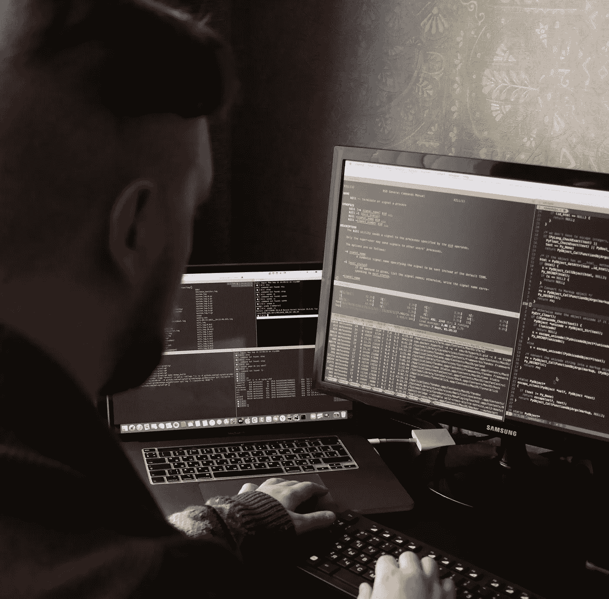

# 这么多年了还在编码

> 原文：<https://medium.com/codex/still-coding-after-all-these-years-8a4423371fdb?source=collection_archive---------3----------------------->

## 想知道 40 多年的软件开发到底是什么样的？从这里开始。

米哈伊尔·费申科在 [Unsplash](https://unsplash.com/s/photos/programmer?utm_source=unsplash&utm_medium=referral&utm_content=creditCopyText) 上拍摄的照片(已剪辑)

1980 年夏天。我所在的高中刚刚拥有了我们的第一台“真正的”电脑，一台无线通讯设备 TRS-80。作为内布拉斯加州穷乡僻壤的一所小学校，没有人真正知道该拿它怎么办，所以我们的校长向我最好的朋友——碰巧也叫凯文——寻求帮助